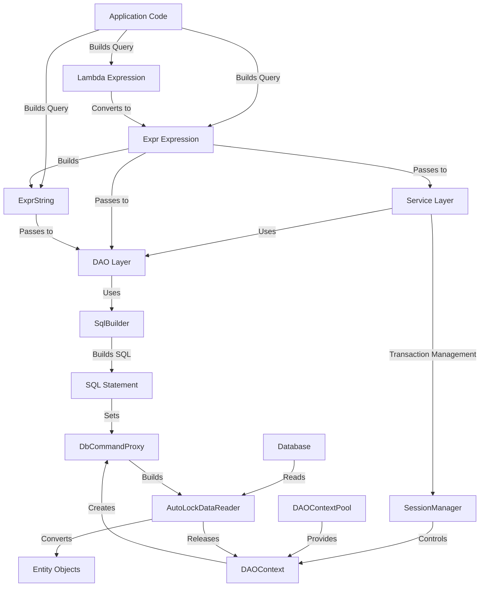

# Overview

LiteOrm is a lightweight, high-performance .NET ORM framework that combines the speed of micro-ORMs with the functionality of full ORMs. It is suitable for projects that require flexible SQL query handling while prioritizing performance.

## 1. When LiteOrm is a good fit

- You want more SQL control than a convention-heavy ORM usually provides.
- You need both day-to-day Lambda queries and dynamic query builders based on `Expr`.
- Your project uses multiple data sources, read/write splitting, or sharded tables.
- You want automatic relationship projection without giving up direct access to DAO-level APIs.

## 2. Core ideas

- Ultra-high performance: close to native Dapper, much faster than EF Core
- Three main query styles: Lambda, `Expr`, and `ExprString`
- Automatic relationship queries through attributes
- Both DAO-style and Service-style data access encapsulation
- Built-in transaction, table sharding, connection pooling, async, and multi-database dialect support
- Expression extension and `SqlBuilder` extension for custom database capabilities
- Complete async/await support

> **Quick understanding of the three query styles**:
> - **Lambda**: Most intuitive—write query conditions like C# code. Example: `u => u.Age >= 18`.
> - **Expr**: JSON-format expression objects, ideal for dynamic frontend parameters or programmatic complex queries.
> - **ExprString**: SQL-like string fragments, DAO-layer only, for scenarios requiring precise SQL control.

## 3. Positioning vs other approaches

| Option | Usually strongest at |
|------|-----------------------|
| EF Core | Migrations, full ecosystem, conventions |
| Dapper | Minimal abstraction and handwritten SQL |
| LiteOrm | Performance, expression extensibility, automatic associations, flexible SQL control |

> **How to choose?** If you come from EF Core, LiteOrm's entity definition style is similar (attribute-based) but lighter. If you come from Dapper, LiteOrm provides more convenient Lambda queries and automatic associations while retaining direct SQL execution capability.

## 4. Recommended reading order

1. [Installation](./02-installation.en.md)
2. [Configuration and Registration](./03-configuration-and-registration.en.md)
3. [First End-to-End Example](./04-first-example.en.md)
4. [Entity Mapping and Data Sources](../02-core-usage/01-entity-mapping.en.md)
5. [Expr Guide](../02-core-usage/03-expr-guide.en.md)
6. [Query Guide](../02-core-usage/04-query-guide.en.md)

> **Learning advice**: If you're a beginner, read the four getting-started docs in order—each takes about 5-10 minutes. After the fourth doc, you should be able to perform basic database operations in a new project. Check the "FAQ" section at the end of each doc if you run into issues.

---

## 5. Project Structure

LiteOrm uses a modular design that clearly separates core functionality, common components, samples, and test code. The project structure is well-organized for easy maintenance and extension.

```text
├── LiteOrm/                # Core library
│   ├── Classes/            # Core classes
│   ├── Converter/          # Converters
│   ├── DAO/                # Data access objects
│   ├── DAOContext/         # Data access context
│   ├── DbAccess/           # Database access
│   ├── Initilizer/         # Initializers
│   ├── Service/            # Service layer
│   └── SqlBuilder/         # SQL builders
├── LiteOrm.Common/         # Common components
│   ├── Attributes/         # Attributes
│   ├── Classes/            # Common classes
│   ├── Converter/          # Common converters
│   ├── Expr/               # Expressions
│   ├── MetaData/           # Metadata
│   ├── Model/              # Models
│   ├── Service/            # Common services
│   ├── SqlBuilder/         # Common SQL builders
│   └── SqlSegment/          # SQL segments
├── LiteOrm.Demo/           # Demo project
│   ├── DAO/                # Demo DAO
│   ├── Data/               # Demo data
│   ├── Demos/              # Demo code
│   ├── Models/             # Demo models
│   └── Services/           # Demo services
├── LiteOrm.Tests/          # Test project
│   ├── Attributes/         # Attribute tests
│   ├── Classes/            # Class tests
│   ├── Converter/          # Converter tests
│   ├── Expr/               # Expression tests
│   ├── Infrastructure/     # Test infrastructure
│   ├── MetaData/           # Metadata tests
│   ├── Models/             # Test models
│   └── Service/            # Service tests
├── LiteOrm.Benchmark/      # Performance benchmark
└── docs/                   # Documentation
    ├── 01-getting-started/ # Getting started guide
    ├── 02-core-usage/      # Core usage
    ├── 03-advanced-topics/ # Advanced topics
    ├── 04-extensibility/   # Extensibility
    └── 05-reference/       # Reference
```

**Core Module Responsibilities:**

| Module | Main Responsibility | File Location |
|-----|---------|---------|
| DAO | Data access operations | LiteOrm/DAO/ |
| Service | Business services | LiteOrm/Service/ |
| SqlBuilder | SQL statement building | LiteOrm/SqlBuilder/ |
| Expr | Query expressions | LiteOrm.Common/Expr/ |
| Attributes | Entity mapping attributes | LiteOrm.Common/Attributes/ |
| MetaData | Metadata management | LiteOrm.Common/MetaData/ |

## 6. System Architecture and Main Flows

LiteOrm uses a layered architecture design that clearly separates data access, business logic, and presentation layers. The system architecture follows the Dependency Inversion Principle, achieving decoupling between layers through interfaces.

### Core Architecture Components

1. **Entity Layer**: Defines data models, mapped to database tables through attributes
2. **DAO Layer**: Provides basic data access operations, handles CRUD operations
3. **Service Layer**: Encapsulates business logic, provides advanced operations and transaction support
4. **Expression System**: Provides powerful query building capabilities
5. **SQL Builder**: Generates optimized SQL statements for different databases
6. **Context Management**: Handles database connections and sessions

### Core Architecture Diagram



## 7. Core Function Modules

### 7.1 Data Access Objects (DAO)

The DAO layer is the core of LiteOrm, providing direct data access operations. It includes multiple implementation classes for different data access scenarios.

**Main Components:**

- **DAOBase**: Abstract base class for all DAOs, providing common operations
- **ObjectDAO**: Object-oriented data access, handles CRUD for entity objects
- **DataDAO**: Data-oriented access, returns DataTable and other data structures
- **ObjectViewDAO**: Handles view object access
- **DataViewDAO**: Handles data view access
- **DbCommandProxy**: Database command proxy, encapsulates IDbCommand, provides parameter processing and execution functionality
- **AutoLockDataReader**: Auto-locking data reader, ensures thread safety during data reading

**Core Features:**
- CRUD operations for entity objects
- Batch operation support
- Expression queries
- Table sharding support
- Async operations
- Command execution and parameter processing
- Safe data reading

### 7.2 Service Layer

The Service layer encapsulates business logic and provides higher-level operation interfaces. It is built on top of the DAO layer, adding transaction management and business rules.

**Main Components:**

- **EntityService**: Entity service, provides complete CRUD operations
- **EntityViewService**: View service, focused on query operations

**Core Features:**
- Complete CRUD operations
- Batch operations
- Transaction support
- Async methods
- Expression queries

### 7.3 Expression System (Expr)

The expression system is a distinctive feature of LiteOrm, providing powerful query building capabilities. It covers three common query entry styles: Lambda expressions, Expr objects, and DAO-only ExprString.

**Main Components:**

- **Expr**: Base expression class
- **LogicExpr**: Logical expression
- **ValueExpr**: Value expression
- **SelectExpr**: Select expression
- **UpdateExpr**: Update expression
- **DeleteExpr**: Delete expression

**Core Features:**
- Build complex query conditions
- Support various operators
- Support subqueries
- Support JOIN operations
- Type safety

### 7.4 SQL Builder (SqlBuilder)

The SQL Builder is responsible for generating optimized SQL statements for different databases based on expressions. It supports multiple database types and provides database-specific syntax and function support.

**Main Components:**

- **SqlBuilder**: Base SQL builder class
- **SqlServerBuilder**: SQL Server specific builder
- **MySqlBuilder**: MySQL specific builder
- **OracleBuilder**: Oracle specific builder
- **PostgreSqlBuilder**: PostgreSQL specific builder
- **SQLiteBuilder**: SQLite specific builder

**Core Features:**
- Generate database-specific SQL statements
- Handle parameterized queries
- Support pagination
- Support function calls
- Handle database-specific syntax

### 7.5 Metadata Management (MetaData)

Metadata management handles the mapping between entity types and database tables. It builds metadata through the attribute system, providing necessary information for DAO and SQL Builder.

**Main Components:**

- **TableInfoProvider**: Table information provider
- **SqlTable**: Table information
- **SqlColumn**: Column information
- **TableDefinition**: Table definition
- **ColumnDefinition**: Column definition

**Core Features:**
- Build metadata for entity types
- Handle table and column mapping
- Manage primary key and foreign key relationships
- Support table sharding configuration

### 7.6 Transaction Management

LiteOrm provides declarative transaction management through the `[Transaction]` attribute to mark methods requiring transactions. Transaction management is handled by SessionManager, ensuring multiple operations execute within the same transaction.

**Core Features:**
- Declarative transactions
- Transaction nesting
- Transaction rollback
- Async transaction support

## 8. Core API/Classes/Functions

### 8.1 Data Access Core API

#### DAOBase

**Function**: Abstract base class for all DAOs, providing common operation methods

**Main Methods**:
- `NewCommand()`: Create database command
- `MakeNamedParamCommand()`: Create parameterized command
- `MakeExprCommand()`: Create command from expression
- `GetValue<T>()`: Execute query and return single value
- `Execute()`: Execute non-query SQL
- `Query<TResult>()`: Execute query and return result set

**Use Case**: As base class for DAOs, providing common functionality

#### ObjectDAO<T>

**Function**: Handles CRUD operations for entity objects

**Main Methods**:
- `Insert()`: Insert entity
- `Update()`: Update entity
- `Delete()`: Delete entity
- `DeleteByKeys()`: Delete by primary keys
- `Search()`: Query entities
- `BatchInsert()`: Batch insert
- `BatchUpdate()`: Batch update
- `BatchDelete()`: Batch delete

**Use Case**: Directly operate entity objects, execute CRUD operations

#### DbCommandProxy

**Function**: Database command proxy, encapsulates DbCommand, provides parameter processing and execution functionality, combined with AutoLockDataReader to implement transactions and async lock management.

**Main Methods**:
- `CreateParameter()`: Create database parameter
- `ExecuteNonQuery()`: Execute non-query command
- `ExecuteReader()`: Execute query and return data reader
- `ExecuteScalar()`: Execute query and return single value

**Use Case**: Encapsulate database commands, handle parameter and execution operations

#### AutoLockDataReader

**Function**: Auto-locking data reader, ensures thread safety during data reading

**Main Methods**:
- `Read()`: Read next record
- `GetValue()`: Get column value
- `GetInt32()/GetString()/etc.`: Get specific type values
- `Dispose()`: Release resources

**Use Case**: Safely read database query results

### 8.2 Service Layer Core API

#### EntityService<T, TView>

**Function**: Provides complete business operations for entities

**Main Methods**:
- `Insert()`: Insert entity
- `Update()`: Update entity
- `Delete()`: Delete entity
- `BatchInsert()`: Batch insert
- `BatchUpdate()`: Batch update
- `BatchDelete()`: Batch delete
- `Search()`: Query entities
- `SearchOne()`: Query single entity
- `SearchAsync()`: Async query

**Use Case**: Use in business logic layer, providing complete entity operations

#### EntityViewService<TView>

**Function**: Service focused on query operations

**Main Methods**:
- `Search()`: Query entities
- `SearchOne()`: Query single entity
- `SearchAsync()`: Async query
- `Count()`: Count records

**Use Case**: Scenarios requiring only query functionality

### 8.3 Expression System Core API

#### Expr

**Function**: Base expression class, provides query building capability

**Main Methods**:
- `Prop()`: Create property expression
- `Exists<T>()`: Create existence subquery
- `From<T>()`: Create query starting from table
- `ToPreparedSql()`: Convert to parameterized SQL statement

**Use Case**: Build complex query conditions

#### LogicExpr

**Function**: Logical expression, used to build WHERE conditions

**Main Operators**:
- `&`: AND operation
- `|`: OR operation
- `!`: NOT operation

**Use Case**: Build complex logical conditions

### 8.4 SQL Builder Core API

#### SqlBuilder

**Function**: Base SQL builder class, provides SQL generation functionality

**Main Methods**:
- `ToSqlName()`: Convert to SQL name
- `ToSqlParam()`: Convert to SQL parameter
- `ConvertToDbValue()`: Convert to database value
- `ConvertFromDbValue()`: Convert from database value
- `BuildSelectSql()`: Build SELECT statement
- `BuildFunctionSql()`: Build function SQL statement

**Use Case**: Generate database-specific SQL statements

### 8.5 Metadata Core API

#### SqlTable

**Function**: Represents metadata of a database table

**Main Properties**:
- `Name`: Table name
- `Columns`: Column collection
- `Keys`: Primary key columns
- `Definition`: Table definition

**Use Case**: Provide table metadata information

#### TableInfoProvider

**Function**: Provider of table information

**Main Methods**:
- `GetTable()`: Get table information
- `GetColumn()`: Get column information

**Use Case**: Build and manage table metadata

## 9. Technology Stack and Dependencies

| Technology/Dependency | Version | Purpose |
|----------|------|-----|
| .NET | 8.0+ | Runtime environment |
| .NET Standard | 2.0+ | Cross-platform support |
| Autofac.Extensions.DependencyInjection | 10.0.0 | Autofac container integration used by `RegisterLiteOrm()` |
| Autofac.Extras.DynamicProxy | 7.1.0 | Autofac interception support |
| Microsoft.Extensions.DependencyInjection | 10.0.0 | DI abstractions and `ServiceCollection` ecosystem |
| Castle.Core | 5.2.1 | Dynamic proxy core |
| Castle.Core.AsyncInterceptor | 2.1.0 | Async interceptor |
| Microsoft.Extensions.Hosting.Abstractions | 10.0.5 | Hosting abstractions |
| Microsoft.Extensions.Logging.Abstractions | 10.0.5 | Logging abstractions |
| System.Text.Json | 10.0.5 | JSON processing |

**Database Support:**
- SQL Server 2012+
- Oracle 12c+
- PostgreSQL
- MySQL8.0+
- SQLite

## 10. Common Beginner Misconceptions

> Here are some common misunderstandings that beginners often have. Knowing them upfront can save you time.

### Misconception 1: LiteOrm is just a "simplified EF Core"

LiteOrm is not a simplified version of EF Core—it's an independently designed ORM framework. Its design philosophy is "give you enough abstraction, but don't hide the SQL." You can inspect generated SQL, execute raw SQL directly, and customize SQL builders—things that are often harder in EF Core.

### Misconception 2: You must define a Service class to use LiteOrm

You can directly inject the framework's generic interfaces `IEntityServiceAsync<T>` and `IEntityViewServiceAsync<T>` without defining any custom Service class. This is very convenient during prototyping. Once your business logic stabilizes, you can gradually encapsulate custom Services.

### Misconception 3: Lambda queries and Expr queries are mutually exclusive

The three query styles (Lambda, Expr, ExprString) can be mixed. Lambda expressions are automatically converted to Expr, and Expr can be embedded into ExprString as fragments. Choose the most appropriate style for each scenario.

### Misconception 4: LiteOrm doesn't support complex queries

LiteOrm supports subqueries, JOINs, CTEs (Common Table Expressions), window functions, grouping, and aggregation. Its API design simply favors explicit construction over implicit "convention over configuration" behavior.

### Misconception 5: `[Table]` and `[Column]` attribute names must match C# property names

The names in attributes are the actual database names. If your C# property name matches the database column name, you can omit the `[Column]` Name parameter (though explicit annotation is recommended for readability). The `[Table]` Name parameter must always specify the actual database table name.

## Related Links

- [Back to docs hub](../README.md)
- [Installation and Environment Requirements](./02-installation.en.md)
- [API Index](../05-reference/02-api-index.en.md)
- [Demo Project](../../LiteOrm.Demo/)
