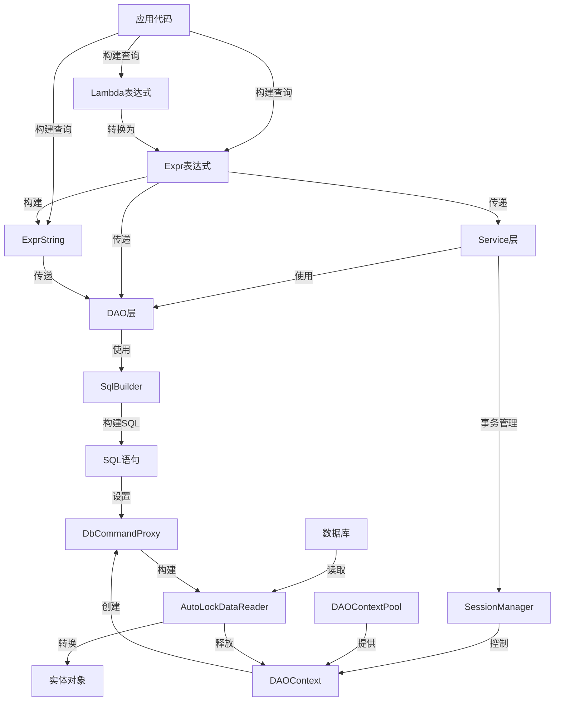

# 概述

LiteOrm 是一个轻量级、高性能的 .NET ORM 框架，结合了微ORM的速度和全ORM的功能性，适用于需要灵活处理SQL查询并且注重性能的场景。

## 1. 适合哪些场景

- 需要比传统 ORM 更接近 SQL 执行过程的业务系统。
- 有多数据源、读写分离、分表分库等需求的中大型系统。
- 希望在 Lambda 查询、动态表达式和原生 SQL 片段之间自由切换。
- 需要保留较高性能，同时不想完全退回到手写 ADO.NET 或 Dapper 拼装层。

## 2. LiteOrm 的核心特点

- 超高性能：性能接近原生Dapper，远超EF Core
- 支持 `Lambda`、`Expr`、`ExprString` 三种查询方式。
- 用特性描述实体、外键和视图，完成自动关联查询。
- 同时支持 DAO 风格和 Service 风格的数据访问封装。
- 内置事务、分表、连接池、异步调用和多数据库方言支持。
- 可以通过表达式扩展和 `SqlBuilder` 扩展自定义数据库能力。
- 异步支持：完整的async/await支持

> **三种查询方式快速理解**：
> - **Lambda**：最直观，像写 C# 代码一样写查询条件。例如 `u => u.Age >= 18`。
> - **Expr**：JSON 格式的表达式对象，适合前端动态传参或程序化构建复杂查询。
> - **ExprString**：类似手写 SQL 片段的字符串，仅在 DAO 层使用，适合需要精确控制 SQL 的场景。

## 3. 与常见方案的定位差异

| 方案 | 更擅长的方向 |
| --- | --- |
| EF Core | 迁移、完整生态、约定优先 |
| Dapper | 极简、手写 SQL，最薄抽象 |
| LiteOrm | 性能、表达式扩展、自动关联、灵活 SQL 控制 |

> **如何选择？** 如果你来自 EF Core 背景，LiteOrm 的实体定义方式类似（都用特性标注），但更轻量；如果你来自 Dapper 背景，LiteOrm 提供了更便捷的 Lambda 查询和自动关联，同时保留了直接执行 SQL 的能力。

## 4. 快速开始

1. 先完成 [安装与环境要求](./02-installation.md)。
2. 再阅读 [配置与注册](./03-configuration-and-registration.md)。
3. 跑通 [第一个完整示例](./04-first-example.md)。
4. 然后进入 [实体映射与数据源](../02-core-usage/01-entity-mapping.md)、[Expr 使用指南](../02-core-usage/03-expr-guide.md) 和 [查询指南](../02-core-usage/04-query-guide.md)。

> **学习建议**：如果你是初学者，建议按顺序阅读入门篇的四篇文档，每篇大约 5-10 分钟。读完第四篇后，你应该能够在一个新项目中完成基本的数据库操作。遇到问题时，可以先查看每篇文档末尾的"常见问题"部分。

---

## 5. 目录结构

LiteOrm 项目采用模块化设计，清晰地分离了核心功能、公共组件、示例和测试代码。项目结构组织合理，便于维护和扩展。

```text
├── LiteOrm/                # 核心库
│   ├── Classes/            # 核心类
│   ├── Converter/          # 转换器
│   ├── DAO/                # 数据访问对象
│   ├── DAOContext/         # 数据访问上下文
│   ├── DbAccess/           # 数据库访问
│   ├── Initilizer/         # 初始化器
│   ├── Service/            # 服务层
│   └── SqlBuilder/         # SQL构建器
├── LiteOrm.Common/         # 公共组件
│   ├── Attributes/         # 特性
│   ├── Classes/            # 公共类
│   ├── Converter/          # 公共转换器
│   ├── Expr/               # 表达式
│   ├── MetaData/           # 元数据
│   ├── Model/              # 模型
│   ├── Service/            # 公共服务
│   ├── SqlBuilder/          # 公共SQL构建器
│   └── SqlSegment/          # SQL片段
├── LiteOrm.Demo/           # 示例项目
│   ├── DAO/                # 示例DAO
│   ├── Data/               # 示例数据
│   ├── Demos/              # 示例代码
│   ├── Models/             # 示例模型
│   └── Services/           # 示例服务
├── LiteOrm.Tests/          # 测试项目
│   ├── Attributes/          # 特性测试
│   ├── Classes/            # 类测试
│   ├── Converter/           # 转换器测试
│   ├── Expr/               # 表达式测试
│   ├── Infrastructure/      # 测试基础设施
│   ├── MetaData/           # 元数据测试
│   ├── Models/             # 测试模型
│   └── Service/            # 服务测试
├── LiteOrm.Benchmark/      # 性能基准测试
└── docs/                    # 文档
    ├── 01-getting-started/ # 入门指南
    ├── 02-core-usage/      # 核心使用
    ├── 03-advanced-topics/ # 高级主题
    ├── 04-extensibility/   # 扩展性
    └── 05-reference/       # 参考
```

**核心模块职责：**

| 模块 | 主要职责 | 文件位置 |
|-----|---------|---------|
| DAO | 数据访问操作 | LiteOrm/DAO/ |
| Service | 业务服务 | LiteOrm/Service/ |
| SqlBuilder | SQL语句构建 | LiteOrm/SqlBuilder/ |
| Expr | 查询表达式 | LiteOrm.Common/Expr/ |
| Attributes | 实体映射特性 | LiteOrm.Common/Attributes/ |
| MetaData | 元数据管理 | LiteOrm.Common/MetaData/ |

## 6. 系统架构与主流程

LiteOrm 采用分层架构设计，清晰地分离了数据访问、业务逻辑和表示层。系统架构遵循依赖倒置原则，通过接口实现各层之间的解耦。

### 核心架构组件

1. **实体层**：定义数据模型，通过特性映射到数据库表
2. **DAO层**：提供基础数据访问操作，处理CRUD操作
3. **服务层**：封装业务逻辑，提供高级操作和事务支持
4. **表达式系统**：提供强大的查询构建能力
5. **SQL构建器**：针对不同数据库生成优化的SQL语句
6. **上下文管理**：处理数据库连接和会话

### 核心架构示意图



## 7. 核心功能模块

### 7.1 数据访问对象 (DAO)

DAO层是LiteOrm的核心，提供了直接的数据访问操作。它包括多个实现类，针对不同的数据访问场景。

**主要组件：**

- **DAOBase**：所有DAO的抽象基类，提供通用操作
- **ObjectDAO**：对象化数据访问，处理实体对象的CRUD
- **DataDAO**：数据化访问，返回DataTable等数据结构
- **ObjectViewDAO**：处理视图对象的访问
- **DataViewDAO**：处理数据视图的访问
- **DbCommandProxy**：数据库命令代理，封装了IDbCommand，提供参数处理和执行功能
- **AutoLockDataReader**：自动锁定的数据读取器，确保数据读取过程中的线程安全

**核心功能：**
- 实体对象的增删改查
- 批量操作支持
- 表达式查询
- 分表支持
- 异步操作
- 命令执行与参数处理
- 安全的数据读取

### 7.2 服务层 (Service)

Service层封装了业务逻辑，提供了更高级的操作接口。它基于DAO层构建，增加了事务管理和业务规则。

**主要组件：**

- **EntityService**：实体服务，提供完整的CRUD操作
- **EntityViewService**：视图服务，专注于查询操作

**核心功能：**
- 完整的CRUD操作
- 批量操作
- 事务支持
- 异步方法
- 表达式查询

### 7.3 表达式系统 (Expr)

表达式系统是LiteOrm的特色功能，提供了强大的查询构建能力。它覆盖三类常见查询入口：Lambda表达式、Expr对象，以及仅供 DAO 使用的 ExprString。

**主要组件：**

- **Expr**：表达式基类
- **LogicExpr**：逻辑表达式
- **ValueExpr**：值表达式
- **SelectExpr**：选择表达式
- **UpdateExpr**：更新表达式
- **DeleteExpr**：删除表达式

**核心功能：**
- 构建复杂查询条件
- 支持各种运算符
- 支持子查询
- 支持JOIN操作
- 类型安全

### 7.4 SQL构建器 (SqlBuilder)

SQL构建器负责根据表达式生成针对不同数据库的优化SQL语句。它支持多种数据库类型，提供了数据库特定的语法和函数支持。

**主要组件：**

- **SqlBuilder**：SQL构建器基类
- **SqlServerBuilder**：SQL Server专用构建器
- **MySqlBuilder**：MySQL专用构建器
- **OracleBuilder**：Oracle专用构建器
- **PostgreSqlBuilder**：PostgreSQL专用构建器
- **SQLiteBuilder**：SQLite专用构建器

**核心功能：**
- 生成数据库特定的SQL语句
- 处理参数化查询
- 支持分页
- 支持函数调用
- 处理数据库特定的语法

### 7.5 元数据管理 (MetaData)

元数据管理负责处理实体类型与数据库表之间的映射关系。它通过特性系统构建元数据，为DAO和SQL构建器提供必要的信息。

**主要组件：**

- **TableInfoProvider**：表信息提供者
- **SqlTable**：表信息
- **SqlColumn**：列信息
- **TableDefinition**：表定义
- **ColumnDefinition**：列定义

**核心功能：**
- 构建实体类型的元数据
- 处理表和列的映射
- 管理主键和外键关系
- 支持分表配置

### 7.6 事务管理

LiteOrm提供了声明式事务管理，通过`[Transaction]`属性标记需要事务的方法。事务管理由SessionManager负责，确保多个操作在同一事务中执行。

**核心功能：**
- 声明式事务
- 事务嵌套
- 事务回滚
- 异步事务支持

## 8. 核心 API/类/函数

### 8.1 数据访问核心 API

#### DAOBase

**功能**：所有DAO的抽象基类，提供通用操作方法

**主要方法**：
- `NewCommand()`：创建数据库命令
- `MakeNamedParamCommand()`：创建带参数的命令
- `MakeExprCommand()`：根据表达式创建命令
- `GetValue<T>()`：执行查询并返回单个值
- `Execute()`：执行非查询SQL
- `Query<TResult>()`：执行查询并返回结果集

**使用场景**：作为DAO的基类，提供通用功能

#### ObjectDAO<T>

**功能**：处理实体对象的CRUD操作

**主要方法**：
- `Insert()`：插入实体
- `Update()`：更新实体
- `Delete()`：删除实体
- `DeleteByKeys()`：根据主键删除
- `Search()`：查询实体
- `BatchInsert()`：批量插入
- `BatchUpdate()`：批量更新
- `BatchDelete()`：批量删除

**使用场景**：直接操作实体对象，执行CRUD操作

#### DbCommandProxy

**功能**：数据库命令代理，封装了DbCommand，提供参数处理和执行功能，结合AutoLockDataReader实现事务、异步锁管理。

**主要方法**：
- `CreateParameter()`：创建数据库参数
- `ExecuteNonQuery()`：执行非查询命令
- `ExecuteReader()`：执行查询并返回数据读取器
- `ExecuteScalar()`：执行查询并返回单个值

**使用场景**：封装数据库命令，处理参数和执行操作

#### AutoLockDataReader

**功能**：自动锁定的数据读取器，确保数据读取过程中的线程安全

**主要方法**：
- `Read()`：读取下一条记录
- `GetValue()`：获取指定列的值
- `GetInt32()/GetString()/等`：获取指定类型的值
- `Dispose()`：释放资源

**使用场景**：安全地读取数据库查询结果

### 8.2 服务层核心 API

#### EntityService<T, TView>

**功能**：提供实体的完整业务操作

**主要方法**：
- `Insert()`：插入实体
- `Update()`：更新实体
- `Delete()`：删除实体
- `BatchInsert()`：批量插入
- `BatchUpdate()`：批量更新
- `BatchDelete()`：批量删除
- `Search()`：查询实体
- `SearchOne()`：查询单个实体
- `SearchAsync()`：异步查询

**使用场景**：在业务逻辑层使用，提供完整的实体操作

#### EntityViewService<TView>

**功能**：专注于查询操作的服务

**主要方法**：
- `Search()`：查询实体
- `SearchOne()`：查询单个实体
- `SearchAsync()`：异步查询
- `Count()`：统计记录数

**使用场景**：仅需要查询功能的场景

### 8.3 表达式系统核心 API

#### Expr

**功能**：表达式基类，提供查询构建能力

**主要方法**：
- `Prop()`：创建属性表达式
- `Exists<T>()`：创建存在性子查询
- `From<T>()`：创建从表开始的查询
- `ToPreparedSql()`：转换为带参数的SQL语句

**使用场景**：构建复杂的查询条件

#### LogicExpr

**功能**：逻辑表达式，用于构建WHERE条件

**主要操作符**：
- `&`：AND操作
- `|`：OR操作
- `!`：NOT操作

**使用场景**：构建复杂的逻辑条件

### 8.4 SQL构建器核心 API

#### SqlBuilder

**功能**：SQL构建器基类，提供SQL生成功能

**主要方法**：
- `ToSqlName()`：转换为SQL名称
- `ToSqlParam()`：转换为SQL参数
- `ConvertToDbValue()`：转换为数据库值
- `ConvertFromDbValue()`：从数据库值转换
- `BuildSelectSql()`：构建SELECT语句
- `BuildFunctionSql()`：构建函数SQL语句

**使用场景**：生成数据库特定的SQL语句

### 8.5 元数据核心 API

#### SqlTable

**功能**：表示数据库表的元数据

**主要属性**：
- `Name`：表名
- `Columns`：列集合
- `Keys`：主键列
- `Definition`：表定义

**使用场景**：提供表的元数据信息

#### TableInfoProvider

**功能**：提供表信息的提供者

**主要方法**：
- `GetTable()`：获取表信息
- `GetColumn()`：获取列信息

**使用场景**：构建和管理表的元数据

## 9. 技术栈与依赖

| 技术/依赖 | 版本 | 用途 |
|----------|------|-----|
| .NET | 8.0+ | 运行环境 |
| .NET Standard | 2.0+ | 跨平台支持 |
| Autofac.Extensions.DependencyInjection | 10.0.0 | Autofac 容器与 `RegisterLiteOrm()` 的宿主集成 |
| Autofac.Extras.DynamicProxy | 7.1.0 | Autofac 拦截支持 |
| Microsoft.Extensions.DependencyInjection | 10.0.0 | DI 抽象与 ServiceCollection 生态 |
| Castle.Core | 5.2.1 | 动态代理核心 |
| Castle.Core.AsyncInterceptor | 2.1.0 | 异步拦截器 |
| Microsoft.Extensions.Hosting.Abstractions | 10.0.5 | 主机抽象 |
| Microsoft.Extensions.Logging.Abstractions | 10.0.5 | 日志抽象 |
| System.Text.Json | 10.0.5 | JSON处理 |

**数据库支持：**
- SQL Server 2012+
- Oracle 12c+
- PostgreSQL
- MySQL8.0+
- SQLite

## 10. 新手常见误区

> 以下是一些初学者容易产生的误解，提前了解可以少走弯路。

### 误区一：LiteOrm 只是一个"简化版 EF Core"

LiteOrm 不是 EF Core 的简化版，而是一个独立设计的 ORM 框架。它的设计哲学是"给你足够的抽象，但不隐藏 SQL"。你可以随时查看生成的 SQL、直接执行原生 SQL、自定义 SQL 构建器，这在 EF Core 中往往比较困难。

### 误区二：必须定义 Service 才能使用

实际上，你可以直接注入框架提供的泛型接口 `IEntityServiceAsync<T>` 和 `IEntityViewServiceAsync<T>`，无需定义任何自定义 Service 类。这在原型开发阶段非常方便。等业务稳定后，再逐步封装自定义 Service。

### 误区三：Lambda 查询和 Expr 查询是互斥的

三种查询方式（Lambda、Expr、ExprString）可以混合使用。Lambda 表达式会自动转换为 Expr，Expr 也可以嵌入到 ExprString 中作为片段。你可以根据场景灵活选择最合适的方式。

### 误区四：LiteOrm 不支持复杂查询

LiteOrm 支持子查询、JOIN、CTE（公共表表达式）、窗口函数、分组聚合等复杂查询。只是它的 API 设计更偏向显式构建，而不是"约定优于配置"的隐式行为。

### 误区五：`[Table]` 和 `[Column]` 特性必须和数据库表名/列名完全一致

特性中的名称是数据库中的实际名称。如果你的 C# 属性名和数据库列名一致，可以省略 `[Column]` 的 Name 参数（但建议显式标注以提高可读性）。`[Table]` 的 Name 参数则必须填写数据库中的实际表名。

## 相关链接

- [GitHub 仓库](https://github.com/danjiewu/LiteOrm)
- [返回目录](../README.md)
- [安装与环境要求](./02-installation.md)
- [API 索引](../05-reference/02-api-index.md)
