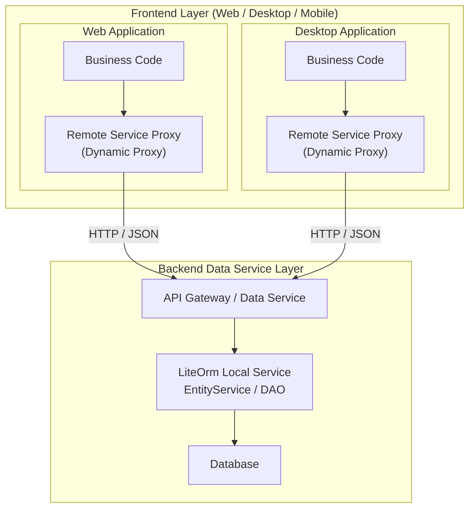
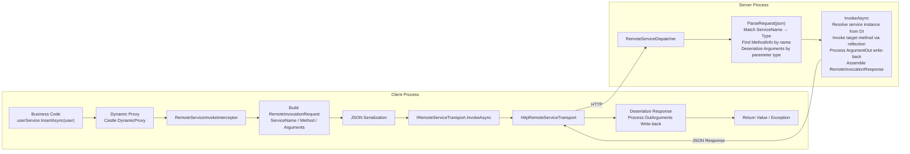
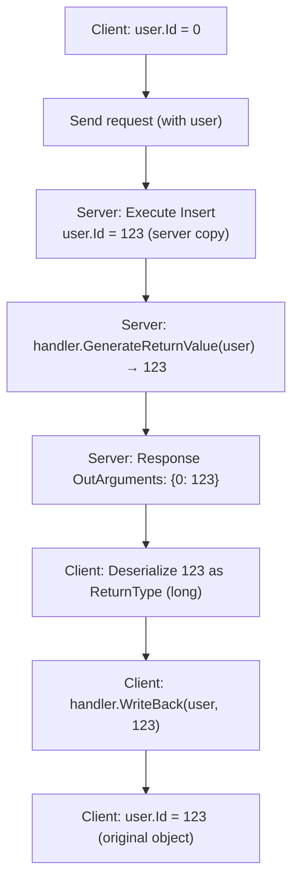

# Remote Service (LiteOrm.Remote)

LiteOrm provides a complete remote service invocation solution, consisting of two independent NuGet packages:

| Package | Role | Description |
|---------|------|-------------|
| `LiteOrm.Remote` | Client | Generates dynamic proxies to intercept method calls and forward them to the server via HTTP |
| `LiteOrm.Remote.Server` | Server | Receives HTTP requests, parses them, resolves service instances from the DI container, and executes them |

The client and server share DTOs in `LiteOrm.Common` (`RemoteInvocationRequest` / `RemoteInvocationResponse`, etc., namespace `LiteOrm.Remote`), ensuring protocol consistency. `ServiceName` generation and resolution is handled uniformly by `LiteOrm.Common.TypeResolverHelper` (client-side `TypeResolverHelper.GetName` generates, server-side `TypeResolverHelper.FindType` resolves).

## 1. Minimal Example

### Server

```bash
dotnet add package LiteOrm.Remote.Server
```

```csharp
using LiteOrm.Remote.Server;

var builder = WebApplication.CreateBuilder(args);
builder.Host.RegisterLiteOrm();        // Register LiteOrm main framework
builder.Services.AddRemoteServer();    // Register remote server

var app = builder.Build();
app.MapRemoteInvokeEndpoint();         // Map remote invocation endpoint
app.Run();
```

### Client

```bash
dotnet add package LiteOrm.Remote
```

```csharp
using LiteOrm.Remote;

var host = Host.CreateDefaultBuilder(args)
    .RegisterLiteOrmRemote(opts =>
    {
        opts.RemoteServiceUri = new Uri("http://localhost:5000");
    })
    .Build();
```

### Calling style is identical to local services

```csharp
using var scope = host.Services.CreateScope();
var userService = scope.ServiceProvider.GetRequiredService<IDemoUserService>();

var user = new DemoUser { UserName = "alice" };
await userService.InsertAsync(user);          // Id auto-write-back
Console.WriteLine($"New user Id = {user.Id}");
```

> `AutoRegisterEntityServices` defaults to `true`. The framework automatically scans interfaces marked with `[Service]` and registers them as remote proxies — no manual registration needed.

---

## 2. The Value of Physical Separation Between Frontend and Backend

In traditional monolithic applications, the data access layer and the application layer run within the same process, with database connection strings directly exposed in configuration files. This means:

- Anyone with access to the application server can reach the database
- The frontend web project is tightly coupled with the database and cannot be independently deployed or scaled
- When multiple clients (Web, mobile, desktop) share the same codebase, database access logic cannot be reused

LiteOrm.Remote achieves physical separation of frontend and backend through **remote service proxies**:



**Core Value:**

| Value | Description |
|-------|-------------|
| **Database not exposed** | Database connection strings exist only in the backend data service layer; the frontend layer cannot directly access the database |
| **Security isolation** | The frontend layer can only access data through controlled service interfaces; all queries pass through ExprValidator |
| **Multi-client reuse** | Web, desktop, and mobile share the same set of service interfaces; backend logic is maintained centrally |
| **Independent deployment** | The frontend and backend layers can be scaled and updated independently without affecting each other |
| **Interface unchanged** | Business code requires no changes — the local call `userService.InsertAsync(user)` and the remote call are written identically |

> **Compared to traditional approaches**: In traditional approaches, if both a web frontend and a desktop client need to access the database, you either maintain separate sets of data access code (redundant and error-prone) or manually wrap REST APIs (requiring extra Controllers and DTO mappings). LiteOrm.Remote makes the service interface definition itself the API protocol, eliminating the need for an additional wrapper layer.

---

## 3. How It Works

### Overall Architecture



### Client Flow

1. **DI resolves proxy**: Business code resolves a service interface (e.g. `IDemoUserService`) from the DI container, receiving a dynamic proxy generated by Castle DynamicProxy
2. **Interceptor kicks in**: `RemoteServiceInvokeInterceptor` intercepts all method calls
3. **Build request**: Converts the method signature to `ServiceName` (short type name) + `Method` (method name) + `Arguments` (serialized parameters)
4. **Transport invocation**: Sends the request to the server via `IRemoteServiceTransport`
5. **Process response**: Deserializes the return value, processes `OutArguments` write-back to original parameter objects

### Server Flow

1. **Receive request**: `RemoteServiceDispatcher.ParseRequest` parses the JSON request
2. **Type matching**: Resolves `ServiceName` to the service interface `Type` via `IRemoteServiceTypeResolver`
3. **Method lookup**: Finds `MethodInfo` by method name in the service type (including base interfaces); results are cached in a `ConcurrentDictionary` for O(1) lookup
4. **Parameter deserialization**: Deserializes `Arguments` by the method's parameter declared types
5. **Service execution**: Resolves the service instance from the DI container and invokes the target method via reflection
6. **Write-back handling**: Extracts `ArgumentOut` parameter write-back values and assembles `RemoteInvocationResponse`

### Method Lookup Mechanism

`RemoteServiceDispatcher.BuildMethodLookup` traverses the service type and all its base interfaces, building a `Dictionary<string, MethodInfo>`:

- Prioritizes `ServiceMethodAttribute.MethodName` as the key
- Falls back to `MethodInfo.Name`
- Throws `AmbiguousMatchException` on duplicate keys
- Results cached in `ConcurrentDictionary<Type, Dictionary<string, MethodInfo>>` for O(1) lookup on subsequent calls

### `$type` Serialization Strategy

When the actual argument runtime type differs from the parameter declared type, the value is wrapped as `{"$type":"ActualTypeName","$value":<value>}` to ensure the server can correctly deserialize to the actual type. `Expr` derived class parameters are serialized by their declared type (Lambdas are already converted to `Expr` on the client side).

### Identity Write-back Mechanism

After the server executes `InsertAsync`, `IdentityOutAttribute.GenerateReturnValue` extracts the Identity column value from the entity copy and places it in `OutArguments`. When the client interceptor receives the response, it calls `WriteBack` to write the value back to the original object held by the business code, preserving the reference.

---

## 4. Detailed Types and Configuration

### `[Service]` Attribute

Marks an interface as a remote service. With `AutoRegisterEntityServices` enabled by default, the framework automatically scans interfaces marked with `[Service]` (and `IsService == true`), registers name mappings via `TypeResolverHelper.Register`, and registers them as remote proxies.

```csharp
[Service]                                        // Expose as remote service, auto-register name mapping
public interface IDemoUserService : IEntityServiceAsync<DemoUser>
{
}

[Service(Name = "UserSvc")]                      // Custom service name
public interface IUserService
{
}

[Service(IsService = false)]                     // Explicitly disable remote invocation
public interface IInternalService
{
}
```

### `[ServiceMethod]` Attribute

Specifies a custom name for a method, used for method name mapping. When not specified, `MethodInfo.Name` is used.

```csharp
public interface IUserService
{
    [ServiceMethod("FindByAccount")]
    Task<User> GetByUserNameAsync(string userName);
}
```

### `TypeResolverHelper` — Bidirectional Type Name ↔ Type Resolution

`LiteOrm.Common.TypeResolverHelper` is a public utility class providing bidirectional conversion between type names and `Type`. **Both the client generating `ServiceName` and the server resolving `ServiceName` depend on it.**

#### Core Methods

| Method | Description |
|--------|-------------|
| `GetName(Type)` | Generates a serializable type name. Non-generic returns `Type.Name`; generic returns `BaseName<ParamShortName1,...>` (strips the backtick arity suffix, recursively handles nested generics) |
| `FindType(string typeName, string? defaultNamespace = null)` | Looks up a type by name |
| `Register(string name, Type type)` | Registers a custom name ↔ type mapping (**highest priority**) |
| `Unregister(string name)` | Unregisters a custom mapping |
| `TryParseGenericServiceName(string)` | Parses a generic service name into (baseName, paramName array), e.g. `IEntityService<User>` → `("IEntityService", ["User"])` |

#### `FindType` Resolution Order

1. **Custom registrations** (mappings registered via `Register`, highest priority)
2. **`Type.GetType`** (supports assembly-qualified names and full names)
3. **Exact full name match** (cross-assembly traversal via `assembly.GetType(typeName)`)
4. **Default namespace + short name** (when `defaultNamespace` is set and `typeName` is a short name, combined into a full name for exact matching)
5. **Short name scan** (traverses all assemblies, matching by `Type.Name`)

> **Generic type names**: Generic types should use the CLR name format `Foo`1` (with backtick arity suffix), to avoid conflicts with non-generic types of the same name.

### Server Configuration

#### `RemoteServerOptions`

| Property | Type | Default | Description |
|----------|------|---------|-------------|
| `InvokePath` | `string` | `"api/remote/invoke"` | Remote invocation HTTP endpoint path |
| `JsonSerializerOptions` | `JsonSerializerOptions` | `UnsafeRelaxedJsonEscaping` + case-insensitive | JSON serialization options |
| `ServiceTypeResolver` | `IRemoteServiceTypeResolver` | `DefaultServiceTypeResolver` | Service type resolver instance |
| `ServiceTypeResolverFactory` | `Func<IServiceProvider, IRemoteServiceTypeResolver>?` | `null` | Resolver factory, takes precedence over `ServiceTypeResolver` |
| `AutoRegisterEntityServices` | `bool` | `true` | Auto-scan interfaces with `[Service]` attribute and register via `TypeResolverHelper.Register` |
| `Assemblies` | `Assembly[]?` | `null` | Scan assembly list (for `AutoRegisterEntityServices`); scans all referenced assemblies if not set |

#### `IRemoteServiceTypeResolver` — Service Type Resolver

The server uses `IRemoteServiceTypeResolver` to resolve the `ServiceName` (short type name) in the request to the actual service interface type.

| Implementation | Behavior |
|---------------|----------|
| `DefaultServiceTypeResolver` | Default implementation. Scans all assemblies by short type name when no namespace is specified; when `ServiceNamespace`/`ModelNamespace` is specified, prefers exact match by `Namespace.TypeName`, falling back to full assembly short-name scan on failure |
| `DelegateRemoteServiceTypeResolver` | Custom resolution logic via delegate |
| Custom `IRemoteServiceTypeResolver` | Full control over the resolution process |

```csharp
// Default: scan all assemblies by short type name
options.ServiceTypeResolver = new DefaultServiceTypeResolver();

// Specify namespaces for faster exact matching and to avoid name conflicts
options.ServiceTypeResolver = new DefaultServiceTypeResolver(
    serviceNamespace: "MyApp.Services",
    modelNamespace: "MyApp.Models");

// Or use a factory (can inject other DI services)
builder.Services.AddRemoteServer(options =>
{
    options.ServiceTypeResolverFactory = sp =>
        new DefaultServiceTypeResolver("MyApp.Services", "MyApp.Models");
});
```

### Client Configuration

#### `LiteOrmOptions`

| Property | Type | Description |
|----------|------|-------------|
| `RemoteServiceUri` | `Uri?` | Remote service base address. When set, automatically registers `HttpRemoteServiceTransport` based on `HttpClient` |
| `RemoteServicePath` | `string` | Request path relative to `RemoteServiceUri`, default `api/remote/invoke` |
| `ConfigureHttpClient` | `Action<HttpClient>?` | Configure the internal `HttpClient` (timeout, default headers, etc.) |
| `Transport` | `IRemoteServiceTransport?` | Custom transport layer instance. Takes precedence over `RemoteServiceUri` when set |
| `AutoRegisterEntityServices` | `bool` | Whether to auto-register all entity services as remote proxies, scan `[Service]` interfaces and register via `TypeResolverHelper.Register`, default `true` |
| `Assemblies` | `Assembly[]?` | Custom interface scan assembly list; scans all referenced assemblies if not set |

> **Required**: At least one of `Transport` or `RemoteServiceUri` must be set, otherwise `InvalidOperationException` is thrown during registration.

### `AutoRegisterEntityServices` Auto-Registration

Both server and client provide the `AutoRegisterEntityServices` setting, defaulting to `true`. The framework automatically scans interfaces marked with `[Service]` (and `IsService == true`):

**Client** performs two-step registration:

**Step 1**: Scan assemblies and for interfaces marked with `[Service]`:
- Register name mappings via `TypeResolverHelper.Register`
- Register as remote proxies (Castle DynamicProxy), forwarding all method calls to the remote server

**Step 2**: Register 4 open generic interface proxy implementations via MS DI `AddScoped`:

| Interface | Proxy Class |
|-----------|-------------|
| `IEntityService<T>` | `RemoteServiceProxy<T>` |
| `IEntityServiceAsync<T>` | `RemoteServiceAsyncProxy<T>` |
| `IEntityViewService<T>` | `RemoteViewServiceProxy<T>` |
| `IEntityViewServiceAsync<T>` | `RemoteViewServiceAsyncProxy<T>` |

**Server** scans interfaces with `[Service]` attribute and registers name mappings via `TypeResolverHelper.Register`, ensuring ServiceName consistency between both ends.

**Registration rules**:
- If `[Service(Name = "CustomName")]` sets `Name`, that name is used
- Otherwise, the short name generated by `TypeResolverHelper.GetName(type)` is used (e.g. `IDemoUserService`, `IEntityServiceAsync<DemoUser>`)

### Manual Registration and Factory Pattern

`AddRemoteService<TService>()` registers any service interface as a remote proxy. It does **not depend on `AutoRegisterEntityServices`** and can be used standalone or coexist with it (manual registration takes priority; auto-scan skips already registered interfaces):

```csharp
// Standalone: register one by one
services.AddRemoteService<IUserService>()
        .AddRemoteService<IOrderService>();

// Or coexist with AutoRegisterEntityServices: manually registered interfaces are not overwritten
services.AddRemoteService<ISpecialService>();
```

| Registration Method | Applicable Scenario | Detection Method |
|---------------------|---------------------|------------------|
| `AutoRegisterEntityServices` | Auto-scan interfaces with `[Service]` attribute, register name mappings and remote proxies | `[Service]` attribute |
| `AddRemoteService<TService>()` | Manually register any service interface (including non-entity services) | Explicit type specification |
| `AddRemoteServiceGenerator<TFactory>()` | Aggregate multiple services through a factory | Auto-scan factory return types |

#### Factory Pattern

Define a factory interface aggregating multiple business services, register once via `AddRemoteServiceGenerator`, and automatically scan all return types of the factory:

```csharp
public interface RemoteServiceFactory
{
    IDemoUserService DemoUserService { get; }
    IDemoOrderService DemoOrderService { get; }
    IDemoDepartmentService DemoDepartmentService { get; }
}

services.AddRemoteServiceGenerator<RemoteServiceFactory>();

var factory = scope.ServiceProvider.GetRequiredService<RemoteServiceFactory>();
var user = await factory.DemoUserService.GetByUserNameAsync("alice");
```

---

## 5. Advanced Usage

### Argument Write-back (ArgumentOut)

> Due to the **loss of reference semantics** in remote calls (parameters are deserialized new instances on the server), modifications to parameters on the server are not automatically reflected back to the client. The `[ArgumentOut]` family of attributes is used to declare parameters that need write-back, with the framework extracting write-back values on the server and applying them on the client.

#### Workflow



#### `[IdentityOut]` — Auto-increment Primary Key Write-back

Directly implements `IArgumentOutHandler`. The server returns the current value of the Identity column, and the client writes it back. `ReturnType` is fixed to `long`.

```csharp
public interface IEntityServiceAsync<T> where T : class
{
    Task<bool> InsertAsync([IdentityOut] T entity, CancellationToken ct = default);
    Task BatchInsertAsync([IdentityOut(Mode = ArgumentMode.Collection)] IEnumerable<T> entities, CancellationToken ct = default);
}
```

After calling, the Id is automatically written back:

```csharp
var user = new User { UserName = "alice" };
await userService.InsertAsync(user);
Console.WriteLine($"New user Id = {user.Id}");  // Id has been written back

var orders = new List<Order> { /* ... */ };
await orderService.BatchInsertAsync(orders);
foreach (var o in orders)
    Console.WriteLine($"OrderNo={o.OrderNo}, Id={o.Id}");  // Each Id has been written back
```

> **Dependency**: `IdentityOutAttribute` resolves the Identity column through `TableInfoProvider.Default`. Both client and server must register it (`LiteOrm` main library's `LiteOrmCoreInitializer` initializes it automatically).

#### `[CopyableOut]` — Full Object Write-back

Applicable to parameter types that implement the `ICopyable` interface. The server returns the parameter object itself directly, and the client copies it entirely to the original object via `ICopyable.CopyFrom`.

```csharp
public class CopyableUser : ICopyable
{
    public long Id { get; set; }
    public string Name { get; set; }
    public DateTime CreatedAt { get; set; }

    public void CopyFrom(object other)
    {
        var src = (CopyableUser)other;
        Id = src.Id;
        Name = src.Name;
        CreatedAt = src.CreatedAt;
    }
}

public interface ICopyableUserService
{
    Task CreateAsync([CopyableOut(typeof(CopyableUser))] CopyableUser user);
}
```

#### `ArgumentMode` Enum

| Value | Description | `ReturnType` Meaning |
|-------|-------------|---------------------|
| `Single` (default) | Single parameter write-back | The type of the write-back value |
| `Collection` | Iterates `IEnumerable`/`IList`, calling handler per item | Write-back value type for **each element** (framework automatically wraps as `List<ReturnType>` for serialization) |

#### Custom Write-back Handler

Implement the `IArgumentOutHandler` interface (in the `LiteOrm.Common` namespace), and mark the parameter with `[ArgumentOut(typeof(YourHandler), typeof(ReturnType))]`:

```csharp
using LiteOrm.Common;

public class TimestampOutHandler : IArgumentOutHandler
{
    public Type ReturnType { get; }

    // Constructor must accept a Type parameter (the framework passes attribute.ReturnType)
    public TimestampOutHandler(Type returnType) { ReturnType = returnType; }

    // Server: extract the value to send back from the parameter object (note: the parameter is a deserialized copy on the server)
    public object GenerateReturnValue(object argument)
    {
        var entity = (MyEntity)argument;
        return entity.UpdatedAt;   // Return the server-generated timestamp
    }

    // Client: apply the write-back value to the original parameter object (keeping the reference unchanged)
    public void WriteBack(object originalArg, object returnValue)
    {
        var entity = (MyEntity)originalArg;
        entity.UpdatedAt = (DateTime)returnValue;
    }
}

// Usage
public interface IMyService
{
    Task InsertAsync([ArgumentOut(typeof(TimestampOutHandler), typeof(DateTime))] MyEntity entity);
}
```

**Handler instantiation rules** (handled by `ArgumentOutHandlerResolver`):

1. If the attribute itself directly implements `IArgumentOutHandler` (e.g. `[IdentityOut]`, `[CopyableOut]`), use the attribute instance itself
2. Otherwise, prefer resolving `HandlerType` from the DI container
3. If DI resolution fails, create via `(Type returnType)` constructor, passing `ReturnType` as a parameter (no parameterless constructor fallback)

> **Note**: The argument to `GenerateReturnValue` is a **deserialized copy generated on the server**; modifications to it do not affect the client. Write-back can only be done through return value + `WriteBack`.

### Custom Transport Layer

#### `IRemoteServiceTransport` Interface

The base interface for all transport layer implementations, defining a single method:

```csharp
public interface IRemoteServiceTransport
{
    Task<RemoteInvocationResponse> InvokeAsync(
        RemoteInvocationRequest request, CancellationToken cancellationToken = default);
}
```

#### `JsonRemoteServiceTransport` Abstract Base Class (Recommended)

In the `LiteOrm.Remote` namespace, handles request/response serialization and deserialization via `System.Text.Json`. **Custom transport layers should prefer inheriting from this class**, only needing to implement one abstract method:

```csharp
public abstract class JsonRemoteServiceTransport : IRemoteServiceTransport
{
    // Already implemented: serialize request → call GetResponseJsonAsync → deserialize response
    public async Task<RemoteInvocationResponse> InvokeAsync(
        RemoteInvocationRequest request, CancellationToken cancellationToken = default);

    // Subclass only needs to implement: send JSON string to remote, return response JSON string
    public abstract Task<string> GetResponseJsonAsync(
        string requestJson, CancellationToken cancellationToken = default);

    // Already implemented: parse response by method return type (including Result type deserialization, OutArguments parsing)
    protected virtual RemoteInvocationResponse ParseResponse(
        string json, MethodInfo method, JsonSerializerOptions options);
}
```

**Built-in serialization config**: `UnsafeRelaxedJsonEscaping` + `PropertyNameCaseInsensitive = true`.

**Inheritance example** (named pipe based):

```csharp
public class NamedPipeTransport : JsonRemoteServiceTransport
{
    private readonly string _pipeName;
    public NamedPipeTransport(string pipeName) => _pipeName = pipeName;

    public override async Task<string> GetResponseJsonAsync(
        string requestJson, CancellationToken cancellationToken = default)
    {
        using var client = new NamedPipeClientStream(".", _pipeName);
        await client.ConnectAsync(cancellationToken);
        var bytes = Encoding.UTF8.GetBytes(requestJson);
        await client.WriteAsync(bytes.AsMemory(0, bytes.Length), cancellationToken);
        // Read response JSON ...
        return responseJson;
    }
}

opts.Transport = new NamedPipeTransport("liteorm-remote");
```

#### Default HTTP Transport (`HttpRemoteServiceTransport`)

Built-in subclass of `JsonRemoteServiceTransport`, based on `HttpClient`:

```csharp
opts.RemoteServiceUri = new Uri("http://localhost:5000");
opts.RemoteServicePath = "api/remote/invoke";
opts.ConfigureHttpClient = client =>
{
    client.Timeout = TimeSpan.FromSeconds(30);
    client.DefaultRequestHeaders.Add("X-Api-Key", "...");
};
```

#### Fully Custom Transport

Implement `IRemoteServiceTransport` directly (without inheriting `JsonRemoteServiceTransport`), handling serialization yourself:

```csharp
public class MyTransport : IRemoteServiceTransport
{
    public Task<RemoteInvocationResponse> InvokeAsync(
        RemoteInvocationRequest request, CancellationToken cancellationToken)
    {
        // Must handle request serialization, transport, and response deserialization on your own
    }
}

opts.Transport = new MyTransport();
```

### Serialization Mechanism

> **Important**: Remote service invocation **completely relies on JSON serialization of input parameters and return values**. Client parameter objects are serialized to JSON for transport, and the server deserializes them to reconstruct parameter objects; return values and write-back values also go through a serialization round-trip. This means:

| Constraint | Description |
|------------|-------------|
| **Loss of reference semantics** | Parameter objects are deserialized new instances on the server; modifications to them are not automatically reflected back to the client. Use `[ArgumentOut]` attributes when write-back is needed |
| **Circular references not supported** | `System.Text.Json` does not support circular references by default; parameter/return value object graphs must be tree-shaped |
| **Types must be serializable** | Parameter and return value types must be public, have a parameterless constructor, and public readable/writable properties. Private fields and read-only collections do not participate in serialization |
| **`CancellationToken` not serialized** | The cancellation token is passed end-to-end by the transport layer as call context and does not appear in `Arguments` |
| **`Expr` parameters serialized by declared type** | Lambda expressions written in business code (e.g. `u => u.Age > 18`) are **first converted to `Expr` derived classes** (e.g. `LogicExpr`) in the client process by `LambdaExprConverter.ToLogicExpr`, then serialized and transmitted as `Expr` type parameters. The server deserializes and reconstructs the expression tree by declared type. `Expression<Func<T,bool>>` itself is never serialized |

#### Request Format (`RemoteInvocationRequest`)

```json
{
  "ServiceName": "IDemoUserService",
  "Method": "InsertAsync",
  "Arguments": [
    { "UserName": "alice", "Role": "Admin", "Id": 0 }
  ]
}
```

- `ServiceName`: Service interface short type name (generic types use `BaseName<ParamShortName1,...>` format, e.g. `IEntityServiceAsync<User>`)
- `Method`: Method name
- `Arguments`: Parameter array (excluding `CancellationToken`, which is passed transparently by the transport layer)

**Parameter serialization rules**:

1. Actual argument runtime type matches the parameter declared type, or the parameter declared type is an `Expr` derived class → serialize directly, no extra type info
2. Type mismatch → wrap with `{"$type":"ActualTypeName","$value":<value>}` structure

#### Response Format (`RemoteInvocationResponse`)

Success response:

```json
{
  "Success": true,
  "Result": { /* return value */ },
  "OutArguments": {
    "0": 123
  }
}
```

- `Result`: Return value. The client interceptor performs a secondary deserialization by the method return type (e.g. `Task<User>` deserialized as `User`)
- `OutArguments`: Parameter write-back dictionary, keyed by the parameter's index in the `Arguments` list (as string), values are write-back values (the client deserializes them by `IArgumentOutHandler.ReturnType`)

Failure response:

```json
{
  "Success": false,
  "Error": {
    "Type": "System.InvalidOperationException",
    "Message": "...",
    "StackTrace": "..."
  }
}
```

### Usage Examples

#### Queries

```csharp
// Query by primary key
var user = await userService.GetObjectAsync(1);

// Lambda condition query
var admins = await userService.SearchAsync(u => u.Role == "Admin");

// Custom method
var user = await userService.GetByUserNameAsync("alice");

// Existence check and count
bool exists = await userService.ExistsAsync(u => u.UserName == "alice");
int count = await userService.CountAsync(u => u.Role == "Admin");
```

#### Writes

```csharp
// Insert (auto-increment Id auto-write-back)
var user = new User { UserName = "alice", Role = "Admin" };
await userService.InsertAsync(user);

// Update
user.DisplayName = "Alice Updated";
await userService.UpdateAsync(user);

// Batch insert (collection mode Id write-back)
var orders = new List<Order> { /* ... */ };
await orderService.BatchInsertAsync(orders);

// Update if exists, insert otherwise
await departmentService.UpdateOrInsertAsync(dept);

// Delete by condition
int deleted = await userService.DeleteAsync(u => u.UserName == "alice");
```

---

## 6. Notes and Limitations

1. **`ForEachAsync` is not supported for remote calls**: Streaming iteration requires continuous data return, which the remote protocol does not support; throws `NotSupportedException`
2. **`CancellationToken` transparent passing**: The cancellation token is not serialized; it is passed end-to-end by the transport layer
3. **Client and server must register the same `TableInfoProvider.Default`**: `IdentityArgumentOutHandler` resolves the Identity column through `TableInfoProvider.Default`, with no reflection fallback
4. **`ServiceName` consistency**: The client and server use the same short type name to generate `ServiceName`. When both ends enable `AutoRegisterEntityServices`, the framework ensures consistency automatically; when manually registering custom names, both ends must call `TypeResolverHelper.Register`
5. **Generic service interfaces**: `DefaultServiceTypeResolver` uses the CLR name format `Foo`1` to look up open generics, avoiding conflicts with non-generic types of the same name
6. **Base interface method inheritance**: `RemoteServiceDispatcher.BuildMethodLookup` traverses the service type and all its base interfaces, ensuring methods declared in base interfaces (e.g. `IEntityServiceAsync<T>.InsertAsync`) can be correctly invoked. Throws `AmbiguousMatchException` on duplicate method keys
7. **Castle DynamicProxy compatibility**: When intercepting methods inherited from base interfaces, `IInvocation.TargetType` may return `null`; the framework uses `GetServiceType(IInvocation)` to resolve the most derived service interface

### Comparison with Local Services

| Dimension | Local Service | Remote Service |
|-----------|---------------|----------------|
| Registration | `RegisterLiteOrm` auto-scans `[Service]` | `RegisterLiteOrmRemote` + proxy registration |
| Invocation | Direct reflection call | Dynamic proxy interception + HTTP forwarding |
| Transactions | `[Transaction]` AOP | Cross-process transactions not supported |
| `ForEachAsync` | Streaming iteration | Throws `NotSupportedException` |
| Parameter write-back | Direct object modification | Serialized write-back via `OutArguments` |
| Exception propagation | Original exception | `RemoteInvocationResponse.Error` carries exception info |

---

## 7. Features and Advantages of LiteOrm.Remote

| Feature | Description |
|---------|-------------|
| **Zero intrusion** | Business code requires no changes — local and remote calls are written identically; only the registration method changes |
| **Interface as contract** | The service interface definition itself is the API protocol; no need to write Controllers, DTO mappings, or OpenAPI docs |
| **Auto Identity write-back** | `[IdentityOut]` attribute automatically handles auto-increment primary key write-back; batch insert supports collection mode write-back |
| **Flexible transport layer** | Built-in HTTP transport; quickly implement named pipe, gRPC, and other custom transports by inheriting `JsonRemoteServiceTransport` |
| **Smart type resolution** | `$type` wrapping strategy automatically handles parameter type polymorphism; `TypeResolverHelper` supports custom service name registration |
| **O(1) method lookup** | `RemoteServiceDispatcher` caches method lookup tables, avoiding per-call reflection overhead |
| **Auto-registration** | `AutoRegisterEntityServices` enabled by default; scans `[Service]` attribute to automatically complete name mapping and proxy registration |
| **Progressive evolution** | Smoothly evolve from a monolithic app (`RegisterLiteOrm`) to frontend-backend separation (`RegisterLiteOrmRemote`) without changing service interface definitions |

> For complete client demonstration code, see [RemoteServiceDemo.cs](https://github.com/danjiewu/LiteOrm/tree/master/LiteOrm.Demo/Demos/RemoteServiceDemo.cs), covering 13 typical operation scenarios.
