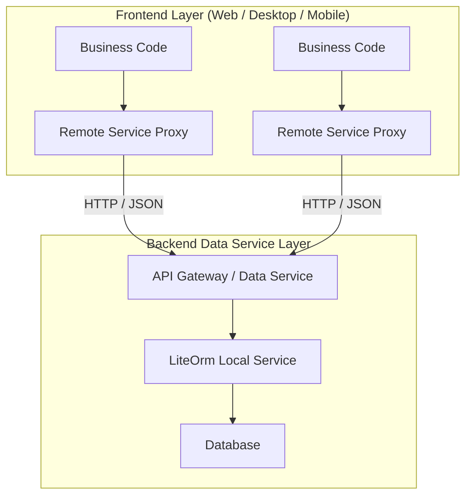
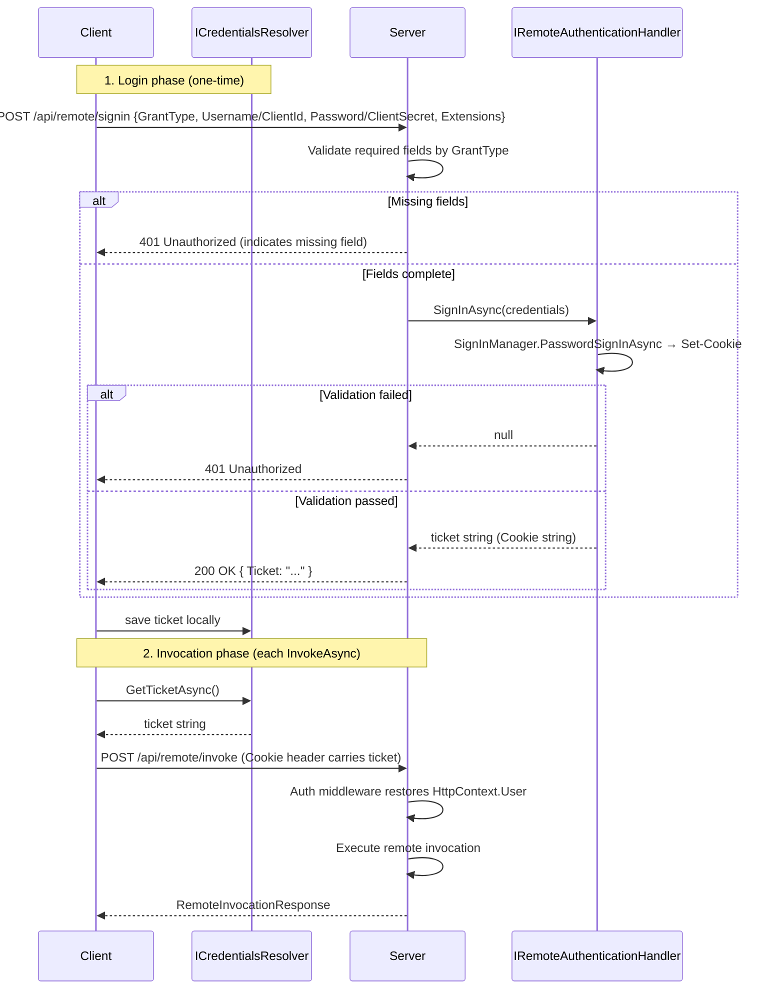
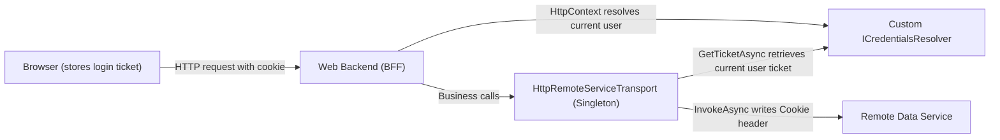

# Remote Service (LiteOrm.Remote)

LiteOrm provides a complete remote service invocation solution, allowing business code to switch seamlessly between "local calls" and "remote calls" — **the interface definition stays the same, the call syntax stays the same**. Only the registration method needs to change to physically decouple the data access layer from the application process.

## 1. Overview

### 1.1 What Problem It Solves

In traditional monolithic applications, the data access layer and the application layer run within the same process, with database connection strings directly exposed in configuration files:

- Anyone with access to the application server can reach the database
- The frontend web project is tightly coupled with the database and cannot be independently deployed or scaled
- When multiple clients (Web, mobile, desktop) share the same codebase, database access logic cannot be reused

LiteOrm.Remote achieves physical separation of frontend and backend through **remote service proxies**:



| Value | Description |
|-------|-------------|
| **Database not exposed** | Connection strings exist only in the backend data service layer; the frontend layer cannot directly access the database |
| **Security isolation** | The frontend layer can only access data through controlled service interfaces; all queries pass through ExprValidator |
| **Multi-client reuse** | Web, desktop, and mobile share the same set of service interfaces; backend logic is maintained centrally |
| **Independent deployment** | The frontend and backend layers can be scaled and updated independently without affecting each other |
| **Interface unchanged** | Business code requires no changes — the local call `userService.InsertAsync(user)` and the remote call are written identically |

> **Compared to traditional approaches**: In traditional approaches, if both a web frontend and a desktop client need to access the database, you either maintain separate sets of data access code (redundant and error-prone) or manually wrap REST APIs (requiring extra Controllers and DTO mappings). LiteOrm.Remote makes the service interface definition itself the API protocol, eliminating the need for an additional wrapper layer.

### 1.2 Two NuGet Packages

| Package | Role | Description |
|---------|------|-------------|
| `LiteOrm.Remote` | Client | Generates dynamic proxies to intercept method calls and forward them to the server via HTTP |
| `LiteOrm.Remote.Server` | Server | Receives HTTP requests, parses them, resolves service instances from the DI container, and executes them |

Both ends share DTOs in `LiteOrm.Common` (`RemoteInvocationRequest` / `RemoteInvocationResponse`), ensuring protocol consistency.

---

## 2. Quick Start

Set up a runnable remote service invocation in 5 minutes. Both ends share the same service interface definition (typically placed in a separate `Contracts` class library).

### 2.1 Define the Service Interface

```csharp
using LiteOrm;
using LiteOrm.Service;

[Service]                                              // Mark as remote service
public interface IDemoUserService : IEntityServiceAsync<DemoUser>
{
    Task<DemoUser> GetByUserNameAsync(string userName);
}
```

### 2.2 Server

```bash
dotnet add package LiteOrm.Remote.Server
```

```csharp
using LiteOrm.Remote.Server;

var builder = WebApplication.CreateBuilder(args);
builder.Host.RegisterLiteOrm();        // Register LiteOrm main framework (with local service implementations)
builder.Services.AddRemoteServer();    // Register remote server

var app = builder.Build();
app.MapRemoteInvokeEndpoint();         // Map remote invocation endpoint
app.Run();
```

### 2.3 Client

```bash
dotnet add package LiteOrm.Remote
```

```csharp
using LiteOrm.Remote;

var host = Host.CreateDefaultBuilder(args)
    .RegisterLiteOrmRemote(opts =>
    {
        opts.RemoteServiceUri = new Uri("http://localhost:5000");
    })
    .Build();
```

### 2.4 Calling — Identical to Local Services

```csharp
using var scope = host.Services.CreateScope();
var userService = scope.ServiceProvider.GetRequiredService<IDemoUserService>();

var user = new DemoUser { UserName = "alice" };
await userService.InsertAsync(user);          // Id auto-write-back
Console.WriteLine($"New user Id = {user.Id}");

var loaded = await userService.GetByUserNameAsync("alice");
Console.WriteLine($"Loaded user: {loaded.UserName}");
```

> `AutoRegisterEntityServices` defaults to `true`. The framework automatically scans interfaces marked with `[Service]` and registers them as remote proxies — no manual registration needed.

---

## 3. Defining and Calling Services

### 3.1 `[Service]` Attribute: Declaring Remote Service Interfaces

```csharp
[Service]                                        // Expose as remote service, auto-register name mapping
public interface IDemoUserService : IEntityServiceAsync<DemoUser>
{
}

[Service(Name = "UserSvc")]                      // Custom service name
public interface IUserService
{
}

[Service(IsService = false)]                     // Explicitly disable remote invocation
public interface IInternalService
{
}
```

### 3.2 `[ServiceMethod]` Attribute: Method Alias

```csharp
public interface IUserService
{
    [ServiceMethod(MethodName = "FindByAccount")]
    Task<User> GetByUserNameAsync(string userName);
}
```

When not specified, `MethodInfo.Name` is used as the method key.

### 3.3 Common Calling Patterns

#### Queries

```csharp
// Query by primary key
var user = await userService.GetObjectAsync(1);

// Lambda condition query
var admins = await userService.SearchAsync(u => u.Role == "Admin");

// Custom method
var user = await userService.GetByUserNameAsync("alice");

// Existence check and count
bool exists = await userService.ExistsAsync(u => u.UserName == "alice");
int count = await userService.CountAsync(u => u.Role == "Admin");
```

#### Writes

```csharp
// Insert (auto-increment Id auto-write-back)
var user = new User { UserName = "alice", Role = "Admin" };
await userService.InsertAsync(user);

// Update
user.DisplayName = "Alice Updated";
await userService.UpdateAsync(user);

// Batch insert (auto-increment Id per-item write-back)
var orders = new List<Order> { /* ... */ };
await orderService.BatchInsertAsync(orders);

// Update if exists, insert otherwise
await departmentService.UpdateOrInsertAsync(dept);

// Delete by condition
int deleted = await userService.DeleteAsync(u => u.UserName == "alice");
```

> Lambda condition queries are written identically to local services. The framework converts Lambda expressions to serializable `Expr` expression trees in the client process before transmission. See [Expression Guide](../02-core-usage/06-expr-guide.md).

---

## 4. Configuration

### 4.1 Server Configuration (`RemoteServerOptions`)

| Property | Type | Default | Description |
|----------|------|---------|-------------|
| `InvokePath` | `string` | `"api/remote/invoke"` | Remote invocation HTTP endpoint path |
| `SignInPath` | `string` | `"api/remote/signin"` | HTTP endpoint path for signing in (issuing identity tickets) |
| `EnableAuthentication` | `bool` | `true` | Enables Cookie authentication. When enabled, the SignIn endpoint creates an identity ticket via `HttpContext.SignInAsync`; the Invoke endpoint restores user context via `HttpContext.User` |
| `JsonSerializerOptions` | `JsonSerializerOptions` | `UnsafeRelaxedJsonEscaping` + case-insensitive | JSON serialization options |
| `ServiceTypeResolver` | `IRemoteServiceTypeResolver` | `DefaultServiceTypeResolver` | Service type resolver instance |
| `ServiceTypeResolverFactory` | `Func<IServiceProvider, IRemoteServiceTypeResolver>?` | `null` | Resolver factory, takes precedence over `ServiceTypeResolver` |
| `AutoRegisterEntityServices` | `bool` | `true` | Auto-scan interfaces with `[Service]` attribute |
| `Assemblies` | `Assembly[]?` | `null` | Scan assembly list; scans all referenced assemblies if not set |

### 4.2 Client Configuration (`LiteOrmOptions`)

| Property | Type | Description |
|----------|------|-------------|
| `RemoteServiceUri` | `Uri?` | Remote service base address. When set, automatically registers `HttpRemoteServiceTransport` based on `HttpClient` |
| `RemoteServicePath` | `string` | Request path relative to `RemoteServiceUri`, default `api/remote/invoke` |
| `RemoteSignInPath` | `string` | Sign-in path relative to `RemoteServiceUri`, default `api/remote/signin` (only used with built-in `StaticCredentialsResolver`) |
| `CredentialsResolver` | `ICredentialsResolver?` | Credentials resolver instance. On each `InvokeAsync`, the resolver provides an identity ticket written to the HTTP request header; `null` means anonymous connection |
| `CredentialsResolverFactory` | `Func<IServiceProvider, ICredentialsResolver>?` | Credentials resolver factory. Receives `IServiceProvider`, returns `ICredentialsResolver` instance. Takes precedence over `CredentialsResolver`, allowing DI service injection in the resolver |
| `ConfigureHttpClient` | `Action<HttpClient>?` | Configure the internal `HttpClient` (timeout, default headers, etc.) |
| `Transport` | `IRemoteServiceTransport?` | Custom transport layer instance. Takes precedence over `RemoteServiceUri`; if `TransportFactory` is also set, the factory takes precedence |
| `TransportFactory` | `Func<IServiceProvider, IRemoteServiceTransport>?` | Custom transport layer factory. Receives `IServiceProvider`, returns `IRemoteServiceTransport` instance. Takes precedence over `Transport`, allowing DI service injection in the transport layer (e.g. `ICredentialsResolver`) |
| `AutoRegisterEntityServices` | `bool` | Whether to auto-register all entity services as remote proxies, default `true` |
| `Assemblies` | `Assembly[]?` | Custom interface scan assembly list; scans all referenced assemblies if not set |

> **Required**: At least one of `Transport`, `TransportFactory`, or `RemoteServiceUri` must be set, otherwise `InvalidOperationException` is thrown during registration.

#### HTTP client tuning example

```csharp
opts.RemoteServiceUri = new Uri("http://localhost:5000");
opts.RemoteServicePath = "api/remote/invoke";
opts.ConfigureHttpClient = client =>
{
    client.Timeout = TimeSpan.FromSeconds(30);
    client.DefaultRequestHeaders.Add("X-Api-Key", "...");
};
```

### 4.3 `AutoRegisterEntityServices` Auto-Registration

Both server and client provide this setting, defaulting to `true`. The framework automatically scans interfaces marked with `[Service]` (and `IsService == true`):

- **Client**: Registers interfaces as remote proxies (Castle DynamicProxy), forwarding all method calls to the remote server
- **Server**: Registers name mappings, ensuring ServiceName consistency between both ends

**Registration rules**:
- If `[Service(Name = "CustomName")]` sets `Name`, that name is used
- Otherwise, the short name generated by `TypeResolverHelper.GetName(type)` is used (e.g. `IDemoUserService`, `IEntityServiceAsync<DemoUser>`)

### 4.4 Manual Registration and Factory Pattern

`AddRemoteService<TService>()` registers any service interface as a remote proxy. It does **not depend on `AutoRegisterEntityServices`** and can be used standalone or coexist with it (manual registration takes priority; auto-scan skips already registered interfaces):

```csharp
// Standalone: register one by one
services.AddRemoteService<IUserService>()
        .AddRemoteService<IOrderService>();

// Or coexist with AutoRegisterEntityServices
services.AddRemoteService<ISpecialService>();
```

| Registration Method | Applicable Scenario | Detection Method |
|---------------------|---------------------|------------------|
| `AutoRegisterEntityServices` | Auto-scan interfaces with `[Service]` attribute | `[Service]` attribute |
| `AddRemoteService<TService>()` | Manually register any service interface | Explicit type specification |
| `AddRemoteServiceGenerator<TFactory>()` | Aggregate multiple services through a factory | Auto-scan factory return types |

#### Factory Pattern

Define a factory interface aggregating multiple business services, register once via `AddRemoteServiceGenerator`:

```csharp
public interface RemoteServiceFactory
{
    IDemoUserService DemoUserService { get; }
    IDemoOrderService DemoOrderService { get; }
    IDemoDepartmentService DemoDepartmentService { get; }
}

services.AddRemoteServiceGenerator<RemoteServiceFactory>();

var factory = scope.ServiceProvider.GetRequiredService<RemoteServiceFactory>();
var user = await factory.DemoUserService.GetByUserNameAsync("alice");
```

---

## 5. Authentication

LiteOrm.Remote uses a **`ICredentialsResolver` + `IRemoteAuthenticationHandler`** ticket-based mechanism for user identity, replacing the traditional SessionID/Connect flow. The client obtains an identity ticket via `ICredentialsResolver` and writes it to the HTTP request header on each `InvokeAsync`; the server issues the ticket through `IRemoteAuthenticationHandler` at the SignIn endpoint, and the ASP.NET Core authentication middleware restores `HttpContext.User` at the Invoke endpoint. The framework does not provide a sign-out (SignOut) endpoint or interface method — ticket expiry and cleanup are handled by the caller.

Two grant types are supported:

| Grant Type | `AuthGrantType` | Required Fields | Use Case |
|------------|----------------|-----------------|----------|
| Password | `Password` (default) | `Username` + `Password` | Authenticating user identity with explicit credentials |
| Client Credentials | `ClientCredentials` | `ClientId` + `ClientSecret` | Authenticating client/application identity without a specific user (e.g., service-to-service calls) |

### 5.1 How It Works



### 5.2 Implementing `IRemoteAuthenticationHandler` on the Server

The server handles sign-in through `IRemoteAuthenticationHandler`. The framework does not register a handler automatically — you must register one manually, typically the built-in `IdentityRemoteAuthenticationHandler<TUser>`, or implement the interface directly for a custom auth flow.

```csharp
public interface IRemoteAuthenticationHandler
{
    // Validate credentials and issue a ticket; return null on validation failure
    Task<string?> SignInAsync(RemoteCredentials credentials, CancellationToken cancellationToken = default);
}
```

#### Option 1: Use `IdentityRemoteAuthenticationHandler<TUser>` (based on ASP.NET Core Identity)

If the server has ASP.NET Core Identity configured, you can use the framework-provided `IdentityRemoteAuthenticationHandler<TUser>` directly. It obtains the `SignInManager<TUser>` service from DI, calls `PasswordSignInAsync` in `SignInAsync` to validate username/password, and extracts the ticket from the `Set-Cookie` response header on success.

```csharp
using LiteOrm.Remote.Server;

// 1. Configure ASP.NET Core Identity
builder.Services.AddIdentity<MyUser, MyRole>()
    .AddEntityFrameworkStores<MyDbContext>();

// 2. Register IdentityRemoteAuthenticationHandler<TUser>
builder.Services.AddSingleton<IRemoteAuthenticationHandler, IdentityRemoteAuthenticationHandler<MyUser>>();

// 3. Register the remote server (set EnableAuthentication to false — Identity manages Cookie auth)
builder.Services.AddRemoteServer(options =>
{
    options.EnableAuthentication = false;
});
```

> `IdentityRemoteAuthenticationHandler<TUser>` only handles `AuthGrantType.Password` by default. To support `ClientCredentials` or custom ticket extraction, inherit and override `SignInAsync`.

#### Option 2: Implement `IRemoteAuthenticationHandler` directly (JWT example)

When not using ASP.NET Core Identity, implement the interface directly for full control over the auth flow. The following **JWT** example shows the server validating credentials and issuing a JWT token; the client writes the token to the `Authorization: Bearer` header on each `InvokeAsync`, and the server's JWT Bearer authentication middleware restores `HttpContext.User`.

**Server configuration and implementation:**

```csharp
using System.IdentityModel.Tokens.Jwt;
using System.Security.Claims;
using System.Text;
using LiteOrm.Common;
using LiteOrm.Remote.Server;
using Microsoft.AspNetCore.Authentication.JwtBearer;
using Microsoft.Extensions.DependencyInjection;
using Microsoft.IdentityModel.Tokens;

// 1. Configure JWT Bearer authentication (replaces the default Cookie auth)
var signingKey = new SymmetricSecurityKey(Encoding.UTF8.GetBytes("Your-Secret-Key-At-Least-32-Chars!!"));
builder.Services.AddAuthentication(JwtBearerDefaults.AuthenticationScheme)
    .AddJwtBearer(options =>
    {
        options.TokenValidationParameters = new TokenValidationParameters
        {
            ValidateIssuer = true,
            ValidIssuer = "LiteOrm.Remote",
            ValidateAudience = true,
            ValidAudience = "LiteOrm.Clients",
            ValidateLifetime = true,
            ValidateIssuerSigningKey = true,
            IssuerSigningKey = signingKey,
        };
    });

// 2. Register the JWT-based IRemoteAuthenticationHandler
builder.Services.AddSingleton<IRemoteAuthenticationHandler>(new JwtAuthHandler(signingKey));

// 3. Register the remote server (disable default Cookie auth — JWT Bearer takes over)
builder.Services.AddRemoteServer(options =>
{
    options.EnableAuthentication = false;
});
```

```csharp
/// <summary>
/// JWT-based IRemoteAuthenticationHandler: validates credentials and issues a JWT token.
/// </summary>
public class JwtAuthHandler : IRemoteAuthenticationHandler
{
    private const string Issuer = "LiteOrm.Remote";
    private const string Audience = "LiteOrm.Clients";
    private const int ExpiresMinutes = 60;

    private readonly SigningCredentials _signingCredentials;
    private readonly JwtSecurityTokenHandler _tokenHandler = new();

    public JwtAuthHandler(SecurityKey signingKey)
    {
        _signingCredentials = new SigningCredentials(signingKey, SecurityAlgorithms.HmacSha256);
    }

    public Task<string?> SignInAsync(RemoteCredentials credentials, CancellationToken cancellationToken = default)
    {
        // Custom credential validation (example: fixed username/password; query your DB in production)
        if (credentials.GrantType != AuthGrantType.Password
            || credentials.Username != "admin"
            || credentials.Password != "pass")
        {
            return Task.FromResult<string?>(null);
        }

        var claims = new[]
        {
            new Claim(ClaimTypes.Name, credentials.Username!),
            new Claim(ClaimTypes.Role, "Admin"),
        };
        var token = new JwtSecurityToken(
            issuer: Issuer,
            audience: Audience,
            claims: claims,
            expires: DateTime.UtcNow.AddMinutes(ExpiresMinutes),
            signingCredentials: _signingCredentials);
        return Task.FromResult<string?>(_tokenHandler.WriteToken(token));
    }
}
```

**Client configuration (JWT written to the `Authorization` header):**

```csharp
var host = Host.CreateDefaultBuilder(args)
    .RegisterLiteOrmRemote(opts =>
    {
        opts.RemoteServiceUri = new Uri("http://localhost:5000");

        // Register StaticCredentialsResolver via CredentialsResolverFactory
        opts.CredentialsResolverFactory = sp =>
        {
            var httpClient = new HttpClient { BaseAddress = opts.RemoteServiceUri };
            opts.ConfigureHttpClient?.Invoke(httpClient);
            return new StaticCredentialsResolver(httpClient, opts.RemoteSignInPath);
        };

        // Use TransportFactory to build the transport layer, resolving ICredentialsResolver from DI
        opts.TransportFactory = sp =>
        {
            var resolver = sp.GetRequiredService<ICredentialsResolver>();
            var httpClient = new HttpClient { BaseAddress = opts.RemoteServiceUri };
            opts.ConfigureHttpClient?.Invoke(httpClient);
            return new HttpRemoteServiceTransport(httpClient, resolver)
            {
                TicketHeaderName = "Authorization",  // default Cookie; switch to Authorization for JWT
                TicketFormat = "Bearer {0}",         // produces "Bearer <token>"
            };
        };
    })
    .Build();

// Log in once at startup to obtain the JWT token
using var scope = host.Services.CreateScope();
var resolver = scope.ServiceProvider.GetRequiredService<ICredentialsResolver>();
await ((StaticCredentialsResolver)resolver).LoginAsync(new RemoteCredentials
{
    GrantType = AuthGrantType.Password,
    Username = "admin",
    Password = "pass",
});
```

> The framework does not provide a sign-out endpoint. For JWT, the caller simply clears the cached client-side token; the server can control validity by shortening `ExpiresMinutes` or maintaining a token blacklist.

### 5.3 Registering the Server

```csharp
// Register IRemoteAuthenticationHandler (before or after AddRemoteServer)
// Using the built-in IdentityRemoteAuthenticationHandler<TUser>:
builder.Services.AddSingleton<IRemoteAuthenticationHandler, IdentityRemoteAuthenticationHandler<MyUser>>();
// Or using a JWT custom implementation:
// builder.Services.AddSingleton<IRemoteAuthenticationHandler>(new JwtAuthHandler(signingKey));
builder.Services.AddRemoteServer();
```

> **The framework does not register a default `IRemoteAuthenticationHandler`** — you must register one manually. If none is registered, the SignIn endpoint returns a 500 error prompting you to register a handler. The built-in `IdentityRemoteAuthenticationHandler<TUser>` is recommended, or implement the interface directly for a custom auth flow.

### 5.4 Implementing `ICredentialsResolver` on the Client

The client provides an identity ticket for each `InvokeAsync` via `ICredentialsResolver`:

```csharp
public interface ICredentialsResolver
{
    // Returns the identity ticket string; returning null means anonymous call (no ticket)
    Task<string?> GetTicketAsync(CancellationToken cancellationToken = default);
}
```

The framework provides `StaticCredentialsResolver` for single-user scenarios (background services, desktop clients): `LoginAsync` posts credentials to the server SignIn endpoint, the returned ticket is saved locally, and `GetTicketAsync` returns the cached ticket.

#### Registering via `LiteOrmOptions`

Register `StaticCredentialsResolver` via the `CredentialsResolverFactory` so the DI container manages its lifetime, and the transport layer can resolve it via the `ICredentialsResolver` interface:

```csharp
var host = Host.CreateDefaultBuilder(args)
    .RegisterLiteOrmRemote(opts =>
    {
        opts.RemoteServiceUri = new Uri("http://localhost:5000");

        // Register StaticCredentialsResolver via the factory
        opts.CredentialsResolverFactory = sp =>
        {
            var httpClient = new HttpClient { BaseAddress = opts.RemoteServiceUri };
            opts.ConfigureHttpClient?.Invoke(httpClient);
            return new StaticCredentialsResolver(httpClient, opts.RemoteSignInPath);
        };
    })
    .Build();

// Log in once at startup (resolve the resolver instance from the DI container)
using (var scope = host.Services.CreateScope())
{
    var resolver = scope.ServiceProvider.GetRequiredService<ICredentialsResolver>();
    await ((StaticCredentialsResolver)resolver).LoginAsync(new RemoteCredentials
    {
        GrantType = AuthGrantType.Password,
        Username = "admin",
        Password = "pass",
    });
}
// In subsequent business calls, HttpRemoteServiceTransport automatically retrieves
// the ticket via ICredentialsResolver and writes it to the request header on each InvokeAsync
```

> - When both `CredentialsResolver` and `CredentialsResolverFactory` are set, the factory takes precedence
> - Setting neither (`null`) means anonymous connection — `HttpRemoteServiceTransport` does not write a ticket header
> - `StaticCredentialsResolver` uses a `SemaphoreSlim` to serialize login/logout — thread-safe; `GetTicketAsync` reads the cached ticket reference and can be called concurrently

### 5.5 Multi-User Scenario: Custom `ICredentialsResolver`

`StaticCredentialsResolver` shares one ticket across the entire process and cannot distinguish multiple users. When a web backend needs to call the remote data service with the identity of "the end user of the current request" (BFF / gateway scenario), implement a custom `ICredentialsResolver` that reads the current user's ticket from `IHttpContextAccessor`:



#### Configuration

```csharp
builder.Services.AddHttpContextAccessor(); // required

builder.Host.RegisterLiteOrmRemote(opts =>
{
    opts.RemoteServiceUri = new Uri("http://localhost:5000");
    opts.CredentialsResolverFactory = sp =>
    {
        var httpCtxAccessor = sp.GetRequiredService<IHttpContextAccessor>();
        return new HttpContextTicketResolver(httpCtxAccessor);
    };
    // Use TransportFactory to build the transport layer with DI injection and configure the ticket header
    opts.TransportFactory = sp =>
    {
        var resolver = sp.GetRequiredService<ICredentialsResolver>();
        var httpClient = new HttpClient { BaseAddress = opts.RemoteServiceUri };
        opts.ConfigureHttpClient?.Invoke(httpClient);
        return new HttpRemoteServiceTransport(httpClient, resolver)
        {
            TicketHeaderName = "Cookie",   // forward browser cookie to the remote service
            TicketFormat = "{0}",
        };
    };
});

// Custom ICredentialsResolver: reads the current user's ticket from HttpContext
public class HttpContextTicketResolver : ICredentialsResolver
{
    private readonly IHttpContextAccessor _accessor;
    public HttpContextTicketResolver(IHttpContextAccessor accessor) => _accessor = accessor;

    public Task<string?> GetTicketAsync(CancellationToken cancellationToken = default)
    {
        var request = _accessor.HttpContext?.Request;
        // Read the remote service ticket named "RemoteTicket" from the browser cookie
        if (request is null || !request.Cookies.TryGetValue("RemoteTicket", out var ticket))
            return Task.FromResult<string?>(null);
        return Task.FromResult<string?>(ticket);
    }
}
```

#### Web Application Example: BFF Forwards Browser Cookie to Remote Service

```csharp
// 1. Login endpoint: BFF forwards user credentials to remote SignIn, writes returned ticket to browser cookie
app.MapPost("/api/login", async (HttpContext ctx, LoginDto dto, IHttpClientFactory httpFactory) =>
{
    var client = httpFactory.CreateClient("Remote");
    var json = JsonSerializer.Serialize(new RemoteCredentials
    {
        GrantType = AuthGrantType.Password,
        Username = dto.Username,
        Password = dto.Password,
    });
    var resp = await client.PostAsync("api/remote/signin",
        new StringContent(json, Encoding.UTF8, "application/json"));
    if (!resp.IsSuccessStatusCode)
    {
        ctx.Response.StatusCode = 401;
        return;
    }
    var body = await resp.Content.ReadAsStringAsync();
    using var doc = JsonDocument.Parse(body);
    var ticket = doc.RootElement.GetProperty("Ticket").GetString();

    // Write the ticket issued by the remote service to the browser cookie
    ctx.Response.Cookies.Append("RemoteTicket", ticket!, new CookieOptions
    {
        HttpOnly = true,
        MaxAge = TimeSpan.FromHours(2),
    });
});

// 2. BFF business endpoint calls the LiteOrm remote proxy; ticket forwarded automatically
app.MapGet("/api/me", async (HttpContext httpContext, IDemoUserService userService) =>
{
    // HttpContextTicketResolver reads HttpContext.Request.Cookies["RemoteTicket"]
    // and writes it to the Invoke request header; the remote service restores the user context via Cookie middleware
    var user = await userService.GetByUserNameAsync("alice");
    return Results.Ok(user);
});
```

> **Production notes**:
> - Storing tickets directly in cookies is insecure; prefer encryption or short-lived tokens
> - For stateless auth like JWT on the remote service, implement a custom `ICredentialsResolver` returning the JWT and set `HttpRemoteServiceTransport.TicketHeaderName = "Authorization"`, `TicketFormat = "Bearer {0}"`
> - When the ticket expires and the remote service returns 401, the caller must re-login to refresh the ticket

### 5.6 Accessing the Current User on the Server

The `Invoke` endpoint automatically restores `HttpContext.User` through the ASP.NET Core authentication middleware. To access the current user in business code, use `IHttpContextAccessor`:

```csharp
public class MyService
{
    private readonly IHttpContextAccessor _httpContextAccessor;
    public MyService(IHttpContextAccessor httpContextAccessor)
    {
        _httpContextAccessor = httpContextAccessor;
    }

    public Task DoSomethingAsync()
    {
        var user = _httpContextAccessor.HttpContext?.User;
        var userName = user?.Identity?.Name ?? "anonymous";
        // ...
    }
}
```

### 5.7 Disabling Built-in Authentication

To use JWT or other custom authentication schemes, set `EnableAuthentication = false`:

```csharp
builder.Services.AddRemoteServer(options =>
{
    options.EnableAuthentication = false;
});

// Configure your own authentication middleware
builder.Services.AddAuthentication(JwtBearerDefaults.AuthenticationScheme).AddJwtBearer(...);
```

---

## 6. Type Resolution and ServiceName

The server finds the corresponding `Type` based on `ServiceName` in the request, and the client generates `ServiceName`. Understanding this section helps with custom service names and handling same-name type conflicts.

### 6.1 `TypeResolverHelper` — Bidirectional Type Name ↔ Type Resolution

`LiteOrm.Common.TypeResolverHelper` is a public utility class providing bidirectional conversion between type names and `Type`.

| Method | Description |
|--------|-------------|
| `GetName(Type)` | Generates a serializable type name. Non-generic returns `Type.Name`; generic returns `BaseName<ParamShortName1,...>` (strips the backtick arity suffix) |
| `FindType(string typeName, string? defaultNamespace = null)` | Looks up a type by name |
| `Register(string name, Type type)` | Registers a custom name ↔ type mapping (**highest priority**) |
| `Unregister(string name)` | Unregisters a custom mapping |
| `TryParseGenericServiceName(string)` | Parses a generic service name into (baseName, paramName array), e.g. `IEntityService<User>` → `("IEntityService", ["User"])` |

`FindType` resolution order: custom registrations → `Type.GetType` → exact full name match → default namespace + short name → short name scan.

> **Generic type names**: Generic types should use the CLR name format `Foo`1` (with backtick arity suffix), to avoid conflicts with non-generic types of the same name.

### 6.2 `IRemoteServiceTypeResolver` — Server Type Resolver

The server uses `IRemoteServiceTypeResolver` to resolve the `ServiceName` (short type name) in the request to the actual service interface type.

| Implementation | Behavior |
|---------------|----------|
| `DefaultServiceTypeResolver` | Default implementation. Scans all assemblies by short type name when no namespace is specified; when `ServiceNamespace`/`ModelNamespace` is specified, prefers exact match by `Namespace.TypeName`, falling back to full assembly short-name scan on failure |
| `DelegateRemoteServiceTypeResolver` | Custom resolution logic via delegate |
| Custom `IRemoteServiceTypeResolver` | Full control over the resolution process |

```csharp
// Default: scan all assemblies by short type name
options.ServiceTypeResolver = new DefaultServiceTypeResolver();

// Specify namespaces for faster exact matching and to avoid name conflicts
options.ServiceTypeResolver = new DefaultServiceTypeResolver(
    serviceNamespace: "MyApp.Services",
    modelNamespace: "MyApp.Models");

// Or use a factory (can inject other DI services)
builder.Services.AddRemoteServer(options =>
{
    options.ServiceTypeResolverFactory = sp =>
        new DefaultServiceTypeResolver("MyApp.Services", "MyApp.Models");
});
```

### 6.3 ServiceName Consistency Convention

- When both ends enable `AutoRegisterEntityServices`, the framework ensures consistency automatically
- When manually registering custom names, both ends must call `TypeResolverHelper.Register`
- Generic service interfaces use the CLR name format `Foo`1` to look up open generics

---

## 7. Argument Write-back (ArgumentOut)

> Due to the **loss of reference semantics** in remote calls (parameters are deserialized new instances on the server), modifications to parameters on the server are not automatically reflected back to the client. The `[ArgumentOut]` family of attributes is used to declare parameters that need write-back, with the framework extracting write-back values on the server and applying them on the client.

### 7.1 `[IdentityOut]` — Auto-increment Primary Key Write-back

`IEntityServiceAsync<T>`'s `InsertAsync` / `BatchInsertAsync` are already annotated with `[IdentityOut]` by default. After calling, the Id is automatically written back:

```csharp
var user = new User { UserName = "alice" };
await userService.InsertAsync(user);
Console.WriteLine($"New user Id = {user.Id}");  // Id has been written back

var orders = new List<Order> { /* ... */ };
await orderService.BatchInsertAsync(orders);
foreach (var o in orders)
    Console.WriteLine($"OrderNo={o.OrderNo}, Id={o.Id}");  // Each Id has been written back
```

> **Dependency**: `IdentityOutAttribute` resolves the Identity column through `TableInfoProvider.Default`. Both client and server must register it (`LiteOrm` main library's `LiteOrmCoreInitializer` initializes it automatically).

### 7.2 `[CopyableOut]` — Full Object Write-back

Applicable to parameter types that implement the `ICopyable` interface. The server returns the parameter object itself directly, and the client copies it entirely to the original object via `ICopyable.CopyFrom`.

```csharp
public class CopyableUser : ICopyable
{
    public long Id { get; set; }
    public string Name { get; set; }
    public DateTime CreatedAt { get; set; }

    public void CopyFrom(object other)
    {
        var src = (CopyableUser)other;
        Id = src.Id;
        Name = src.Name;
        CreatedAt = src.CreatedAt;
    }
}

public interface ICopyableUserService
{
    Task CreateAsync([CopyableOut(typeof(CopyableUser))] CopyableUser user);
}
```

### 7.3 `ArgumentMode` Enum

| Value | Description | `ReturnType` Meaning |
|-------|-------------|----------------------|
| `Single` (default) | Single parameter write-back | The type of the write-back value |
| `Collection` | Iterates `IEnumerable`/`IList`, calling handler per item | Write-back value type for **each element** (framework automatically wraps as `List<ReturnType>` for serialization) |

### 6.4 Custom Write-back Handler

Implement the `IArgumentOutHandler` interface (in the `LiteOrm.Common` namespace), and mark the parameter with `[ArgumentOut(typeof(YourHandler), typeof(ReturnType))]`:

```csharp
using LiteOrm.Common;

public class TimestampOutHandler : IArgumentOutHandler
{
    public Type ReturnType { get; }

    // Constructor must accept a Type parameter (the framework passes attribute.ReturnType)
    public TimestampOutHandler(Type returnType) { ReturnType = returnType; }

    // Server: extract the value to send back from the parameter object
    public object GenerateReturnValue(object argument)
    {
        var entity = (MyEntity)argument;
        return entity.UpdatedAt;   // Return the server-generated timestamp
    }

    // Client: apply the write-back value to the original parameter object (keeping the reference unchanged)
    public void WriteBack(object originalArg, object returnValue)
    {
        var entity = (MyEntity)originalArg;
        entity.UpdatedAt = (DateTime)returnValue;
    }
}

// Usage
public interface IMyService
{
    Task InsertAsync([ArgumentOut(typeof(TimestampOutHandler), typeof(DateTime))] MyEntity entity);
}
```

**Handler instantiation rules**:

1. If the attribute itself directly implements `IArgumentOutHandler` (e.g. `[IdentityOut]`, `[CopyableOut]`), use the attribute instance itself
2. Otherwise, prefer resolving `HandlerType` from the DI container
3. If DI resolution fails, create via `(Type returnType)` constructor

> **Note**: The argument to `GenerateReturnValue` is a **deserialized copy generated on the server**; modifications to it do not affect the client. Write-back can only be done through return value + `WriteBack`.

---

## 8. Custom Transport Layer

Beyond the default HTTP transport, you can implement custom transports based on named pipes, gRPC, message queues, etc.

### 8.1 `IRemoteServiceTransport` Interface

The base interface for all transport layer implementations, containing only the invocation method — Connect/session management is no longer part of the transport layer:

```csharp
public interface IRemoteServiceTransport
{
    Task<RemoteInvocationResponse> InvokeAsync(
        RemoteInvocationRequest request, CancellationToken cancellationToken = default);
}
```

Authentication tickets are written to the request header inside `InvokeAsync` by `ICredentialsResolver`; the transport layer no longer maintains a separate Connect session.

### 8.2 `JsonRemoteServiceTransport` Abstract Base Class (Recommended)

In the `LiteOrm.Remote` namespace, handles request/response serialization and deserialization via `System.Text.Json`. **Custom transport layers should prefer inheriting from this class**, only needing to implement one abstract method:

```csharp
public abstract class JsonRemoteServiceTransport : IRemoteServiceTransport
{
    // Already implemented: serialize request → call GetResponseJsonAsync → deserialize response
    public virtual async Task<RemoteInvocationResponse> InvokeAsync(
        RemoteInvocationRequest request, CancellationToken cancellationToken = default);

    // Subclass must implement: send the JSON string to the remote, return the response JSON string
    public abstract Task<string> GetResponseJsonAsync(
        string requestJson, CancellationToken cancellationToken = default);
}
```

**Built-in serialization config**: `UnsafeRelaxedJsonEscaping` + `PropertyNameCaseInsensitive = true`.

**Inheritance example** (named pipe based):

```csharp
using LiteOrm.Common;

public class NamedPipeTransport : JsonRemoteServiceTransport
{
    private readonly string _pipeName;
    public NamedPipeTransport(string pipeName) => _pipeName = pipeName;

    public override async Task<string> GetResponseJsonAsync(
        string requestJson, CancellationToken cancellationToken = default)
    {
        using var client = new NamedPipeClientStream(".", _pipeName);
        await client.ConnectAsync(cancellationToken);
        var bytes = Encoding.UTF8.GetBytes(requestJson);
        await client.WriteAsync(bytes.AsMemory(0, bytes.Length), cancellationToken);
        // Read response JSON ...
        return responseJson;
    }
}

opts.Transport = new NamedPipeTransport("liteorm-remote");
```

### 8.3 Default HTTP Transport (`HttpRemoteServiceTransport`)

Built-in subclass of `JsonRemoteServiceTransport`, based on `HttpClient`. Configure via `RemoteServiceUri` + `ConfigureHttpClient` (see [Section 4.2](#42-client-configuration-liteormoptions)).

The constructor accepts an `ICredentialsResolver?`; in `GetResponseJsonAsync` it obtains the ticket via `GetTicketAsync` and writes it to the HTTP request header using `TicketHeaderName` (default `Cookie`) and `TicketFormat` (default `{0}`):

```csharp
public sealed class HttpRemoteServiceTransport : JsonRemoteServiceTransport
{
    public string TicketHeaderName { get; set; } = "Cookie";   // ticket request header name
    public string TicketFormat { get; set; } = "{0}";          // ticket format template (e.g. "Bearer {0}")

    public HttpRemoteServiceTransport(HttpClient httpClient,
        ICredentialsResolver? credentialsResolver = null,
        string requestUri = "api/remote/invoke");
}
```

### 8.4 Fully Custom Transport

Implement `IRemoteServiceTransport` directly (without inheriting `JsonRemoteServiceTransport`), handling serialization yourself:

```csharp
public class MyTransport : IRemoteServiceTransport
{
    public Task<RemoteInvocationResponse> InvokeAsync(
        RemoteInvocationRequest request, CancellationToken cancellationToken)
    {
        // Must handle request serialization, transport, and response deserialization on your own
        // Tickets can be obtained at call time via an ICredentialsResolver injected through the constructor
    }
}

opts.Transport = new MyTransport();
```

---

## 9. Serialization Constraints

Remote service invocation **completely relies on JSON serialization of input parameters and return values**. Understanding the following constraints helps avoid common pitfalls.

| Constraint | Description |
|------------|-------------|
| **Loss of reference semantics** | Parameter objects are deserialized new instances on the server; modifications to them are not automatically reflected back to the client. Use `[ArgumentOut]` attributes when write-back is needed |
| **Circular references not supported** | `System.Text.Json` does not support circular references by default; parameter/return value object graphs must be tree-shaped |
| **Types must be serializable** | Parameter and return value types must be public, have a parameterless constructor, and public readable/writable properties. Private fields and read-only collections do not participate in serialization |
| **`CancellationToken` not serialized** | The cancellation token is passed end-to-end by the transport layer as call context and does not appear in `Arguments` |
| **`Expr` parameters serialized by declared type** | Lambda expressions written in business code are **first converted to `Expr` derived classes** in the client process by `LambdaExprConverter.ToLogicExpr` before transmission. `Expression<Func<T,bool>>` itself is never serialized |

For the JSON structure of requests and responses, see [Expression Serialization](../04-extensibility/04-expr-serialization.md) and the source code `LiteOrm.Common/Remote/RemoteInvocationMessage.cs`.

---

## 10. Notes

1. **`ForEachAsync` is not supported for remote calls**: Streaming iteration requires continuous data return, which the remote protocol does not support; throws `NotSupportedException`
2. **`CancellationToken` transparent passing**: The cancellation token is not serialized; it is passed end-to-end by the transport layer
3. **Client and server must register the same `TableInfoProvider.Default`**: `IdentityOutAttribute` resolves the Identity column through `TableInfoProvider.Default`, with no reflection fallback
4. **`ServiceName` consistency**: When both ends enable `AutoRegisterEntityServices`, the framework ensures consistency automatically; when manually registering custom names, both ends must call `TypeResolverHelper.Register`
5. **Generic service interfaces**: `DefaultServiceTypeResolver` uses the CLR name format `Foo`1` to look up open generics, avoiding conflicts with non-generic types of the same name
6. **Base interface method inheritance**: Methods declared in the service type and all its base interfaces can be invoked; throws `AmbiguousMatchException` on duplicate method keys
7. **Castle DynamicProxy compatibility**: When intercepting methods inherited from base interfaces, the framework automatically resolves the most derived service interface

### Comparison with Local Services

| Dimension | Local Service | Remote Service |
|-----------|---------------|----------------|
| Registration | `RegisterLiteOrm` auto-scans `[Service]` | `RegisterLiteOrmRemote` + proxy registration |
| Invocation | Direct reflection call | Dynamic proxy interception + HTTP forwarding |
| Transactions | `[Transaction]` AOP | Cross-process transactions not supported (see [Transactions Guide](01-transactions.en.md)) |
| `ForEachAsync` | Streaming iteration | Throws `NotSupportedException` |
| Parameter write-back | Direct object modification | Serialized write-back via `OutArguments` |
| Exception propagation | Original exception | `RemoteInvocationResponse.Error` carries exception info |

---

## 11. Features and Advantages

| Feature | Description |
|---------|-------------|
| **Zero intrusion** | Business code requires no changes — local and remote calls are written identically; only the registration method changes |
| **Interface as contract** | The service interface definition itself is the API protocol; no need to write Controllers, DTO mappings, or OpenAPI docs |
| **Auto Identity write-back** | `[IdentityOut]` attribute automatically handles auto-increment primary key write-back; batch insert supports collection mode write-back |
| **Flexible transport layer** | Built-in HTTP transport; quickly implement named pipe, gRPC, and other custom transports by inheriting `JsonRemoteServiceTransport` |
| **Smart type resolution** | `$type` wrapping strategy automatically handles parameter type polymorphism; `TypeResolverHelper` supports custom service name registration |
| **Auto-registration** | `AutoRegisterEntityServices` enabled by default; scans `[Service]` attribute to automatically complete name mapping and proxy registration |
| **Progressive evolution** | Smoothly evolve from a monolithic app (`RegisterLiteOrm`) to frontend-backend separation (`RegisterLiteOrmRemote`) without changing service interface definitions |

---

## Related Links

- [Configuration and Registration](../01-getting-started/03-configuration-and-registration.en.md) — Full documentation for `RegisterLiteOrm` / `RegisterLiteOrmRemote`
- [Expression Guide](../02-core-usage/06-expr-guide.en.md) — Lambda condition queries, also applicable to remote calls
- [Expression Serialization](../04-extensibility/04-expr-serialization.en.md) — Serialization mechanism for `Expr` expression trees
- [RemoteServiceDemo.cs](https://github.com/danjiewu/LiteOrm/tree/master/LiteOrm.Demo/Demos/RemoteServiceDemo.cs) — 13 typical client operation scenarios
