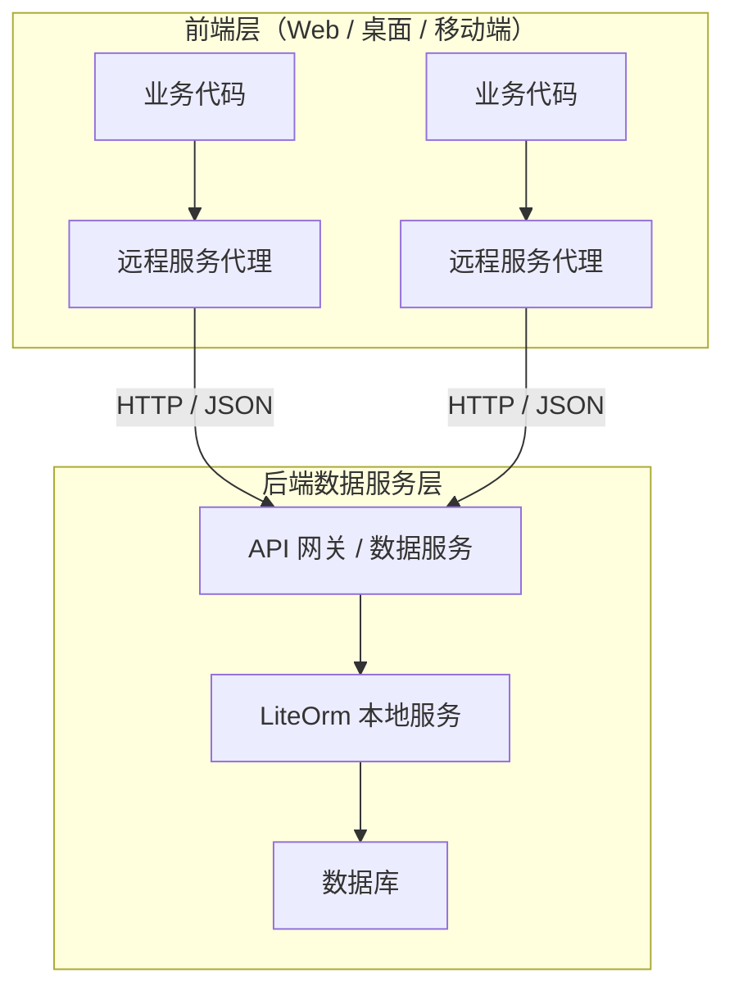

# 远程服务（LiteOrm.Remote）

LiteOrm 提供完整的远程服务调用方案，让业务代码在「本地调用」和「远程调用」之间无缝切换——**接口定义不变、调用写法不变**，只需更换注册方式即可将数据访问层从应用进程中物理剥离。

## 一、概述

### 1.1 它解决什么问题

在传统单体应用中，数据访问层与应用层运行在同一进程，数据库连接串直接暴露在配置文件中：

- 任何能访问应用服务器的人都能触达数据库
- 前端 Web 项目与数据库紧耦合，无法独立部署和扩展
- 多端（Web、移动端、桌面端）共享同一套代码时，数据访问逻辑无法复用

LiteOrm.Remote 通过**远程服务代理**实现前后端的物理分离：



| 价值 | 说明 |
|------|------|
| **数据库不暴露** | 连接串仅存在于后端数据服务层，前端层无法直接访问数据库 |
| **安全隔离** | 前端层只能通过受控的服务接口访问数据，所有查询经过 ExprValidator 验证 |
| **多端复用** | Web、桌面、移动端共享同一套服务接口，后端逻辑统一维护 |
| **独立部署** | 前端层和后端层可独立扩容、独立更新，互不影响 |
| **接口不变** | 业务代码无需改动——`userService.InsertAsync(user)` 本地与远程写法完全一致 |

> **对比传统方案**：传统方案中，如果 Web 前端和桌面客户端都需要访问数据库，要么各自维护一套数据访问代码（重复且易出错），要么通过 REST API 手动封装（需额外编写 Controller 和 DTO 映射）。LiteOrm.Remote 让服务接口定义本身就成为 API 协议，无需额外封装层。

### 1.2 两个 NuGet 包

| 包 | 角色 | 说明 |
|----|------|------|
| `LiteOrm.Remote` | 客户端 | 生成动态代理拦截方法调用，通过 HTTP 转发到服务端 |
| `LiteOrm.Remote.Server` | 服务端 | 接收 HTTP 请求，解析后从 DI 容器解析服务实例并执行 |

两端共享 `LiteOrm.Common` 中的 DTO（`RemoteInvocationRequest` / `RemoteInvocationResponse`），保证协议一致。

---

## 二、快速开始

5 分钟搭建一个可运行的远程服务调用。两端共享同一个服务接口定义（通常放在独立的 `Contracts` 类库中）。

### 2.1 定义服务接口

```csharp
using LiteOrm;
using LiteOrm.Service;

[Service]                                              // 标记为远程服务
public interface IDemoUserService : IEntityServiceAsync<DemoUser>
{
    Task<DemoUser> GetByUserNameAsync(string userName);
}
```

### 2.2 服务端

```bash
dotnet add package LiteOrm.Remote.Server
```

```csharp
using LiteOrm.Remote.Server;

var builder = WebApplication.CreateBuilder(args);
builder.Host.RegisterLiteOrm();        // 注册 LiteOrm 主框架（含本地服务实现）
builder.Services.AddRemoteServer();    // 注册远程服务端

var app = builder.Build();
app.MapRemoteInvokeEndpoint();         // 映射远程调用端点
app.Run();
```

### 2.3 客户端

```bash
dotnet add package LiteOrm.Remote
```

```csharp
using LiteOrm.Remote;

var host = Host.CreateDefaultBuilder(args)
    .RegisterLiteOrmRemote(opts =>
    {
        opts.RemoteServiceUri = new Uri("http://localhost:5000");
    })
    .Build();
```

### 2.4 调用——与本地服务完全一致

```csharp
using var scope = host.Services.CreateScope();
var userService = scope.ServiceProvider.GetRequiredService<IDemoUserService>();

var user = new DemoUser { UserName = "alice" };
await userService.InsertAsync(user);          // Id 自动回写
Console.WriteLine($"新增用户 Id = {user.Id}");

var loaded = await userService.GetByUserNameAsync("alice");
Console.WriteLine($"查询到用户：{loaded.UserName}");
```

> `AutoRegisterEntityServices` 默认为 `true`，框架自动扫描带 `[Service]` 特性的接口并注册为远程代理，无需手动逐个注册。

---

## 三、定义与调用服务

### 3.1 `[Service]` 特性：声明远程服务接口

```csharp
[Service]                                        // 暴露为远程服务，自动注册名称映射
public interface IDemoUserService : IEntityServiceAsync<DemoUser>
{
}

[Service(Name = "UserSvc")]                      // 自定义服务名
public interface IUserService
{
}

[Service(IsService = false)]                     // 显式禁用远程调用
public interface IInternalService
{
}
```

### 3.2 `[ServiceMethod]` 特性：为方法指定别名

```csharp
public interface IUserService
{
    [ServiceMethod(MethodName = "FindByAccount")]
    Task<User> GetByUserNameAsync(string userName);
}
```

未标注时使用 `MethodInfo.Name` 作为方法键。

### 3.3 常用调用模式

#### 查询

```csharp
// 按主键查询
var user = await userService.GetObjectAsync(1);

// Lambda 条件查询
var admins = await userService.SearchAsync(u => u.Role == "Admin");

// 自定义方法
var user = await userService.GetByUserNameAsync("alice");

// 存在性检查与计数
bool exists = await userService.ExistsAsync(u => u.UserName == "alice");
int count = await userService.CountAsync(u => u.Role == "Admin");
```

#### 写入

```csharp
// 新增（自增 Id 自动回写）
var user = new User { UserName = "alice", Role = "Admin" };
await userService.InsertAsync(user);

// 更新
user.DisplayName = "Alice Updated";
await userService.UpdateAsync(user);

// 批量新增（自增 Id 逐项回写）
var orders = new List<Order> { /* ... */ };
await orderService.BatchInsertAsync(orders);

// 存在则更新、不存在则新增
await departmentService.UpdateOrInsertAsync(dept);

// 按条件删除
int deleted = await userService.DeleteAsync(u => u.UserName == "alice");
```

> Lambda 条件查询的写法与本地服务完全一致，框架会在客户端进程内将 Lambda 转换为可序列化的 `Expr` 表达式树后传输。详见 [表达式指南](../02-core-usage/06-expr-guide.md)。

---

## 四、配置详解

### 4.1 服务端配置（`RemoteServerOptions`）

| 属性 | 类型 | 默认值 | 说明 |
|------|------|--------|------|
| `InvokePath` | `string` | `"api/remote/invoke"` | 远程调用 HTTP 端点路径 |
| `JsonSerializerOptions` | `JsonSerializerOptions` | `UnsafeRelaxedJsonEscaping` + 大小写不敏感 | JSON 序列化选项 |
| `ServiceTypeResolver` | `IRemoteServiceTypeResolver` | `DefaultServiceTypeResolver` | 服务类型解析器实例 |
| `ServiceTypeResolverFactory` | `Func<IServiceProvider, IRemoteServiceTypeResolver>?` | `null` | 解析器工厂，优先级高于 `ServiceTypeResolver` |
| `AutoRegisterEntityServices` | `bool` | `true` | 自动扫描带 `[Service]` 特性的接口 |
| `Assemblies` | `Assembly[]?` | `null` | 扫描程序集列表，未设置则扫描所有引用程序集 |

### 4.2 客户端配置（`LiteOrmOptions`）

| 属性 | 类型 | 说明 |
|------|------|------|
| `RemoteServiceUri` | `Uri?` | 远程服务基础地址。设置后自动注册基于 `HttpClient` 的 `HttpRemoteServiceTransport` |
| `RemoteServicePath` | `string` | 相对于 `RemoteServiceUri` 的请求路径，默认 `api/remote/invoke` |
| `ConfigureHttpClient` | `Action<HttpClient>?` | 配置内部 `HttpClient`（超时、默认请求头等） |
| `Transport` | `IRemoteServiceTransport?` | 自定义传输层实例。设置后优先于 `RemoteServiceUri` |
| `AutoRegisterEntityServices` | `bool` | 是否自动注册所有实体服务为远程代理，默认 `true` |
| `Assemblies` | `Assembly[]?` | 自定义接口扫描程序集列表，未设置则扫描所有引用程序集 |

> **必填项**：`Transport` 或 `RemoteServiceUri` 至少设置一个，否则注册时抛出 `InvalidOperationException`。

#### HTTP 客户端调优示例

```csharp
opts.RemoteServiceUri = new Uri("http://localhost:5000");
opts.RemoteServicePath = "api/remote/invoke";
opts.ConfigureHttpClient = client =>
{
    client.Timeout = TimeSpan.FromSeconds(30);
    client.DefaultRequestHeaders.Add("X-Api-Key", "...");
};
```

### 4.3 `AutoRegisterEntityServices` 自动注册

服务端和客户端均提供此设置，默认为 `true`。框架自动扫描程序集中标记了 `[Service]`（且 `IsService == true`）的接口：

- **客户端**：将接口注册为远程代理（Castle DynamicProxy），所有方法调用转发到远程服务端
- **服务端**：注册名称映射，确保两端 ServiceName 一致

**注册规则**：
- 若 `[Service(Name = "CustomName")]` 设置了 `Name`，使用该名称注册
- 否则使用 `TypeResolverHelper.GetName(type)` 生成的短名（如 `IDemoUserService`、`IEntityServiceAsync<DemoUser>`）

### 4.4 手动注册与工厂模式

`AddRemoteService<TService>()` 用于手动注册任意服务接口为远程代理，**不依赖 `AutoRegisterEntityServices`**，可单独使用，也可与 `AutoRegisterEntityServices` 共存（手动注册优先，自动扫描会跳过已注册的接口）：

```csharp
// 单独使用：逐个注册
services.AddRemoteService<IUserService>()
        .AddRemoteService<IOrderService>();

// 或与 AutoRegisterEntityServices 共存
services.AddRemoteService<ISpecialService>();
```

| 注册方式 | 适用场景 | 检测方式 |
|----------|---------|----------|
| `AutoRegisterEntityServices` | 自动扫描带 `[Service]` 特性的接口 | `[Service]` 特性 |
| `AddRemoteService<TService>()` | 手动注册任意服务接口 | 显式指定类型 |
| `AddRemoteServiceGenerator<TFactory>()` | 通过工厂聚合多个服务 | 自动扫描工厂返回类型 |

#### 工厂模式

定义工厂接口聚合多个业务服务，通过 `AddRemoteServiceGenerator` 一次性注册：

```csharp
public interface RemoteServiceFactory
{
    IDemoUserService DemoUserService { get; }
    IDemoOrderService DemoOrderService { get; }
    IDemoDepartmentService DemoDepartmentService { get; }
}

services.AddRemoteServiceGenerator<RemoteServiceFactory>();

var factory = scope.ServiceProvider.GetRequiredService<RemoteServiceFactory>();
var user = await factory.DemoUserService.GetByUserNameAsync("alice");
```

---

## 五、类型解析与服务名

服务端根据请求中的 `ServiceName` 找到对应的 `Type`，客户端负责生成 `ServiceName`。理解这一节有助于自定义服务名和处理同名类型冲突。

### 5.1 `TypeResolverHelper` —— 类型名 ↔ 类型双向解析

`LiteOrm.Common.TypeResolverHelper` 是公共工具类，提供类型名与 `Type` 的双向转换。

| 方法 | 说明 |
|------|------|
| `GetName(Type)` | 生成类型可序列化名称。非泛型返回 `Type.Name`；泛型返回 `基名<参数短名1,...>`（去除反引号 arity 后缀） |
| `FindType(string typeName, string? defaultNamespace = null)` | 按名称查找类型 |
| `Register(string name, Type type)` | 注册自定义名称 ↔ 类型映射（**优先级最高**） |
| `Unregister(string name)` | 注销自定义映射 |
| `TryParseGenericServiceName(string)` | 解析泛型服务名为 (基名, 参数名数组)，如 `IEntityService<User>` → `("IEntityService", ["User"])` |

`FindType` 解析顺序：自定义注册 → `Type.GetType` → 精确全名匹配 → 默认命名空间 + 短名 → 短名扫描。

> **泛型类型名**：泛型类型应使用 CLR 名称格式 `Foo`1`（含反引号 arity 后缀），避免与同名的非泛型类型冲突。

### 5.2 `IRemoteServiceTypeResolver` —— 服务端类型解析器

服务端通过 `IRemoteServiceTypeResolver` 将请求中的 `ServiceName` 解析为实际服务接口类型。

| 实现 | 行为 |
|------|------|
| `DefaultServiceTypeResolver` | 默认实现。未指定命名空间时全程序集按类型短名扫描；指定 `ServiceNamespace`/`ModelNamespace` 后优先按 `命名空间.类型名` 精确匹配，失败再回退全程序集短名扫描 |
| `DelegateRemoteServiceTypeResolver` | 通过委托自定义解析逻辑 |
| 自定义实现 `IRemoteServiceTypeResolver` | 完全控制解析过程 |

```csharp
// 默认：全程序集按类型短名扫描
options.ServiceTypeResolver = new DefaultServiceTypeResolver();

// 指定命名空间，优先精确匹配、提升解析速度并避免同名类型冲突
options.ServiceTypeResolver = new DefaultServiceTypeResolver(
    serviceNamespace: "MyApp.Services",
    modelNamespace: "MyApp.Models");

// 或使用工厂（可注入其他 DI 服务）
builder.Services.AddRemoteServer(options =>
{
    options.ServiceTypeResolverFactory = sp =>
        new DefaultServiceTypeResolver("MyApp.Services", "MyApp.Models");
});
```

### 5.3 `ServiceName` 一致性约定

- 两端均启用 `AutoRegisterEntityServices` 时框架自动保证一致
- 手动注册自定义名称时，两端必须同时调用 `TypeResolverHelper.Register`
- 泛型服务接口使用 CLR 名格式 `Foo`1` 查找开放泛型

---

## 六、参数回写（ArgumentOut）

> 由于远程调用的**引用语义丢失**（参数在服务端是反序列化的新实例），服务端对参数的修改不会自动反映回客户端。`[ArgumentOut]` 系列特性用于声明需要回写的参数，由框架在服务端提取回写值、客户端应用回写值。

### 6.1 `[IdentityOut]` —— 自增主键回写

`IEntityServiceAsync<T>` 的 `InsertAsync` / `BatchInsertAsync` 已默认标注 `[IdentityOut]`，调用后 Id 自动回写：

```csharp
var user = new User { UserName = "alice" };
await userService.InsertAsync(user);
Console.WriteLine($"新增用户 Id = {user.Id}");  // Id 已回写

var orders = new List<Order> { /* ... */ };
await orderService.BatchInsertAsync(orders);
foreach (var o in orders)
    Console.WriteLine($"OrderNo={o.OrderNo}, Id={o.Id}");  // 每个 Id 都已回写
```

> **依赖**：`IdentityOutAttribute` 通过 `TableInfoProvider.Default` 解析 Identity 列，客户端与服务端均需注册（`LiteOrm` 主库的 `LiteOrmCoreInitializer` 会自动初始化）。

### 6.2 `[CopyableOut]` —— 整体回写

适用于实现了 `ICopyable` 接口的参数类型。服务端直接返回参数对象本身，客户端通过 `ICopyable.CopyFrom` 整体复制到原始对象。

```csharp
public class CopyableUser : ICopyable
{
    public long Id { get; set; }
    public string Name { get; set; }
    public DateTime CreatedAt { get; set; }

    public void CopyFrom(object other)
    {
        var src = (CopyableUser)other;
        Id = src.Id;
        Name = src.Name;
        CreatedAt = src.CreatedAt;
    }
}

public interface ICopyableUserService
{
    Task CreateAsync([CopyableOut(typeof(CopyableUser))] CopyableUser user);
}
```

### 6.3 `ArgumentMode` 枚举

| 值 | 说明 | `ReturnType` 含义 |
|----|------|-------------------|
| `Single`（默认） | 单个参数回写 | 回写值的类型 |
| `Collection` | 遍历 `IEnumerable`/`IList`，逐项调用 handler | **单个元素**的回写值类型（框架自动包装为 `List<ReturnType>` 序列化） |

### 6.4 自定义回写处理器

实现 `IArgumentOutHandler` 接口（位于 `LiteOrm.Common` 命名空间），通过 `[ArgumentOut(typeof(YourHandler), typeof(ReturnType))]` 标记参数：

```csharp
using LiteOrm.Common;

public class TimestampOutHandler : IArgumentOutHandler
{
    public Type ReturnType { get; }

    // 构造函数必须接受 Type 参数（框架将 attribute.ReturnType 传入）
    public TimestampOutHandler(Type returnType) { ReturnType = returnType; }

    // 服务端：从参数对象提取需要回传的值
    public object GenerateReturnValue(object argument)
    {
        var entity = (MyEntity)argument;
        return entity.UpdatedAt;   // 返回服务端生成的时间戳
    }

    // 客户端：将回写值应用到原始参数对象（保持引用不变）
    public void WriteBack(object originalArg, object returnValue)
    {
        var entity = (MyEntity)originalArg;
        entity.UpdatedAt = (DateTime)returnValue;
    }
}

// 使用
public interface IMyService
{
    Task InsertAsync([ArgumentOut(typeof(TimestampOutHandler), typeof(DateTime))] MyEntity entity);
}
```

**处理器实例化规则**：

1. 若特性自身直接实现 `IArgumentOutHandler`（如 `[IdentityOut]`、`[CopyableOut]`），使用特性实例本身
2. 否则优先从 DI 容器解析 `HandlerType`
3. DI 无法解析时，通过 `(Type returnType)` 构造函数创建

> **注意**：`GenerateReturnValue` 的参数是**服务端反序列化生成的副本**，对它的修改不会影响客户端。回写只能通过返回值 + `WriteBack` 完成。

---

## 七、自定义传输层

默认 HTTP 传输之外，可基于 named pipe、gRPC、消息队列等实现自定义传输。

### 7.1 `IRemoteServiceTransport` 接口

所有传输层实现的基础接口，只定义一个方法：

```csharp
public interface IRemoteServiceTransport
{
    Task<RemoteInvocationResponse> InvokeAsync(
        RemoteInvocationRequest request, CancellationToken cancellationToken = default);
}
```

### 7.2 `JsonRemoteServiceTransport` 抽象基类（推荐基类）

位于 `LiteOrm.Remote` 命名空间，基于 `System.Text.Json` 完成请求/响应的序列化与反序列化，**自定义传输层优先继承此类**，只需实现一个抽象方法：

```csharp
public abstract class JsonRemoteServiceTransport : IRemoteServiceTransport
{
    // 已实现：序列化 request → 调用 GetResponseJsonAsync → 反序列化 response
    public async Task<RemoteInvocationResponse> InvokeAsync(
        RemoteInvocationRequest request, CancellationToken cancellationToken = default);

    // 子类只需实现：发送 JSON 字符串到远端，返回响应 JSON 字符串
    public abstract Task<string> GetResponseJsonAsync(
        string requestJson, CancellationToken cancellationToken = default);
}
```

**内置序列化配置**：`UnsafeRelaxedJsonEscaping` + `PropertyNameCaseInsensitive = true`。

**继承示例**（基于 named pipe）：

```csharp
public class NamedPipeTransport : JsonRemoteServiceTransport
{
    private readonly string _pipeName;
    public NamedPipeTransport(string pipeName) => _pipeName = pipeName;

    public override async Task<string> GetResponseJsonAsync(
        string requestJson, CancellationToken cancellationToken = default)
    {
        using var client = new NamedPipeClientStream(".", _pipeName);
        await client.ConnectAsync(cancellationToken);
        var bytes = Encoding.UTF8.GetBytes(requestJson);
        await client.WriteAsync(bytes.AsMemory(0, bytes.Length), cancellationToken);
        // 读取响应 JSON ...
        return responseJson;
    }
}

opts.Transport = new NamedPipeTransport("liteorm-remote");
```

### 7.3 默认 HTTP 传输（`HttpRemoteServiceTransport`）

`JsonRemoteServiceTransport` 的内置子类，基于 `HttpClient`。通过 `RemoteServiceUri` + `ConfigureHttpClient` 即可配置（详见 [4.2 节](#42-客户端配置liteormoptions)）。

### 7.4 完全自定义传输

直接实现 `IRemoteServiceTransport`（不继承 `JsonRemoteServiceTransport`），需自行处理序列化：

```csharp
public class MyTransport : IRemoteServiceTransport
{
    public Task<RemoteInvocationResponse> InvokeAsync(
        RemoteInvocationRequest request, CancellationToken cancellationToken)
    {
        // 需自行完成 request 序列化、传输、response 反序列化
    }
}

opts.Transport = new MyTransport();
```

---

## 八、序列化约束

远程服务调用**完全依赖对输入参数和返回值的 JSON 序列化**。理解以下约束有助于避免常见陷阱。

| 约束 | 说明 |
|------|------|
| **引用语义丢失** | 参数对象在服务端是反序列化生成的新实例，对它的修改不会自动反映回客户端。需要回写时必须使用 `[ArgumentOut]` 特性 |
| **循环引用不支持** | `System.Text.Json` 默认不支持循环引用，参数/返回值对象图须为树形 |
| **类型必须可序列化** | 参数与返回值类型必须为公开类型、有无参构造函数、公共属性可读写。私有字段与只读集合不参与序列化 |
| **`CancellationToken` 不序列化** | 取消令牌作为调用上下文由传输层端到端透传，不出现在 `Arguments` 中 |
| **`Expr` 参数按声明类型序列化** | 业务代码中写的 Lambda 由 `LambdaExprConverter.ToLogicExpr` **在客户端进程内先转换为 `Expr` 派生类**再传输。`Expression<Func<T,bool>>` 本身不会被序列化 |

请求与响应的 JSON 结构参见 [表达式序列化](../04-extensibility/04-expr-serialization.md) 与源码 `LiteOrm.Common/Remote/RemoteInvocationMessage.cs`。

---

## 九、注意事项

1. **`ForEachAsync` 不支持远程调用**：流式遍历需要持续返回数据，远程协议不支持，会抛出 `NotSupportedException`
2. **`CancellationToken` 透传**：取消令牌不参与序列化，通过传输层端到端传递
3. **客户端与服务端必须注册相同的 `TableInfoProvider.Default`**：`IdentityOutAttribute` 通过 `TableInfoProvider.Default` 解析 Identity 列，无反射回退
4. **`ServiceName` 一致性**：两端均启用 `AutoRegisterEntityServices` 时框架自动保证一致；手动注册自定义名称时，两端必须同时调用 `TypeResolverHelper.Register`
5. **泛型服务接口**：`DefaultServiceTypeResolver` 使用 CLR 名格式 `Foo`1` 查找开放泛型，避免与非泛型同名类型冲突
6. **基接口方法继承**：服务类型及其所有基接口声明的方法均可被调用；遇到重复方法键时抛出 `AmbiguousMatchException`
7. **Castle DynamicProxy 兼容性**：拦截从基接口继承的方法时，框架内部自动解析最派生的服务接口

### 与本地服务的对比

| 维度 | 本地服务 | 远程服务 |
|------|---------|---------|
| 注册方式 | `RegisterLiteOrm` 自动扫描 `[Service]` | `RegisterLiteOrmRemote` + 代理注册 |
| 调用方式 | 直接反射调用 | 动态代理拦截 + HTTP 转发 |
| 事务 | `[Transaction]` AOP | 不支持跨进程事务（详见 [事务指南](01-transactions.md)） |
| `ForEachAsync` | 流式遍历 | 抛出 `NotSupportedException` |
| 参数回写 | 直接修改对象 | 通过 `OutArguments` 序列化回写 |
| 异常传播 | 原始异常 | `RemoteInvocationResponse.Error` 携带异常信息 |

---

## 十、特点与优势

| 特点 | 说明 |
|------|------|
| **零侵入** | 业务代码无需任何改动——本地调用与远程调用写法完全一致，只需切换注册方式 |
| **接口即契约** | 服务接口定义本身就是 API 协议，无需额外编写 Controller、DTO 映射或 OpenAPI 文档 |
| **Identity 自动回写** | `[IdentityOut]` 特性自动处理自增主键回写，批量插入也支持集合模式回写 |
| **灵活的传输层** | 内置 HTTP 传输，可通过继承 `JsonRemoteServiceTransport` 快速实现 named pipe、gRPC 等自定义传输 |
| **智能类型解析** | `$type` 包装策略自动处理参数类型多态；`TypeResolverHelper` 支持自定义服务名注册 |
| **自动注册** | `AutoRegisterEntityServices` 默认开启，扫描 `[Service]` 特性自动完成名称映射和代理注册 |
| **渐进式演进** | 可从单体应用（`RegisterLiteOrm`）平滑演进到前后端分离（`RegisterLiteOrmRemote`），服务接口定义不变 |

---

## 相关链接

- [配置与注册](../01-getting-started/03-configuration-and-registration.md) — `RegisterLiteOrm` / `RegisterLiteOrmRemote` 的完整说明
- [表达式指南](../02-core-usage/06-expr-guide.md) — Lambda 条件查询，远程调用同样适用
- [表达式序列化](../04-extensibility/04-expr-serialization.md) — `Expr` 表达式树的序列化机制
- [RemoteServiceDemo.cs](https://github.com/danjiewu/LiteOrm/tree/master/LiteOrm.Demo/Demos/RemoteServiceDemo.cs) — 客户端 13 种典型操作场景
