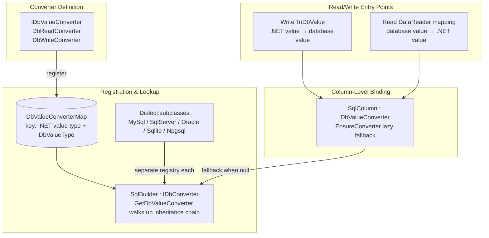
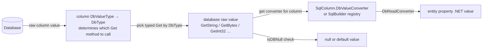
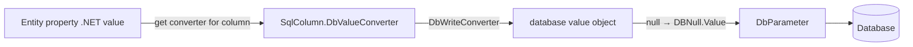
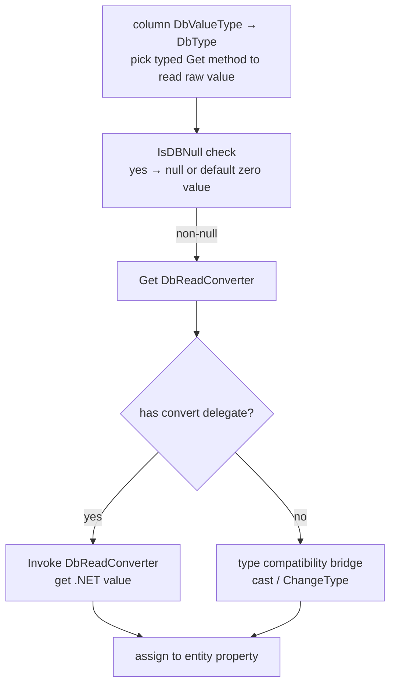
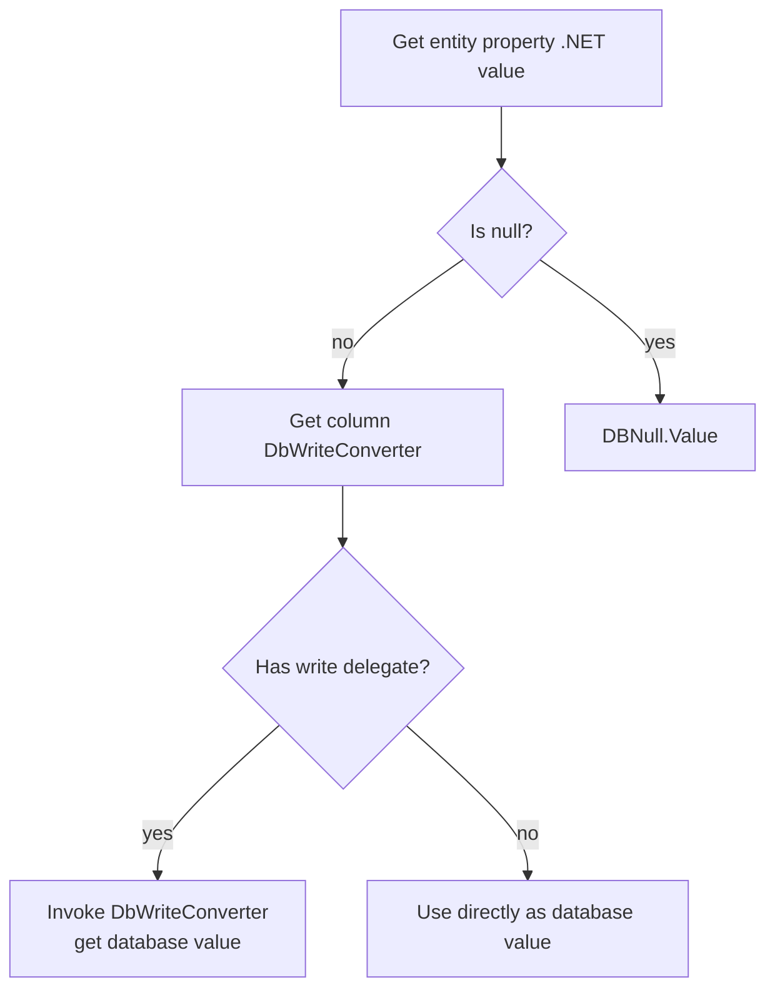
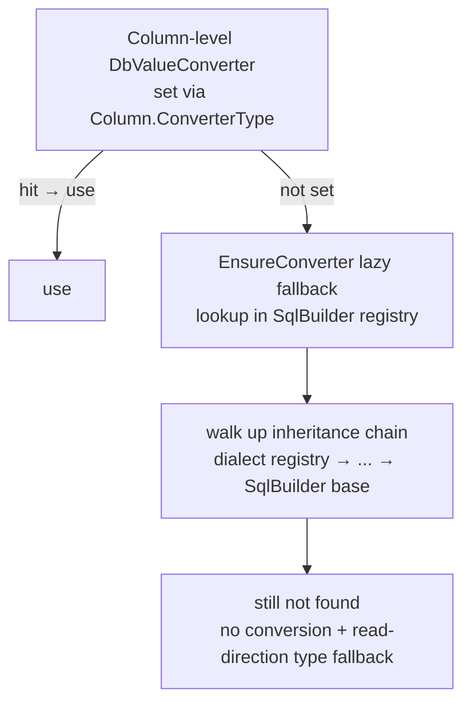

# Data Mapping & Value Conversion

LiteOrm's data mapping system handles bidirectional type conversion and data population between .NET entities and database columns. This article starts with the architecture overview, then focuses on the **database value → .NET value (read)** and **.NET value → database value (write)** conversion principles, and how to customize converters.

## 1. Architecture Overview

### 1.1 Component Relationships

The data mapping system consists of four layers: **converter definition / SqlBuilder registry / column-level binding / read-write entry points**.



**Layer responsibilities**:
- **Converter definition**: `IDbValueConverter` packages a read delegate (database value → .NET value) and a write delegate (.NET value → database value) into one unit.
- **SqlBuilder registry**: `SqlBuilder` itself implements `IDbConverter` — it is both a SQL generator and a converter registry. Each dialect subclass maintains an **independent** registry; lookup walks up the inheritance chain, so dialect registrations override base-class ones.
- **Column-level binding**: `SqlColumn` can hold a **column-level** converter (highest priority); when not specified, `EnsureConverter` lazily fills it in from the SqlBuilder registry.
- **Read/write entry points**: the read direction is driven by the DataReader mapper; the write direction is driven by the DAO when constructing SQL parameters. Both ultimately resolve to "that column's converter delegates."

> `DbValueType` is LiteOrm's internal abstraction of **database value types** (e.g., `Int32`, `String`, `Json`, `Binary`, `Date`), database-agnostic; `DbType` is the ADO.NET standard enum used for `DbParameter.DbType`. The mapping between them is done by each dialect's SqlBuilder.

### 1.2 Read/Write Data Flow

Read (query): `database → pick a Get method by column DbValueType→DbType to read raw value → (that column's converter) → DbReadConverter → entity property`



Write (insert/update/delete): `entity .NET value → (that column's converter) → DbWriteConverter → database value → DbParameter`



## 2. Conversion Principles: Database Value ↔ .NET Value

This is the heart of the entire mapping system. **A conversion is essentially translating a "database value" (described by `DbValueType`) into the .NET type of an entity property, or the reverse.**

### 2.1 One Converter, Two Directional Delegates

A single `IDbValueConverter` expresses the conversion rules for both directions:

- **Read direction `DbReadConverter`**: takes a database raw value and produces the entity property's .NET value. For example, date string `"2024-01-01"` → `DateTime`.
- **Write direction `DbWriteConverter`**: takes the entity property's .NET value and produces a value the database accepts. For example, `DateTime` → date string.

The two directions are independent — you can implement both, only one, or neither (meaning "pass-through"):
- A `null` delegate → that direction performs **no conversion**: direct assignment / direct return.
- In the read direction, if the types still don't match, the framework performs a **compatibility fallback** (compile-time cast; failing that, runtime `ChangeType`).

### 2.2 Read Direction: Database Value → .NET Value

The process has four steps:



Key points:
- **The Get method is decided by the column's DbValueType** (first step): the framework first resolves the column to a `DbValueType` (given by **that database Builder's `GetDbValueType(propertyType)`**), maps it to a `DbType`, then picks the typed read method accordingly — `String→GetString`, `Binary→GetBytes`, `Int32→GetInt32`… which determines the raw-value type fed to the converter. Therefore **the column's DbValueType must match its actual storage type, or the wrong Get method is called** (scenario in [7.3 VARBINARY example](#73-overriding-for-a-specific-database)).
- **Null handling is independent of the converter**: nullable/reference types get `null`, non-nullable value types get that type's zero value (`default`). The converter delegate itself does not handle null.
- **The converter's input type** (`TDbType`) must align with the return type of the Get method picked in the first step (e.g., `Binary→byte[]`, `String→string`), so the raw value can directly hit the strongly-typed delegate and avoid runtime bridging.

### 2.3 Write Direction: .NET Value → Database Value



Key points:
- **null always maps to `DBNull.Value`**, regardless of the converter.
- The write direction only honors **that column's converter** — it does not do an in-place fallback to the SqlBuilder registry (fallback happens during metadata initialization, see Chapter 3).

### 2.4 Converter Lookup Chain & Priority

Regardless of direction, the system must resolve "which converter does this column use." The resolution order is:



That is: **column-level attribute > dialect registration > base-class fallback registration > no conversion.**

### 2.5 Registration Target & Scope (RegisterDbValueConverter)

`RegisterDbValueConverter` is an extension method that **registers against the SqlBuilder type declared by the generic parameter `T`, independent of the instance passed in** (the instance is only used for invocation; the actual destination is the registry corresponding to `T`). So which instance calls it doesn't matter — what matters is which `T` you choose:

| `T` specified as | Registers into | Scope |
|------------------|----------------|-------|
| `SqlBuilder` (base) | SqlBuilder base registry | **Fallback for all databases** — any dialect hits it via the inheritance chain, unless that dialect overrides the same key |
| A dialect subclass (`MySqlBuilder`, etc.) | That dialect's independent registry | Effective only for that dialect; overrides base-class registrations for the same key |

So, to make a custom converter work for all databases, **register it once against the base class**:

```csharp
SqlBuilder.Instance.RegisterDbValueConverter<SqlBuilder, TDbType, TValueType>(
    targetType: <DbValueType>,
    fromDb: <database value> => <.NET value>,
    toDb:   <.NET value> => <database value>
);
```

If a specific database needs special handling, register again against that dialect type to override the base registration.

## 3. Built-in Default Conversions

At startup (first access to `SqlBuilder` triggers static initialization), the framework automatically registers common type conversions into the **base registry**, plus a few dialect-specific defaults.

### 3.1 Base Default Conversions (Common to All Databases)

| Value Type (.NET) | DB Value Type (DbValueType) | Read DB → .NET | Write .NET → DB |
|-------------------|----------------------------|----------------|-----------------|
| `bool` | various numeric types | `!= 0` → true | `true ? 1 : 0` |
| `bool` | Boolean | pass-through | pass-through |
| numeric types | various numeric DbValueTypes | numeric conversion | pass-through |
| `Guid` | Guid | pass-through | pass-through |
| `Guid` | Binary | `new Guid(byte[])` | `ToByteArray()` |
| `Guid` | String family | `Guid.Parse` | `ToString()` |
| `DateTime` / `DateTimeOffset` | Date/DateTime | pass-through | pass-through |
| `DateTimeOffset` | DateTime | construct `DateTimeOffset` | take `.DateTime` |
| `TimeSpan` | Time | pass-through | pass-through |
| `TimeSpan` | Int64 | `FromTicks` | `Ticks` |
| `string` | String family | pass-through | pass-through |
| `JsonNode` | Json / String | `JsonNode.Parse` | `ToJsonString()` |

### 3.2 Dialect-Specific Default Conversions

- **Oracle**: `bool` stored as integer (`≠0` / `1:0`); `Guid` stored as `byte[]` (`new Guid(byte[])` / `ToByteArray()`).
- **SQLite**: `DateTime`, `DateTimeOffset`, `TimeSpan` stored as text; parsed from strings on read, serialized with fixed formats on write.

> These cover common conventions only. When dialect differences are significant, use `RegisterDbValueConverter` to add or override behavior as needed.

## 4. Column-Level Converters

When a **specific column** needs a special type (e.g., enums, custom value objects), the column-level converter is the simplest approach — it has the highest priority and affects only that column.

### 4.1 Two Ways to Specify

- **Attribute-based** (most common): write `[Column(ConverterType = typeof(MyEnumConverter))]` on the entity property. The framework instantiates the converter when parsing column metadata and binds it to `SqlColumn`.
- **Code-based**: assign `SqlColumn.DbValueConverter` directly when dynamically constructing table metadata.

A converter used with `ConverterType` must: implement `IDbValueConverter` and have a public parameterless constructor.

### 4.2 Lazy Fallback

- If a column is **not** given a converter via the attribute, `SqlColumn` invokes `EnsureConverter` during metadata initialization to look up and fill one from the SqlBuilder registry by (property type, column type).
- Fallback runs once (batch-processed at table level with a double-checked lock).
- Thanks to this step, although the write direction only honors the column-level converter, that converter is usually already filled in — so globally registered converters take effect indirectly.

## 5. DataReader Mapping (Read Direction)

The mapper fills entity objects column-by-column from returned rows; it decides how the "read direction" executes and invokes the conversion delegates resolved per [Chapter 4](#4-column-level-converters). There are three mapping paths, ordered by performance (highest to lowest):

| Path | Trigger | Mechanism | Performance |
|------|---------|-----------|-------------|
| **Source generator pre-registration** | entity marked `[Table]` | compile-time generated per-column assignment, registered at startup | highest |
| **JIT expression-tree compilation** | runtime supports dynamic code | dynamically compiled mapping delegate | highest |
| **AOT reflection mapping** | NativeAOT (no dynamic code) | reflection assignment | moderate |

All three behave identically: per column, do an `IsDBNull` check → get that column's converter / typed read → assign to the entity property. They differ only in *how* they execute:
- **JIT path**: uses typed read methods (`GetInt32`/`GetString`…) to avoid boxing; when a column converter is hit, inlines the strongly-typed delegate into the compiled code; keeps a dual-layer cache (by type and by column schema).
- **AOT path**: uses a unified `GetValue()` read (returns object), bridges via the non-generic delegate or `ChangeType`, assigns via reflection, and has lower performance; but `[Table]` entities hit the source-generator path with JIT-comparable performance.
- **Source-generator path**: targets `[Table]` entities, no reflection, no boxing; the recommended option under AOT.

> Tip: normal runtime code can rely on the JIT path; for NativeAOT builds, mark entities `[Table]` to hit the source-generator implementation for near-JIT performance.

## 6. JsonNode Mapping (Navigation)

`JsonNode` (`JsonObject` / `JsonArray` / `JsonValue`) enjoys first-class treatment in LiteOrm:

- **Auto-mapping**: properties of type `JsonNode` are automatically mapped to JSON columns (stored as strings) with automatic serialization/deserialization (see the base default conversions in [Chapter 3](#3-built-in-default-conversions)).
- **Lambda queries**: indexers and `GetValue<T>()` can query JSON fields directly — see [Lambda Query Guide](../02-core-usage/05-lambda-guide.en.md#7-jsonnode-queries).
- **Expr expressions**: functions such as `JsonExtract`, `JsonValue`, `JsonQuery`, `JsonContains`, `JsonObject`, `JsonArray`, `IsJson` are supported — see [Expression Extension](../04-extensibility/01-expression-extension.en.md#9-json-function-extensions).

## 7. Complete Example: Custom IP Address Converter

A full example showing how to customize a converter and make it work for all databases.

**Scenario**: the business uses `System.Net.IPAddress` for IP addresses, stored as `VARCHAR(45)` strings. Implement an `IPAddress ↔ string` bidirectional conversion.

### 7.1 Implement the Converter

```csharp
using System.Net;
using LiteOrm.Common;

public sealed class IPAddressConverter : IDbValueConverter<string, IPAddress>
{
    public Type ValueType => typeof(IPAddress);

    // Generic strong version (hit by JIT path, no boxing)
    DbConvertHandler<string, IPAddress>? IDbValueConverter<string, IPAddress>.DbReadConverter
        => dbValue => IPAddress.Parse(dbValue);

    DbConvertHandler<IPAddress, object>? IDbValueConverter<string, IPAddress>.DbWriteConverter
        => value => value.ToString();

    // Non-generic version (used by AOT reflection path)
    DbConvertHandler? IDbValueConverter.DbReadConverter
        => dbValue => IPAddress.Parse((string)dbValue!);

    DbConvertHandler? IDbValueConverter.DbWriteConverter
        => value => ((IPAddress)value!).ToString();
}
```

> Null values are handled uniformly by the framework; the converter itself does not handle null.

### 7.2 Global Registration (Recommended; Applies to All Databases)

**Register once with `T = SqlBuilder`** as the base fallback for all databases:

```csharp
using static LiteOrm.Common.DbValueType;

SqlBuilder.Instance.RegisterDbValueConverter<SqlBuilder, string, IPAddress>(
    targetType: String,
    fromDb: s => IPAddress.Parse(s),   // read: string → IPAddress
    toDb:   ip => ip.ToString()        // write: IPAddress → string
);
```

After registration, any `IPAddress` property (whose column's DbValueType is String) automatically uses this converter — no need to mark each one:

```csharp
[Table("Servers")]
public class Server
{
    [Column("Id", IsPrimaryKey = true)]
    public int Id { get; set; }

    [Column("Name")]
    public string Name { get; set; }

    // No ConverterType needed; global registration applies automatically
    [Column("IpAddress")]
    public IPAddress? IpAddress { get; set; }

    [Column("Gateway")]
    public IPAddress? Gateway { get; set; }
}
```

Usage is identical to ordinary properties:

```csharp
// Insert: automatically calls the write delegate to convert IPAddress to string
await serverDAO.InsertAsync(new Server
{
    Name = "web-01",
    IpAddress = IPAddress.Parse("192.168.1.100")
});

// Query: automatically calls the read delegate to convert string to IPAddress
var server = await serverDAO.GetObjectAsync(1);
Console.WriteLine(server.IpAddress); // 192.168.1.100
```

### 7.3 Overriding for a Specific Database

If one database stores IPs as `VARBINARY`, you need to do **two** things: register a `byte[] ↔ IPAddress` converter, **and** make that database resolve the `IPAddress` column to the `Binary` DbValueType (see [2.2 Read Direction](#22-read-direction-database-value--net-value): otherwise the framework still calls `GetString` per the `String` type, mismatching the binary data).

```csharp
// 1) Register byte[] ↔ IPAddress converter on that dialect (overrides the base)
MySqlBuilder.Instance.RegisterDbValueConverter<MySqlBuilder, byte[], IPAddress>(
    targetType: Binary,              // note: read method maps Binary → GetBytes(byte[])
    fromDb: b => new IPAddress(b),
    toDb:   ip => ip.GetAddressBytes()
);
```

The second step is making that database's Builder decide the `IPAddress` column's DbValueType. `IDbConverter.GetDbValueType(type)` defaults to the global `DbValueTypeMap` mapping (`IPAddress` is not in the table, so it falls back to `Object`), so you should override `GetDbValueTypeInternal` in that **dialect Builder** to resolve `IPAddress` as `Binary`:

```csharp
// 2) Override that database Builder's GetDbValueTypeInternal to resolve IPAddress as Binary
public class MySqlBinaryIpBuilder : MySqlBuilder
{
    protected override DbValueType GetDbValueTypeInternal(Type type)
        => type == typeof(IPAddress) ? DbValueType.Binary : base.GetDbValueTypeInternal(type);
}
```

> Key point: registering the converter only solves "byte[] ↔ IPAddress"; for the column to be correctly read as `byte[]`, its DbValueType must be `Binary`. Both are required. If you don't want to subclass the Builder for one dialect, you can instead use `DbValueTypeMap.Set(typeof(IPAddress), DbValueType.Binary)` globally — but that affects all databases, so use with care.

### 7.4 Column-Level Usage (When Global Registration Does Not Apply)

If only an individual column needs a special conversion and you don't want to affect the whole app, use `ConverterType` on the property:

```csharp
[Column("IpAddress", ConverterType = typeof(IPAddressConverter))]
public IPAddress? IpAddress { get; set; }
```

The column level has the highest priority and overrides both global and dialect registrations.

### 7.5 Robustness Tips

In production, use `TryParse` as a fallback so dirty data doesn't fail entire queries:

```csharp
DbConvertHandler<string, IPAddress>? IDbValueConverter<string, IPAddress>.DbReadConverter
    => dbValue => IPAddress.TryParse(dbValue, out var ip)
        ? ip
        : null!;   // return null or a default per business rules on parse failure
```

> Exceptions from column-level converters (JIT path) are wrapped by the mapper with column name/ordinal for easier diagnosis.

## 8. AOT vs Non-AOT Differences

| Dimension | JIT (Non-AOT) | AOT (NativeAOT) |
|-----------|---------------|-----------------|
| Converter registration | identical | identical |
| Mapping implementation | expression-tree compilation | reflection assignment |
| Read method | typed read, no boxing | unified `GetValue()` + bridging |
| Converter invocation | compile-time inlined strong delegate | runtime non-generic delegate |
| Performance | highest | moderate; `[Table]` entities hit source generator ≈ JIT |
| Trimming safety | needs `[RequiresDynamicCode]` | fully safe |

AOT performance tips:
1. Mark entities `[Table]` to hit the source-generator mapping.
2. Implement both generic and non-generic interfaces; the source-generator path prefers the generic version.
3. Prefer known strongly-typed entities over anonymous-type projections.

## 9. FAQ

### Q1: Why isn't my column-level converter working?

Check: does the `ConverterType` type implement `IDbValueConverter`; does it have a public parameterless constructor; are the read/write delegate directions correct; does the property type match `ValueType`?

### Q2: AOT is much slower than JIT — what can I do?

Mark entities `[Table]` to hit the source-generator pre-registered mapping, whose performance is comparable to JIT.

### Q3: What happens if I re-register the same key?

The later registration overrides the earlier one. The column-level `ConverterType` always has the highest priority and wins.

### Q4: How are Nullable types handled?

- **Null detection is independent of the converter**: in the read direction, nullable/reference types get `null`, non-nullable value types get `default`; in the write direction, `null` → `DBNull.Value`.
- In the read direction when non-null, the result is wrapped as `Nullable<T>` / assigned directly to a reference type.

### Q5: What's the difference between `DbValueType` and `DbType`?

`DbValueType` is LiteOrm's internal database-value abstraction (`Int32`/`String`/`Json`/`Binary`…), database-agnostic; `DbType` is the ADO.NET standard enum used for `DbParameter.DbType`. The two are mapped by each dialect's SqlBuilder.

### Q6: Will registering a custom converter against the base class change existing default behavior?

Yes — if the key (.NET value type, DbValueType) matches a built-in default, it will override that default. Before registering, confirm the key isn't already occupied by the framework; to adjust a single database, prefer registering against that dialect type rather than the base.

## Related Links

- [Back to docs hub](../README.en.md)
- [Entity Mapping](../02-core-usage/01-entity-mapping.en.md)
- [Lambda Query Guide](../02-core-usage/05-lambda-guide.en.md)
- [Expression Extension](../04-extensibility/01-expression-extension.en.md)
- [AOT Support](./06-aot.en.md)
- [Performance](./03-performance.en.md)