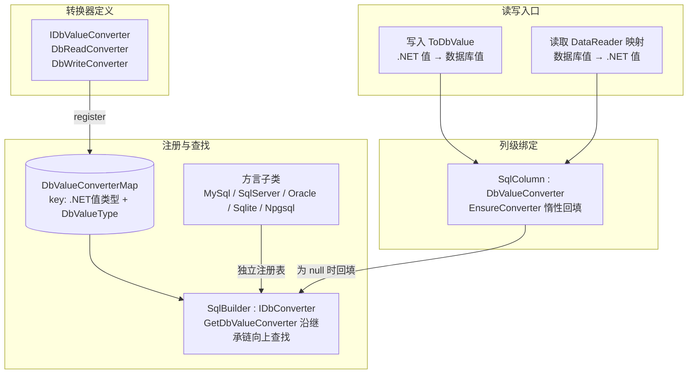
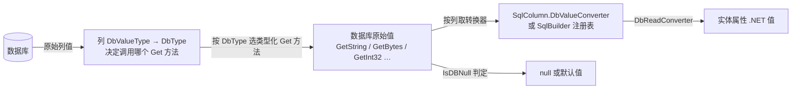
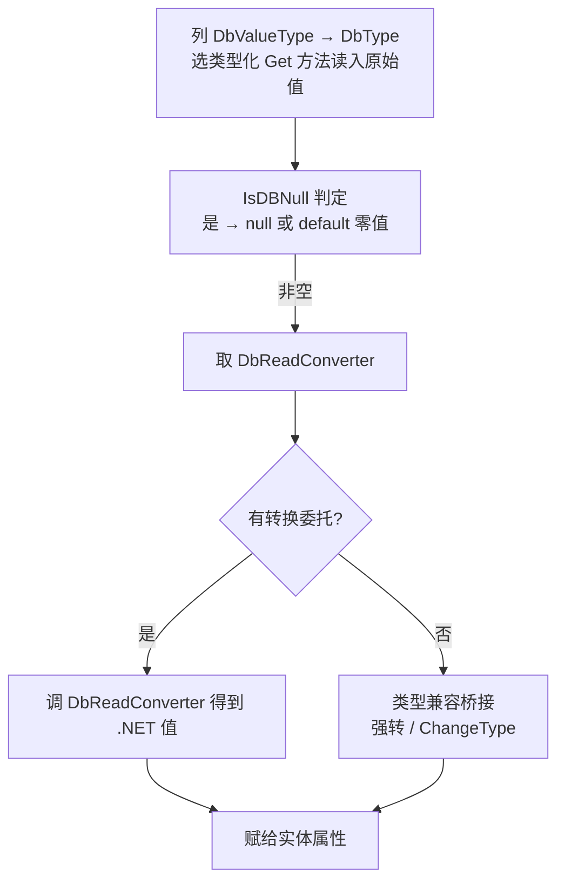
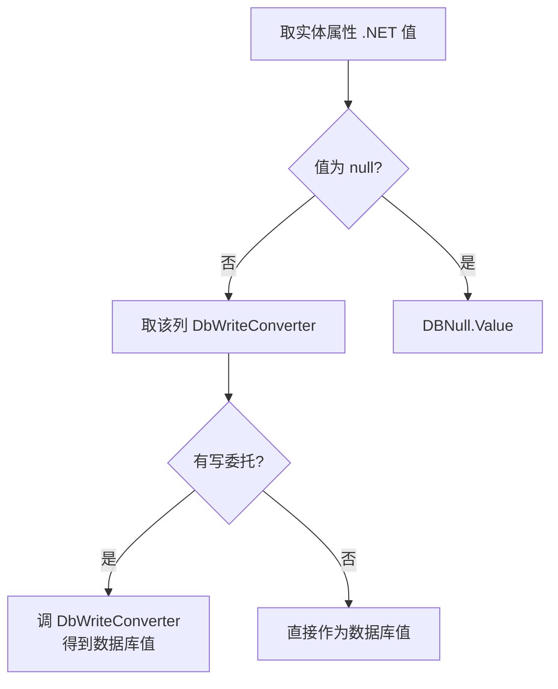
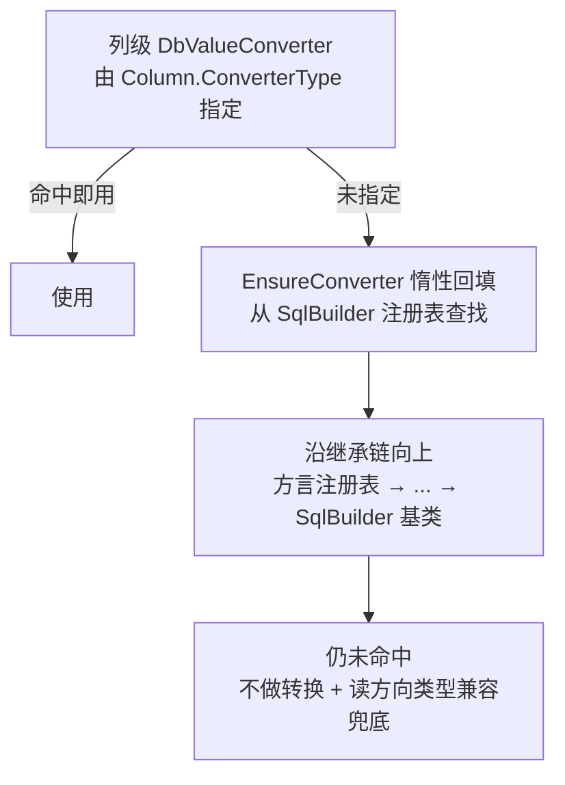

# 数据映射与值转换

LiteOrm 的数据映射系统负责在 .NET 实体与数据库列之间完成双向的类型转换与数据填充。本文从架构全景讲起，重点说清楚**数据库值 → .NET 值（读取）** 与 **.NET 值 → 数据库值（写入）** 的转换原理，以及如何定制转换器。

## 1. 架构全景

### 1.1 组件关系

数据映射系统由「转换器定义 / SqlBuilder 注册表 / 列级绑定 / 读写入口」四层组成：



**各层职责**：
- **转换器定义**：`IDbValueConverter` 将"读委托（数据库值→.NET 值）"与"写委托（.NET 值→数据库值）"打包成一个单元。
- **SqlBuilder 注册表**：`SqlBuilder` 本身即 `IDbConverter`，既是 SQL 生成器也是转换器注册表。每个方言子类维护**独立**的注册表，查找时沿继承链向上，方言注册覆盖基类注册。
- **列级绑定**：`SqlColumn` 可以挂载**列级**转换器（优先级最高）；未指定时经 `EnsureConverter` 惰性回填，即从 SqlBuilder 注册表取一个。
- **读写入口**：读取方向由 DataReader 映射器驱动，写入方向由 DAO 构造 SQL 参数时驱动，两者最终都落在"该列的转换器委托"上。

> `DbValueType` 是 LiteOrm 内部对**数据库取值**的抽象枚举（如 `Int32`、`String`、`Json`、`Binary`、`Date`），与具体数据库无关；`DbType` 是 ADO.NET 标准枚举，用于 `DbParameter.DbType`。二者由各方言的 SqlBuilder 映射。

### 1.2 读写数据流

读取（查询）：`数据库 → 按列 DbValueType→DbType 选 Get 方法读原始值 → (该列转换器) → DbReadConverter → 实体属性`



写入（增删改）：`实体属性 .NET 值 → (该列转换器) → DbWriteConverter → 数据库值 → DbParameter`


## 2. 转换原理：数据库值 ↔ .NET 值

这是整个映射系统的核心。**转换的本质，是把一个"数据库取值"（以 `DbValueType` 描述类型）转换成实体属性的 .NET 类型，或反向转换。**

### 2.1 一个转换器，两个方向的委托

一个 `IDbValueConverter` 同时表达两个方向的转换规则：

- **读取方向 `DbReadConverter`**：输入数据库原始值，输出实体属性的 .NET 值。例如日期字符串 `"2024-01-01"` → `DateTime`。
- **写入方向 `DbWriteConverter`**：输入实体属性 .NET 值，输出数据库能接受的原始值。例如 `DateTime` → 日期字符串。

两个方向各自独立，可以都实现、只实现其一、或不实现（等于直通）：
- 委托为 `null` → 该方向**不做转换**，直接赋值 / 直接返回。
- 读方向若类型仍不匹配，框架再做一次**兼容性兜底**（编译期强转，失败则运行时 `ChangeType`）。

### 2.2 读取方向：数据库值 → .NET 值

过程分四步：



要点：
- **读取方法由列的 DbValueType 决定**（第一步）：框架先把列解析为 `DbValueType`（由**该数据库 Builder 的 `GetDbValueType(属性类型)`** 给出），再映射为 `DbType` 并据此选择类型化读取方法——`String→GetString`、`Binary→GetBytes`、`Int32→GetInt32`…进而决定送入转换器的原始值类型。因此**列的 DbValueType 必须与列实际存储类型一致，否则会调错 Get 方法**（场景见 [6.3 VARBINARY 示例](#63-某数据库需要覆盖)）。
- **空值独立于转换器处理**：可空类型/引用类型得 `null`，非可空值类型得该类型的零值（`default`）。转换委托本身不处理 null。
- **转换器的输入类型**（`TDbType`）必须与第一步选定的 Get 方法返回类型对齐（如 `Binary→byte[]`、`String→string`），这样读到原始值后能直接命中强类型委托、避免运行时桥接。

### 2.3 写入方向：.NET 值 → 数据库值

过程：



要点：
- **null 始终映射为 `DBNull.Value`**，与转换器无关。
- 写入方向只认**该列的转换器**，不做 SqlBuilder 注册表的就地回退（回退发生在元数据初始化阶段，见第 3 章）。

### 2.4 转换器的查找链与优先级

无论读写，最终都要定位到"某个列用哪个转换器"。定位顺序是：



即：**列级特性 > 方言注册 > 基类保底注册 > 无转换。**

### 2.5 注册目标与作用域（RegisterDbValueConverter）

`RegisterDbValueConverter` 是扩展方法，**它按泛型参数 `T` 声明的 SqlBuilder 类型进行注册，与传入的实例无关**（实例只用于调用，真正的落点是 `T` 对应的那张注册表）。因此用哪个实例调用不影响结果，关键是 `T` 选谁：

| 用 `T` 指定 | 注册到 | 作用域 |
|------------|--------|--------|
| `SqlBuilder`（基类） | SqlBuilder 基类注册表 | **所有数据库的保底**——任何方言沿继承链都能命中，除非方言自带了同 key 的覆盖 |
| 某方言子类（`MySqlBuilder` 等） | 该方言独立注册表 | 仅该方言生效，会覆盖基类对同 key 的注册 |

所以，要让一个自定义转换器对所有数据库生效，**只需注册一次到基类**：

```csharp
SqlBuilder.Instance.RegisterDbValueConverter<SqlBuilder, TDbType, TValueType>(
    targetType: <DbValueType>,
    fromDb: <数据库值> => <.NET值>,
    toDb:   <.NET值> => <数据库值>
);
```

若某个数据库需要特殊处理，再单独向该方言类型注册以覆盖基类。

## 3. 内置默认转换

框架启动时（首次访问 `SqlBuilder` 触发静态初始化）自动为**基类注册表**注册常用类型转换，并针对少数方言补充差异性的默认转换。

### 3.1 基类默认转换（所有数据库通用）

| 值类型 (.NET) | 数据库取值类型 (DbValueType) | 读取 DB → .NET | 写入 .NET → DB |
|--------------|---------------------------|----------------|----------------|
| `bool` | 各数值类型 | `!= 0` → true | `true ? 1 : 0` |
| `bool` | Boolean | 直通 | 直通 |
| 数值类型 | 各种数值 DbValueType | 数值互转 | 直通 |
| `Guid` | Guid | 直通 | 直通 |
| `Guid` | Binary | `new Guid(byte[])` | `ToByteArray()` |
| `Guid` | String 系 | `Guid.Parse` | `ToString()` |
| `DateTime` / `DateTimeOffset` | Date/DateTime | 直通 | 直通 |
| `DateTimeOffset` | DateTime | 构造 `DateTimeOffset` | 取 `.DateTime` |
| `TimeSpan` | Time | 直通 | 直通 |
| `TimeSpan` | Int64 | `FromTicks` | `Ticks` |
| `string` | String 系 | 直通 | 直通 |
| `JsonNode` | Json / String | `JsonNode.Parse` | `ToJsonString()` |

### 3.2 方言差异默认转换

- **Oracle**：`bool` 以整数存储（`≠0` / `1:0`）；`Guid` 以 `byte[]` 存储（`new Guid(byte[])` / `ToByteArray()`）。
- **SQLite**：`DateTime`、`DateTimeOffset`、`TimeSpan` 以文本存储，读取时字符串解析、写入时按固定格式序列化。

> 这些只覆盖常见约定。方言之间差异较大时，应通过 `RegisterDbValueConverter` 按需增补或覆盖。

### 3.3 JsonNode 映射（导航）

`JsonNode`（`JsonObject` / `JsonArray` / `JsonValue`）在 LiteOrm 中享有一等公民待遇：

- **自动映射**：属性类型为 `JsonNode` 时自动映射为 JSON 列（字符串存储），自动序列化/反序列化（见上文[3.1](#31-基类默认转换所有数据库通用)的基类默认转换）。
- **Lambda 查询**：支持索引器和 `GetValue<T>()` 直接查询 JSON 字段，详见 [Lambda 查询指南](../02-core-usage/05-lambda-guide.md#7-jsonnode-查询)。
- **Expr 表达式**：支持 `JsonExtract`、`JsonValue`、`JsonQuery`、`JsonContains`、`JsonObject`、`JsonArray`、`IsJson` 等函数，详见 [表达式扩展](../04-extensibility/01-expression-extension.md#9-json-函数扩展)。

## 4. 列级转换器

当某**个别列**需要特殊类型（如枚举、自定义值对象）时，用列级转换器最简单——它优先级最高，只影响这一列。

### 4.1 两种指定方式

- **特性方式**（最常用）：在实体属性上写 `[Column(ConverterType = typeof(MyEnumConverter))]`。框架解析列元数据时实例化该转换器并绑到 `SqlColumn`。
- **代码方式**：动态构造表元数据时直接给 `SqlColumn.DbValueConverter` 赋值。

使用 `ConverterType` 的转换器类型需满足：实现了 `IDbValueConverter`，且有公共无参构造函数。

### 4.2 惰性回填

- 若列**未**通过特性指定转换器，`SqlColumn` 会在元数据初始化阶段调用 `EnsureConverter`，从 SqlBuilder 注册表按（属性类型，列类型）查找并填充。
- 回填只做一次（表级批量处理，双检锁保证单次执行）。
- 正因为有这一步，写入方向虽然"只认列级转换器"，但列级转换器通常已被回填，所以全局注册的转换器也能间接生效。

## 5. DataReader 映射（读取方向）

Mapper 把数据库返回的行逐列填充到实体对象，它决定"读方向"如何执行，并会对命中[第 4 章](#4-列级转换器)的转换委托完成调用。存在三种映射路径，按性能从高到低：

| 路径 | 触发条件 | 机制 | 性能 |
|------|---------|------|------|
| **源生成器预注册** | 实体标注 `[Table]` | 编译期生成静态逐列赋值代码并注册 | 最高 |
| **JIT 表达式树编译** | 运行时支持动态代码 | 动态编译映射委托 | 最高 |
| **AOT 反射映射** | NativeAOT（无动态代码） | 反射赋值 | 中等 |

三者的行为一致：逐列做 `IsDBNull` 判定 → 取该列转换器 / 类型化读取 → 赋给实体属性。差异仅在"用什么方式执行"：
- **JIT 路径**：用类型化读取方法（`GetInt32`/`GetString`…）避免装箱；命中列转换器时把强类型委托内联进编译好的代码；按类型和按列架构做双层缓存。
- **AOT 路径**：统一 `GetValue()` 读取（返回 `object`）再经非泛型委托或 `ChangeType` 桥接；构建期无法预判数据库某列实际返回的 CLR 类型，没法按 `DbType` 选 `GetInt32` / `GetString`，**装箱不可避免**；标注 `[Table]` 的实体走源生成器预注册路径，性能仍高于纯反射路径，但低于 JIT。
- **源生成器路径**：以 `[Table]` 实体为目标，无反射，但读取统一走 `GetValue()`（返回 `object`）加非泛型转换器委托；**装箱免不掉**。

> 选择建议：常规运行时代码可以放心依赖 JIT 路径；在 NativeAOT 发布时，请确保实体标注 `[Table]` 以命中源生成器实现，但仍需了解 AOT 路径下的装箱开销高于 JIT。

## 6. 完整示例：自定义 IP 地址转换器

用一个完整例子演示如何自定义转换器并对所有数据库生效。

**场景**：业务中用 `System.Net.IPAddress` 表示 IP 地址，数据库以 `VARCHAR(45)` 字符串存储。实现 `IPAddress ↔ string` 双向转换。

### 6.1 实现转换器

```csharp
using System.Net;
using LiteOrm.Common;

public sealed class IPAddressConverter : IDbValueConverter<string, IPAddress>
{
    public Type ValueType => typeof(IPAddress);

    // 泛型强版本（JIT 路径命中，无装箱）
    DbConvertHandler<string, IPAddress>? IDbValueConverter<string, IPAddress>.DbReadConverter
        => dbValue => IPAddress.Parse(dbValue);

    DbConvertHandler<IPAddress, object>? IDbValueConverter<string, IPAddress>.DbWriteConverter
        => value => value.ToString();

    // 非泛型版本（AOT 反射路径使用）
    DbConvertHandler? IDbValueConverter.DbReadConverter
        => dbValue => IPAddress.Parse((string)dbValue!);

    DbConvertHandler? IDbValueConverter.DbWriteConverter
        => value => ((IPAddress)value!).ToString();
}
```

> 空值由框架统一处理，转换器本身不处理 null。

### 6.2 全局注册（推荐，对所有数据库生效）

**使用 `T = SqlBuilder` 注册一次**，即可作为所有数据库的保底转换：

```csharp
using static LiteOrm.Common.DbValueType;

SqlBuilder.Instance.RegisterDbValueConverter<SqlBuilder, string, IPAddress>(
    targetType: String,
    fromDb: s => IPAddress.Parse(s),   // 读取：string → IPAddress
    toDb:   ip => ip.ToString()        // 写入：IPAddress → string
);
```

注册后，所有 `IPAddress` 属性（其列 DbValueType 为 String）都会自动使用该转换器，无需逐个标注：

```csharp
[Table("Servers")]
public class Server
{
    [Column("Id", IsPrimaryKey = true)]
    public int Id { get; set; }

    [Column("Name")]
    public string Name { get; set; }

    // 无需 ConverterType，全局注册自动生效
    [Column("IpAddress")]
    public IPAddress? IpAddress { get; set; }

    [Column("Gateway")]
    public IPAddress? Gateway { get; set; }
}
```

使用方式与普通属性完全一致：

```csharp
// 插入：自动调用写委托把 IPAddress 转成字符串
await serverDAO.InsertAsync(new Server
{
    Name = "web-01",
    IpAddress = IPAddress.Parse("192.168.1.100")
});

// 查询：自动调用读委托把字符串转成 IPAddress
var server = await serverDAO.GetObjectAsync(1);
Console.WriteLine(server.IpAddress); // 192.168.1.100
```

### 6.3 某数据库需要覆盖

若某个数据库改用 `VARBINARY` 存 IP，需要同时做两件事：**注册 `byte[] ↔ IPAddress` 转换器**，并**让该数据库把 `IPAddress` 列解析为 `Binary` 的 DbValueType**（见 [2.2 读取原理](#22-读取方向数据库值--net-值)：否则框架读取时仍按 `String` 调用 `GetString`，与二进制数据不符）。

```csharp
// 1) 注册 byte[] ↔ IPAddress 转换器到该方言（覆盖基类）
MySqlBuilder.Instance.RegisterDbValueConverter<MySqlBuilder, byte[], IPAddress>(
    targetType: Binary,              // 注意：读取方法按 Binary → GetBytes(byte[])
    fromDb: b => new IPAddress(b),
    toDb:   ip => ip.GetAddressBytes()
);
```

第二步是让该数据库的 Builder 决定 `IPAddress` 列的 DbValueType。`IDbConverter.GetDbValueType(type)` 默认取 `DbValueTypeMap` 的全局映射（`IPAddress` 不在映射表中，会退回 `Object`），所以要用该 **方言 Builder 覆写 `GetDbValueTypeInternal`**，把 `IPAddress` 解析为 `Binary`：

```csharp
// 2) 覆写该数据库 Builder 的 GetDbValueTypeInternal，把 IPAddress 解析为 Binary
public class MySqlBinaryIpBuilder : MySqlBuilder
{
    protected override DbValueType GetDbValueTypeInternal(Type type)
        => type == typeof(IPAddress) ? DbValueType.Binary : base.GetDbValueTypeInternal(type);
}
```

> 要点：注册转换器只解决"byte[] 与 IPAddress 互转"，列能正确读成 `byte[]` 还依赖列 DbValueType 为 `Binary`。二者缺一不可。若不想为某方言单独子类化 Builder，也可用 `DbValueTypeMap.Set(typeof(IPAddress), DbValueType.Binary)` 全局声明——但那样会影响所有数据库，需谨慎。

### 6.4 列级使用（全局注册不适用时）

若仅个别列需要特殊转换、不想全局影响，可在属性上标注 `ConverterType`：

```csharp
[Column("IpAddress", ConverterType = typeof(IPAddressConverter))]
public IPAddress? IpAddress { get; set; }
```

列级优先级最高，会覆盖全局注册与方言注册。

### 6.5 健壮性建议

生产环境建议用 `TryParse` 兜底，避免脏数据使整条查询失败：

```csharp
DbConvertHandler<string, IPAddress>? IDbValueConverter<string, IPAddress>.DbReadConverter
    => dbValue => IPAddress.TryParse(dbValue, out var ip)
        ? ip
        : null!;   // 解析失败时按业务返回 null 或默认值
```

> 列级转换器（JIT 路径）的异常会被映射器包装，抛出带列名/序号的异常信息，便于定位。

## 7. AOT 与非 AOT 的差异

| 维度 | JIT（非 AOT） | AOT（NativeAOT） |
|------|--------------|-----------------|
| 转换器注册 | 相同 | 相同 |
| 映射实现 | 表达式树编译 | 反射赋值 |
| 读取方式 | 类型化读取，无装箱 | `GetValue()` 统一读取 + 桥接 |
| 转换器调用 | 编译期内联强类型委托 | 运行时非泛型委托 |
| 性能 | 最高 | 中等；`[Table]` 实体走源生成器仍高于纯反射路径，但低于 JIT |
| 裁剪安全 | 需要 `[RequiresDynamicCode]` | 完全安全 |

AOT 性能建议：
1. 实体标注 `[Table]`，命中源生成器映射。
2. 转换器同时实现泛型与非泛型接口,源生成器路径使用**非泛型**转换器委托（以 `GetValue()` 结果为输入），泛型版本仅供 JIT 路径使用。
3. 减少匿名类型投影,多用已知强类型实体。

## 8. 常见问题

### Q1：为什么列级转换器没有生效？

检查：`ConverterType` 类型是否实现了 `IDbValueConverter`；是否有公共无参构造函数；读/写委托方向是否正确；属性类型是否与 `ValueType` 匹配。

### Q2：AOT 下比 JIT 慢很多怎么办？

确保实体标注 `[Table]`，命中源生成器预注册的映射，性能与 JIT 相当。

### Q3：重复注册同 key 的转换器会怎样？

后者覆盖前者。列级 `ConverterType` 优先级最高，永远优先生效。

### Q4：Nullable 类型怎么处理？

- **空值判定独立于转换器**：读方向，可空/引用类型得 `null`，非可空值类型得 `default` 零值；写方向，`null` → `DBNull.Value`。
- 读方向非空时，转换结果再包装为 `Nullable<T>` / 直接赋给引用类型。

### Q5：`DbValueType` 和 `DbType` 有什么区别？

`DbValueType` 是 LiteOrm 内部的数据库取值抽象（`Int32`/`String`/`Json`/`Binary`…），数据库无关；`DbType` 是 ADO.NET 标准枚举，用于 `DbParameter.DbType`。二者由各方言的 SqlBuilder 映射。

### Q6：自定义转换器注册到基类，会不会影响已有类型的默认行为？

会——如果注册的 key（.NET 值类型, DbValueType）与内置默认转换相同，就会覆盖它们。注册前请确认该 key 未被框架占用；如需针对个别数据库调整，优先注册到该方言类型而非基类。

## 相关链接

- [返回目录](../README.md)
- [实体映射](../02-core-usage/01-entity-mapping.md)
- [Lambda 查询指南](../02-core-usage/05-lambda-guide.md)
- [表达式扩展](../04-extensibility/01-expression-extension.md)
- [AOT 支持](./06-aot.md)
- [性能优化](./03-performance.md)