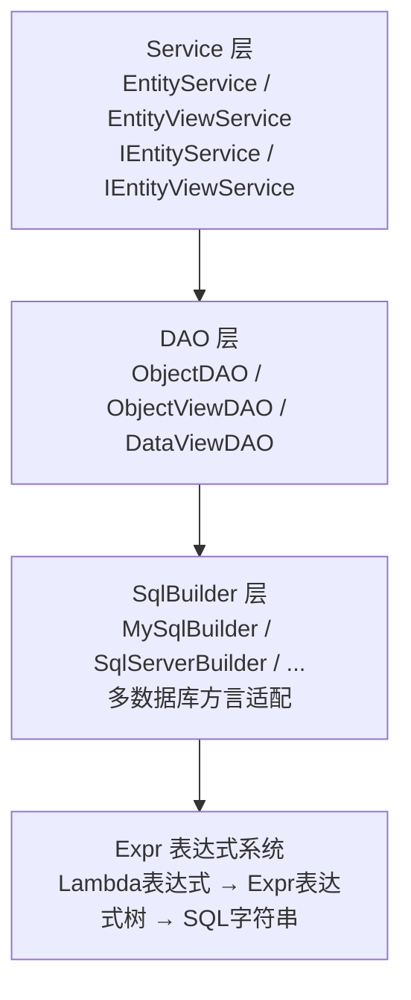

# 第1篇：LiteOrm 概述与快速入门

> ⏱ 阅读约 20 分钟

## 前言

在 .NET 生态中，ORM（对象关系映射）框架的选择一直是个热门话题。Entity Framework Core 功能全面但性能开销大，Dapper 性能极致但缺乏高级抽象，SqlSugar 和 FreeSql 则在两者之间寻找平衡。

**LiteOrm** 是一个定位独特的 .NET ORM 框架 —— 它兼顾微型 ORM 的执行效率和完整 ORM 的易用性，适合对性能敏感且又需要灵活处理复杂 SQL 的业务场景。

## 与其他 .NET ORM 的定位对比

| 维度 | LiteOrm | EF Core | Dapper | SqlSugar | FreeSql |
|------|---------|---------|--------|----------|---------|
| **设计理念** | 轻量高性能 + 完整ORM特性 | 全功能、约定优于配置 | 极简、手写SQL为主 | 功能全面、接近EF | 功能全面、多数据库 |
| **性能** | 接近Dapper，远超EF Core | 较慢（变更追踪开销） | 最快（接近手写ADO.NET） | 中等 | 中等偏上 |
| **Lambda查询** | 完整支持，可混合Expr | 完整支持 | 不支持（需扩展） | 完整支持 | 完整支持 |
| **动态查询** | Expr表达式树，JSON序列化 | Expression树手动构建 | 字符串拼接 | SqlSugar表达式 | 动态Lambda |
| **关联查询** | 特性声明式自动JOIN | Include/ThenInclude | 手写SQL+MultiMapping | 导航属性 | 导航属性 |
| **分表** | IArged接口原生支持 | 需第三方或手写 | 手写 | 内置 | 内置 |
| **声明式事务** | AOP特性 | TransactionScope | TransactionScope | AOP特性 | 工作单元 |
| **学习曲线** | 中等 | 较陡 | 平缓（需SQL功底） | 中等 | 中等 |

### 核心优势

1. **性能卓越**：批量插入1000条仅需~16ms，性能领先，远超EF Core（~150ms）
2. **内存友好**：批量操作内存分配仅为SqlSugar的1/5~1/10
3. **Expr表达式系统**：Lambda与Expr可组合、可序列化、可从前后端双向传递
4. **原生分表支持**：`IArged`接口一行代码实现按月/按租户分表
5. **AOP声明式事务**：`[Transaction]`特性零侵入实现事务管理
6. **安全内置**：多层SQL注入防护（参数化、LIKE转义、ExprValidator）

## 环境要求

- **.NET 8.0+** / **.NET Standard 2.0**（兼容 .NET Framework 4.6.1+）
- **依赖库**：Autofac、Castle.Core（用于AOP拦截）
- **支持的数据库**：SQL Server 2012+、Oracle 12c+、PostgreSQL、MySQL 8.0+、SQLite

## 安装

```bash
dotnet add package LiteOrm
```

## 配置与注册

### 1. 配置数据库连接（appsettings.json）

```json
{
  "LiteOrm": {
    "Default": "DefaultConnection",
    "DataSources": [
      {
        "Name": "DefaultConnection",
        "ConnectionString": "Server=localhost;Database=TestDb;User Id=root;Password=123456;",
        "Provider": "MySqlConnector.MySqlConnection, MySqlConnector"
      }
    ]
  }
}
```

配置要点：
- `Default`：指定默认使用的数据源名称
- `DataSources`：支持配置多数据源，每个数据源指定连接字符串和数据库提供程序
- `Provider`：采用 `"完整类型名, 程序集名"` 的格式，如 `MySqlConnector.MySqlConnection, MySqlConnector`
- 对于 SQL Server 可使用内置的 `System.Data.SqlClient`，对于 SQLite 可使用 `Microsoft.Data.Sqlite`

### 2. 注册 LiteOrm（Program.cs）

**控制台应用：**

```csharp
using Microsoft.Extensions.Hosting;

var host = Host.CreateDefaultBuilder(args)
    .RegisterLiteOrm()   // 一行注册，自动完成初始化
    .Build();

// 获取服务
var userService = host.Services.GetRequiredService<IUserService>();
```

**ASP.NET Core 应用：**

```csharp
var builder = WebApplication.CreateBuilder(args);

// 通过 IHostBuilder 扩展方法集成
builder.Host.RegisterLiteOrm();

// 继续注册其他服务...
builder.Services.AddControllers();

var app = builder.Build();
app.MapControllers();
app.Run();
```

`RegisterLiteOrm()` 会自动完成：
- 读取 `appsettings.json` 中的 `LiteOrm` 配置节
- 注册 Autofac 容器
- 扫描程序集中的实体和特性
- 初始化 Lambda 表达式处理器和 SQL 函数映射
- 注册核心服务（DAO、EntityService 等）

## 第一个完整示例

### 定义实体

```csharp
using LiteOrm.Common;

[Table("Users")]
public class User : ObjectBase
{
    [Column("Id", IsPrimaryKey = true, IsIdentity = true)]
    public int Id { get; set; }

    [Column("UserName")]
    public string UserName { get; set; } = string.Empty;

    [Column("Email")]
    public string Email { get; set; } = string.Empty;

    [Column("Age")]
    public int Age { get; set; }

    [Column("Status")]
    public int Status { get; set; }

    [Column("CreateTime")]
    public DateTime? CreateTime { get; set; }
}
```

实体定义要点：
- 继承 `ObjectBase`（提供对象复制、克隆、日志脱敏等基础能力）
- `[Table("Users")]` 映射到数据库表名
- `[Column("...")]` 映射数据库列名
- `IsPrimaryKey = true` 标记主键
- `IsIdentity = true` 标记自增列

### 定义视图模型（可选）

```csharp
// 视图模型继承实体，可添加关联字段
public class UserView : User
{
    // 可以在这里添加关联查询的额外字段
}
```

### 定义服务

```csharp
// 服务接口继承泛型接口即可获得完整CRUD能力
public interface IUserService :
    IEntityService<User>,           // 同步实体操作
    IEntityServiceAsync<User>,      // 异步实体操作
    IEntityViewService<UserView>,   // 同步视图查询
    IEntityViewServiceAsync<UserView>  // 异步视图查询
{
}

// 服务实现只需继承 EntityService<实体, 视图>
public class UserService : EntityService<User, UserView>, IUserService
{
    // 无需写任何方法，CRUD全部继承自基类
}
```

相比 EF Core 需要手动实现每个仓储方法，LiteOrm 的 Service 层做到了一行代码获得全部 CRUD。

### 使用服务

```csharp
// 插入
var user = new User { UserName = "admin", Email = "admin@test.com", Age = 25 };
await userService.InsertAsync(user);

// 查询单个
var found = await userService.SearchOneAsync(u => u.UserName == "admin");

// 条件查询
var adults = await userService.SearchAsync(u => u.Age >= 18);

// 分页查询
var page = await userService.SearchAsync(
    q => q.Where(u => u.CreateTime > DateTime.Today)
          .OrderByDescending(u => u.CreateTime)
          .Skip(0).Take(10)
);

// 更新
found.Email = "newemail@test.com";
await userService.UpdateAsync(found);

// 按主键删除
await userService.DeleteIDAsync(found.Id);
```

## 架构概览

LiteOrm 采用分层架构：



核心设计思路：
1. **Service层**面向业务，提供类型安全的CRUD接口
2. **DAO层**负责SQL执行和结果映射
3. **SqlBuilder层**负责多数据库方言适配
4. **Expr表达式系统**是核心抽象层，统一了Lambda、Expr、ExprString三种查询方式

## 三种查询方式

LiteOrm 提供了三种查询方式，灵活度递增：

| 方式 | 适用场景 | 示例 |
|------|---------|------|
| **Lambda** | 固定条件、编译时检查 | `u => u.Age >= 18` |
| **Expr** | 动态拼装条件 | `Prop("Age") >= 18 & Prop("Status") == 1` |
| **ExprString** | 在DAO层手写部分SQL | `$"WHERE {expr} AND Age > {minAge}"` |

三种方式可以混合使用（详见第4篇），这是 LiteOrm 区别于其他ORM的重要特性。

## 性能一瞥

以下是基于官方 Benchmark（.NET 10，MySQL）的插入性能对比：

| 框架 | 100条 | 1000条 | 5000条 |
|------|-------|--------|--------|
| **LiteOrm** | 3.98ms | 16.39ms | 75.62ms |
| SqlSugar | 4.33ms | 19.12ms | 98.15ms |
| FreeSql | 4.36ms | 18.48ms | 85.00ms |
| EF Core | 18.50ms | 150.35ms | 670.19ms |
| Dapper | 26.19ms | 215.12ms | 1,129.57ms |

内存分配方面，LiteOrm在1000条批量插入时仅862KB，而SqlSugar为4,573KB（5.3倍），EF Core为12,503KB（14.5倍）。

## 学习路径建议

如果你是 LiteOrm 新手，建议按以下顺序阅读本系列：

| 篇目 | 内容 | 学习目标 |
|------|------|---------|
| 第1篇 | 概述与快速入门 | 理解定位、完成安装和第一个示例 |
| 第2篇 | 实体映射 | 掌握 Table/Column/ObjectBase |
| 第3篇 | Lambda CRUD | 掌握增删改查、排序分页 |
| 第4篇 | Expr 表达式 | 掌握动态查询和 Lambda/Expr 混合 |
| 第5篇 | 关联查询 | 掌握自动 JOIN 和 EXISTS |
| 第6篇 | 事务管理 | 掌握声明式和手动事务 |
| 第7篇 | 动态分表 | 掌握 IArged 和 TableArgs |
| 第8篇 | 高级查询 | 掌握 CTE、窗口函数 |
| 第9篇 | 扩展性 | 掌握表达式扩展和自定义 SQL |
| 第10篇 | 前端集成 | 掌握 Expr JSON 和泛型 Controller 示例 |
| 第11篇 | 日志与权限 | 掌握日志诊断和权限过滤 |
| 第12篇 | 性能对比 | 理解性能优势和选型建议 |
| 第13篇 | 远程服务调用 | 掌握 LiteOrm.Remote / LiteOrm.Remote.Server 的客户端/服务端配置 |

## 结语

LiteOrm 是一个在性能、功能、易用性三者之间取得了出色平衡的 .NET ORM。它既有接近 Dapper 的执行效率和极低的内存占用，又提供了 EF Core 级别的开发体验，还在动态查询和前后端集成方面做到了独树一帜。

如果你正在寻找一个轻量但功能完备、高性能且易于扩展的 .NET ORM，LiteOrm 值得深入了解。

> **项目地址**：[https://github.com/danjiewu/LiteOrm](https://github.com/danjiewu/LiteOrm)
> **NuGet**：[LiteOrm](https://www.nuget.org/packages/LiteOrm/)
> **文档中心**：[https://danjiewu.github.io/LiteOrm/](https://danjiewu.github.io/LiteOrm/)

## 下一篇预告

[第2篇：实体映射与数据源配置](../series/02-entity-mapping.md) — 深入讲解 Table/Column 特性、ObjectBase 基类、多数据源配置等核心概念。