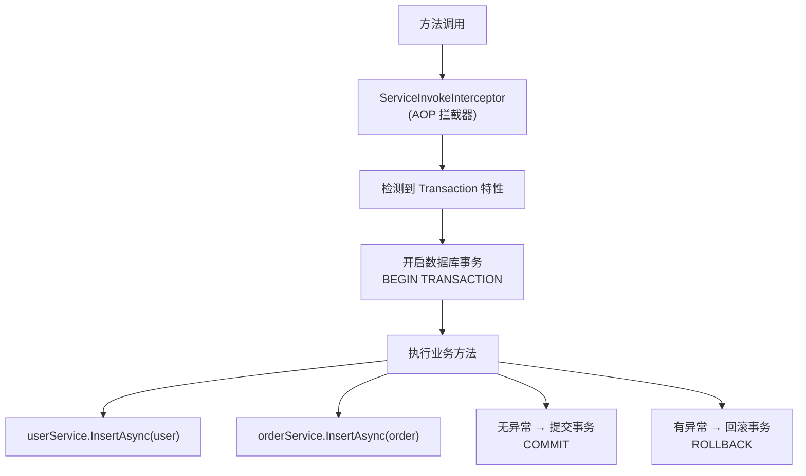

# 第6篇：事务管理

> ⏱ 阅读约 15 分钟

数据库事务是保证数据一致性的关键机制。LiteOrm 提供了两种事务管理方式：**声明式事务**（AOP 特性）和**手动事务**（编程式）。声明式事务是 LiteOrm 的一大亮点。

## 与其他 ORM 的事务对比

| 维度 | LiteOrm | EF Core | Dapper |
|------|---------|---------|--------|
| 声明式事务 | `[Transaction]` AOP 特性 | `TransactionScope` | `TransactionScope` |
| 手动事务 | `SessionManager` API | `DbContext.Database.BeginTransaction()` | `IDbConnection.BeginTransaction()` |
| 嵌套事务 | 支持（保存点） | 支持（保存点） | 手动管理保存点 |
| 事务传播 | 自动加入外层事务 | 通过 `TransactionScope` | 手动传递 |
| 代码侵入性 | 低（特性标注） | 中 | 高 |

## 声明式事务

声明式事务是 LiteOrm 最具特色的功能之一。只需在方法上标注 `[Transaction]` 特性，框架就会通过 AOP（面向切面编程）自动管理事务的开启、提交和回滚。

### 基础用法

```csharp
public class BusinessService
{
    private readonly IUserService _userService;
    private readonly IOrderService _orderService;

    public BusinessService(IUserService userService, IOrderService orderService)
    {
        _userService = userService;
        _orderService = orderService;
    }

    [Transaction]
    public async Task CreateUserWithOrder(User user, Order order)
    {
        // 整个方法在一个事务中执行
        await _userService.InsertAsync(user);

        order.UserId = user.Id;
        await _orderService.InsertAsync(order);

        // 如果中途抛出异常，所有操作自动回滚
    }
}
```

### 工作原理



### 事务传播（嵌套事务）

当标记了 `[Transaction]` 的方法调用另一个也标记了 `[Transaction]` 的方法时，内层方法会自动加入到外层事务中：

```csharp
[Transaction]
public async Task ProcessOrder(int orderId)
{
    // 外层事务开始

    var order = await _orderService.GetObjectAsync(orderId);
    order.Status = "Processing";
    await _orderService.UpdateAsync(order);

    // 内层方法的事务会自动加入外层
    await CreatePaymentRecord(order);

    // 如果这里抛出异常，上面的所有操作都会回滚
}

[Transaction]
private async Task CreatePaymentRecord(Order order)
{
    // 自动加入外层事务，不会开启新事务
    var payment = new Payment
    {
        OrderId = order.Id,
        Amount = order.Amount,
        CreateTime = DateTime.Now
    };
    await _paymentService.InsertAsync(payment);
}
```

### 事务选项

`[Transaction]` 特性支持以下参数：

```csharp
[Transaction(IsolationLevel = IsolationLevel.ReadCommitted)]  // 事务隔离级别
public async Task TransferMoney(long fromId, long toId, decimal amount)
{
    // ...
}
```

`[Transaction]` 只有两个属性：

| 属性 | 类型 | 默认值 | 说明 |
|------|------|--------|------|
| `IsTransaction` | `bool` | `true` | 是否启用事务 |
| `IsolationLevel` | `IsolationLevel` | `ReadCommitted` | 事务隔离级别 |

### 多数据源事务

LiteOrm 的事务管理器自动支持多数据源场景。当在同一个 `[Transaction]` 方法中操作不同数据源的实体时，`SessionManager` 会为每个数据源独立开启事务，提交/回滚时也会分别处理：

```csharp
[Transaction]
public async Task TransferBetweenDatabases()
{
    // User 表默认走 MainDb，Log 表走 LogDb
    // SessionManager 自动为两个数据源分别管理事务
    var user = await _userService.GetObjectAsync(1);
    user.Balance -= 100;
    await _userService.UpdateAsync(user);

    await _logService.InsertAsync(new OperationLog
    {
        Content = $"User {user.Id} deducted 100"
    });
    // 任一操作失败，两个数据源的事务都会回滚
}

## 手动事务

对于需要精细控制事务边界的场景，LiteOrm 提供了手动事务 API：

```csharp
var sessionManager = SessionManager.Current;

try
{
    sessionManager.BeginTransaction();

    // 执行数据库操作
    var user = new User { UserName = "newuser", Email = "new@test.com" };
    await userService.InsertAsync(user);

    var order = new Order { UserId = user.Id, Amount = 100 };
    await orderService.InsertAsync(order);

    sessionManager.Commit();  // 提交
}
catch
{
    sessionManager.Rollback();  // 回滚
    throw;
}
```

### 手动事务的完整模式

```csharp
public async Task<bool> TransferWithManualTransaction(long fromId, long toId, decimal amount)
{
    var sessionManager = SessionManager.Current;

    try
    {
        sessionManager.BeginTransaction();

        var fromAccount = await accountService.GetObjectAsync(fromId);
        var toAccount = await accountService.GetObjectAsync(toId);

        if (fromAccount == null || toAccount == null)
        {
            sessionManager.Rollback();
            return false;
        }

        if (fromAccount.Balance < amount)
        {
            sessionManager.Rollback();
            return false;
        }

        fromAccount.Balance -= amount;
        toAccount.Balance += amount;

        await accountService.UpdateAsync(fromAccount);
        await accountService.UpdateAsync(toAccount);

        sessionManager.Commit();
        return true;
    }
    catch
    {
        sessionManager.Rollback();
        throw;
    }
}
```

## 声明式 vs 手动事务

| 场景 | 推荐方式 | 原因 |
|------|---------|------|
| 单个 Service 方法内多步操作 | `[Transaction]` | 代码简洁，自动管理 |
| 跨多个 Service 调用 | `[Transaction]` | AOP 自动传播 |
| 需要在事务中做业务判断 | 手动事务 | 灵活控制提交/回滚时机 |
| 需要条件性提交/回滚 | 手动事务 | 可以基于返回值决定 |
| 简单两步操作 | `[Transaction]` | 减少样板代码 |

## 完整示例：电商下单

```csharp
public class OrderBusinessService
{
    private readonly IUserService _userService;
    private readonly IOrderService _orderService;
    private readonly IProductService _productService;
    private readonly IInventoryService _inventoryService;

    // 声明式事务 —— 一站式下单
    [Transaction(IsolationLevel = IsolationLevel.ReadCommitted)]
    public async Task<OrderResult> PlaceOrder(int userId, List<OrderItem> items)
    {
        // 1. 验证用户
        var user = await _userService.GetObjectAsync(userId);
        if (user == null || user.Status != 1)
            throw new BusinessException("用户状态异常");

        // 2. 检查库存并锁定
        foreach (var item in items)
        {
            var stockOk = await _inventoryService.DeductStock(item.ProductId, item.Quantity);
            if (!stockOk)
                throw new BusinessException($"商品 {item.ProductId} 库存不足");
        }

        // 3. 创建订单
        var order = new Order
        {
            UserId = userId,
            TotalAmount = items.Sum(i => i.Price * i.Quantity),
            Status = "Pending",
            CreateTime = DateTime.Now
        };
        await _orderService.InsertAsync(order);

        // 4. 创建订单明细
        foreach (var item in items)
        {
            var detail = new OrderDetail
            {
                OrderId = order.Id,
                ProductId = item.ProductId,
                Quantity = item.Quantity,
                Price = item.Price
            };
            await _detailService.InsertAsync(detail);
        }

        // 任何步骤抛出异常，全部回滚
        return new OrderResult { OrderId = order.Id, Success = true };
    }
}
```

> **对比 EF Core**：EF Core 实现同样逻辑需要 `using var transaction = await dbContext.Database.BeginTransactionAsync()`，代码量更多，且需要手动传递 `DbContext`。

## 事务最佳实践

1. **保持事务简短**：事务持有锁，长时间事务会影响并发性能
2. **避免在事务中做非数据库操作**：不要在事务中发邮件、调RPC、做复杂计算
3. **选择合适的隔离级别**：
   - `ReadCommitted`：默认级别，适合大多数场景
   - `RepeatableRead`：防止不可重复读，适合需要一致性读的场景
   - `Serializable`：最严格，性能最差，慎用
4. **声明式事务优先**：大多数场景下 `[Transaction]` 足够且更简洁
5. **明确回滚条件**：手动事务中，确保所有异常路径都执行了 `Rollback()`
6. **注意事务嵌套**：`[Transaction]` 嵌套时内层自动加入外层，不会创建保存点

## 常见陷阱

### 陷阱1：异步方法中忘记 await

```csharp
[Transaction]
public async Task BadExample()
{
    userService.InsertAsync(user);  // 没有 await！事务可能在操作完成前就提交了
    // 正确：await userService.InsertAsync(user);
}
```

### 陷阱2：捕获异常但不重新抛出

```csharp
[Transaction]
public async Task BadExample2()
{
    try
    {
        await userService.InsertAsync(user);
        throw new Exception("业务错误");
    }
    catch (Exception)
    {
        // 吞掉异常 —— 事务不会回滚！
        // 如果确实需要捕获异常，确保在 finally 或适当的时机处理事务
    }
}
```

## 下一篇预告

[第7篇：动态分表与分表路由](../series/07-sharding.md) — 通过 `IArged` 接口实现按时间、按租户等维度的动态分表路由。