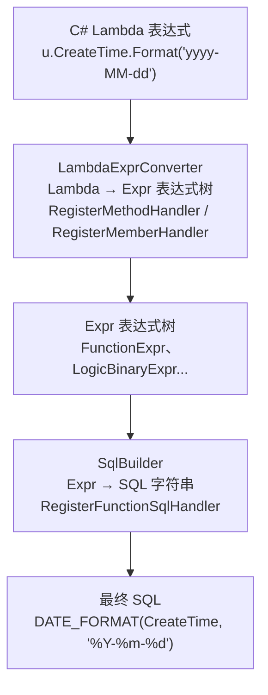

# 第9篇：扩展性

> ⏱ 阅读约 20 分钟

LiteOrm 设计上充分考虑了扩展性，提供了表达式扩展、自定义 SQL 构建器、函数验证器等多层次的扩展机制。你可以将 C# 方法/属性映射到数据库原生函数，甚至完全定制特定数据库的 SQL 方言。

## 扩展架构

LiteOrm 的扩展机制运行在两个层面：



要添加一个完整的自定义函数扩展，需要注册两个处理器：
1. **LambdaExprConverter**：将 Lambda 中的方法调用转为 `FunctionExpr`
2. **SqlBuilder**：将 `FunctionExpr` 转为具体数据库的 SQL

## 示例1：日期格式化

### 步骤1：定义扩展方法

```csharp
public static class DateTimeExtensions
{
    public static string Format(this DateTime date, string format)
    {
        return date.ToString(format);
    }
}
```

### 步骤2：注册 Lambda 处理器

```csharp
LambdaExprConverter.RegisterMethodHandler(nameof(DateTimeExtensions.Format), (node, converter) =>
{
    var dateExpr = converter.ConvertInternal(node.Arguments[0]) as ValueTypeExpr;
    var formatExpr = converter.ConvertInternal(node.Arguments[1]) as ValueTypeExpr;
    return new FunctionExpr("DATE_FORMAT", dateExpr, formatExpr);
});
```

### 步骤3：注册 SQL 处理器（MySQL）

```csharp
using static LiteOrm.Common.Expr;

MySqlBuilder.Instance.RegisterFunctionSqlHandler("DATE_FORMAT",
    (ref ValueStringBuilder outSql, FunctionExpr expr, SqlBuildContext context,
     ISqlBuilder sqlBuilder, ICollection<KeyValuePair<string, object>> outputParams) =>
{
    if (expr.Args.Count != 2)
        throw new ArgumentException("DATE_FORMAT requires 2 arguments");

    outSql.Append("DATE_FORMAT(");
    expr.Args[0].ToSql(ref outSql, context, sqlBuilder, outputParams);
    outSql.Append(", ");
    expr.Args[1].ToSql(ref outSql, context, sqlBuilder, outputParams);
    outSql.Append(')');
});
```

### 步骤4：使用

```csharp
// Lambda 方式
var users = await userService.SearchAsync(
    u => u.CreateTime.Format("yyyy-MM-dd") == "2024-06-15"
);

// Expr 方式
using static LiteOrm.Common.Expr;
var formatExpr = new FunctionExpr("DATE_FORMAT", Prop("CreateTime"), new ValueExpr("yyyy-MM-dd"));
var users = await userService.SearchAsync(formatExpr == "2024-06-15");
```

## 示例2：计算属性（非数据库列）

```csharp
public class UserView : User
{
    // Age 是计算属性，不存储在数据库
    // 但可以通过表达式扩展映射到 SQL 表达式
    public int Age => DateTime.Now.Year - BirthDate.Year;
}

// 注册 Lambda 处理器
LambdaExprConverter.RegisterMemberHandler(typeof(UserView), nameof(UserView.Age), (node, converter) =>
{
    var userExpr = converter.ConvertInternal(node.Expression) as ValueTypeExpr;
    return new FunctionExpr("YEAR", new FunctionExpr("CURRENT_DATE"))
         - new FunctionExpr("YEAR", new PropertyExpr("BirthDate"));
});

// 使用
var adults = await userService.SearchAsync(u => u.Age >= 18);
// 生成 SQL: WHERE YEAR(CURRENT_DATE) - YEAR(BirthDate) >= 18
```

## 示例3：自定义字符串函数

```csharp
// 定义扩展方法
public static class StringExtensions
{
    public static string CustomProcess(this string value)
    {
        return value.ToUpper();
    }
}

// 注册
LambdaExprConverter.RegisterMethodHandler(nameof(StringExtensions.CustomProcess), (node, converter) =>
{
    var strExpr = converter.ConvertInternal(node.Arguments[0]) as ValueTypeExpr;
    return new FunctionExpr("CUSTOM_PROCESS", strExpr);
});

SqlServerBuilder.Instance.RegisterFunctionSqlHandler("CUSTOM_PROCESS",
    (ref ValueStringBuilder outSql, FunctionExpr expr, SqlBuildContext context,
     ISqlBuilder sqlBuilder, ICollection<KeyValuePair<string, object>> outputParams) =>
{
    outSql.Append("dbo.CustomProcess(");
    expr.Args[0].ToSql(ref outSql, context, sqlBuilder, outputParams);
    outSql.Append(')');
});

// 使用
var users = await userService.SearchAsync(
    u => u.UserName.CustomProcess() == "ADMIN"
);
```

## 多数据库适配

同一个函数名可以在不同数据库中注册不同的 SQL 处理器：

```csharp
// MySQL
MySqlBuilder.Instance.RegisterFunctionSqlHandler("CUSTOM_FUNC", (ref outSql, expr, ctx, sb, p) =>
{
    outSql.Append("MYSQL_CUSTOM(");
    expr.Args[0].ToSql(ref outSql, ctx, sb, p);
    outSql.Append(')');
});

// SQL Server
SqlServerBuilder.Instance.RegisterFunctionSqlHandler("CUSTOM_FUNC", (ref outSql, expr, ctx, sb, p) =>
{
    outSql.Append("dbo.CustomFunc(");
    expr.Args[0].ToSql(ref outSql, ctx, sb, p);
    outSql.Append(')');
});

// PostgreSQL
PostgreSqlBuilder.Instance.RegisterFunctionSqlHandler("CUSTOM_FUNC", (ref outSql, expr, ctx, sb, p) =>
{
    outSql.Append("custom_func(");
    expr.Args[0].ToSql(ref outSql, ctx, sb, p);
    outSql.Append(')');
});
```

使用时无需关心底层是哪种数据库——LiteOrm 会根据当前数据库类型自动选择对应的 `SqlBuilder`。

## 自定义 SqlBuilder

如果内置的数据库方言无法满足需求（比如老旧数据库版本），可以继承现有 `SqlBuilder` 并重写分页方法 `BuildSelectSql`：

```csharp
// 为 Oracle 11g 自定义分页（Oracle 11g 不支持 OFFSET/FETCH）
public class Oracle11gBuilder : OracleBuilder
{
    public override void BuildSelectSql(ref SqlValueStringBuilder subSelect, ref ValueStringBuilder result, int indent)
    {
        if (subSelect.Take <= 0)
        {
            // 无分页时直接调用基类
            base.BuildSelectSql(ref subSelect, ref result, indent);
            return;
        }

        // Oracle 11g 使用 ROWNUM 分页
        var innerSql = new ValueStringBuilder();
        base.BuildSelectSql(ref subSelect, ref innerSql, indent);
        var inner = innerSql.ToString();

        result.Append($"SELECT * FROM (");
        result.Append($"SELECT t.*, ROWNUM rn FROM ({inner}) t WHERE ROWNUM <= {subSelect.Skip + subSelect.Take}");
        result.Append($") WHERE rn > {subSelect.Skip}");
    }

    public static new Oracle11gBuilder Instance { get; } = new Oracle11gBuilder();
}

// 注册到容器（在 RegisterLiteOrm 时替换默认的 OracleBuilder）
```

## 自定义 Bulk 批量提供器

对于大批量数据导入，可以注册数据库原生的批量提供器：

```csharp
[AutoRegister(Key = typeof(MySqlConnection))]
public class MySqlBulkCopyProvider : IBulkProvider
{
    public async Task<int> BulkInsertAsync(
        DataTable dt,
        IDbConnection dbConnection,
        IDbTransaction? transaction,
        CancellationToken cancellationToken = default)
    {
        using var bulkCopy = new MySqlBulkCopy(
            dbConnection as MySqlConnection,
            transaction as MySqlTransaction)
        {
            DestinationTableName = dt.TableName
        };

        for (int i = 0; i < dt.Columns.Count; i++)
            bulkCopy.ColumnMappings.Add(new MySqlBulkCopyColumnMapping(i, dt.Columns[i].ColumnName));

        var result = await bulkCopy.WriteToServerAsync(dt, cancellationToken);
        return result.RowsInserted;
    }
}
```

通过 `[AutoRegister(Key = typeof(MySqlConnection))]` 自动注册后，`BulkProviderFactory` 会根据连接类型自动选择对应的 Provider。

## 函数验证器

当允许前端提交 Expr JSON 时，必须通过验证器限制可执行的函数范围：

### AllowRegisted（推荐生产环境使用）

```csharp
var validator = ExprValidatorGroup.Create(
    ExprValidator.CreateQueryOnly(),      // 只允许查询类型
    FunctionExprValidator.AllowRegisted    // 只允许已注册的函数
);

if (!validator.VisitAll(frontendExpr))
{
    throw new UnauthorizedAccessException(
        $"Rejected: {validator.FailedExpr}"
    );
}

var result = await userService.SearchAsync(frontendExpr);
```

### 策略对比

| 策略 | 值 | 说明 | 适用场景 |
|------|---|------|---------|
| `AllowAll` | 0 | 允许所有函数 | 本地开发/内部工具 |
| `AllowRegisted` | 1 | 仅允许已注册的函数 | **生产环境推荐** |
| `Disallow` | 2 | 禁止所有函数 | 完全受限环境 |

## 已内置的默认注册

LiteOrm 在启动时已自动注册了大量常用方法和 SQL 函数：

### Lambda 方法映射

| 类型 | 方法/成员 | 映射处理 |
|------|----------|---------|
| `DateTime` | `.Now` | `CURRENT_TIMESTAMP` |
| `DateTime` | `.Today` | `CURRENT_DATE` |
| `DateTime` | `.AddYears/Months/Days/Hours/Minutes/Seconds(n)` | `DATE_ADD(...)` |
| `TimeSpan` | `.TotalSeconds / .TotalMinutes / .TotalHours / .TotalDays / .TotalMilliseconds` | 日期差值函数 |
| `string` | `.StartsWith(x)` | `LIKE 'x%'` |
| `string` | `.EndsWith(x)` | `LIKE '%x'` |
| `string` | `.Contains(x)` | `LIKE '%x%'`（自动转义通配符） |
| `string` | `.Length` | `CHAR_LENGTH`（MySQL）/ `LEN`（SQL Server） |
| `string` | `.Trim()` | `TRIM()` |
| `string` | `.TrimStart()` | `LTRIM()` |
| `string` | `.TrimEnd()` | `RTRIM()` |
| `string` | `.IndexOf(sub)` | `INSTR()-1`（MySQL）/ `CHARINDEX()-1`（SQL Server） |
| `string` | `.Substring(start, len)` | `SUBSTR(pos+1, len)` |
| `string` | `.Remove(start)` | `LEFT(str, start)` |
| `string` | `.Replace(a,b)` | `REPLACE(a, b)` |
| `string` | `.ToLower() / .ToUpper()` | `LOWER()` / `UPPER()` |
| `string` | `.Concat(...)` | `CONCAT()` / `\|\|`（SQLite） |
| `string` | `.ToString(format)` | `DATE_FORMAT` / `FORMAT` |
| `IList<T>` | `.Contains(x)` | `IN (...)` |
| `Equals()` | 实例/静态 `Equals` | `=` |
| `Math` | `.Abs / .Max / .Min / .Floor / .Ceiling / .Round / .Pow / .Sqrt / .Truncate` | 直接映射为 SQL 数学函数 |

### SQL 函数跨数据库映射

| SqlFunction | MySQL | SQL Server | PostgreSQL | Oracle | SQLite |
|-------------|-------|------------|------------|--------|-------|
| `Now` | `NOW()` | `GETDATE()` | `NOW()` | `sysdate` | `datetime('now','localtime')` |
| `Today` | `CURDATE()` | `CAST(GETDATE() AS DATE)` | `CURRENT_DATE` | `trunc(sysdate)` | `date('now','localtime')` |
| `IfNull` | `IFNULL(x,y)` | `ISNULL(x,y)` | `COALESCE(x,y)` | `NVL(x,y)` | `IFNULL(x,y)` |
| `IndexOf` | `INSTR(x,y)-1` | `CHARINDEX(y,x)-1` | `POSITION(y IN x)-1` | `INSTR(x,y)-1` | `INSTR(x,y)-1` |
| `Substring` | `SUBSTR(x,pos+1,len)` | `SUBSTRING(x,pos+1,len)` | `SUBSTRING(x FROM pos+1 FOR len)` | `SUBSTR(x,pos+1,len)` | `SUBSTR(x,pos+1,len)` |
| `Format` | `DATE_FORMAT(...)` | `FORMAT(...)` | `TO_CHAR(...)` | `TO_CHAR(...)` | `strftime(...)` |
| `Length` | `CHAR_LENGTH(x)` | `LEN(x)` | `LENGTH(x)` | `LENGTH(x)` | `LENGTH(x)` |
| `DateDiffSeconds` | `TIMESTAMPDIFF(SECOND,...)` | `DATEDIFF(SECOND,...)` | `EXTRACT(EPOCH FROM ...)` | `(Expr1-Expr2)*86400` | `(julianday(...)-...)*86400` |
| `Trim` | `TRIM(x)` | `TRIM(x)` | `TRIM(x)` | `TRIM(x)` | `TRIM(x)` |
| `Remove` | `LEFT(str, count)` | `LEFT(str, count)` | `LEFT(str, count)` | `LEFT(str, count)` | `LEFT(str, count)` |
| `CASE` | `CASE WHEN ... THEN ... ELSE ... END` | 同标准 | 同标准 | 同标准 | 同标准 |
| `Over` | `... OVER (PARTITION BY ... ORDER BY ...)` | 同标准 | 同标准 | 同标准 | 不支持 |
| `RowsBetween`/`RangeBetween` | `ROWS/RANGE BETWEEN ... AND ...` | 同标准 | 同标准 | 同标准 | 不支持 |

## 自定义 DAO

如果需要绕过 Service 层直接操作数据库，可以自定义 DAO：

```csharp
public interface IUserCustomDAO : IObjectViewDAO<UserView>
{
    Task<List<UserView>> GetTopUsersAsync(int limit);
}

public class UserCustomDAO : ObjectViewDAO<UserView>, IUserCustomDAO
{
    public async Task<List<UserView>> GetTopUsersAsync(int limit)
    {
        return await Search(
            $"ORDER BY {Prop("Score")} DESC LIMIT {limit}"
        ).ToListAsync();
    }
}
```

## 与 EF Core 的扩展性对比

| 维度 | LiteOrm | EF Core |
|------|---------|---------|
| 自定义函数映射 | LambdaExprConverter + SqlBuilder | `HasDbFunction()` + 自定义转换 |
| 多数据库方言 | SqlBuilder 实例化注册 | `IQueryTranslationPluginFactory` |
| 批量操作 | `IBulkProvider` 接口 | 需第三方库 |
| DAO 扩展 | 继承 ObjectViewDAO | `IInterceptor` |
| 函数验证 | `FunctionExprValidator` 内建 | 需自建 |

## 最佳实践

1. **优先复用内置注册**：LiteOrm 已注册了大量常用函数，检查是否已有对应映射
2. **函数名使用常量**：避免硬编码字符串重复
3. **多数据库分别注册**：利用 `MySqlBuilder.Instance`、`SqlServerBuilder.Instance` 等分离方言差异
4. **生产环境必用 AllowRegisted**：防范前端 Expr 注入执行危险函数
5. **扩展方法保持无副作用**：Lambda 扩展方法不应包含业务逻辑，仅作为 SQL 映射的占位符

## 下一篇预告

[第10篇：前端集成](../series/10-frontend-integration.md) — Expr JSON 序列化、QueryString 查询、前端原生 Expr 提交。