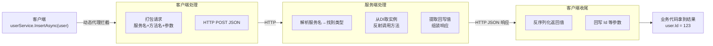
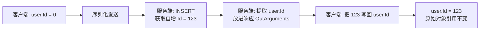

# 第13篇：远程服务调用

> ⏱ 阅读约 20 分钟

你可能遇到这样的场景：

**场景一：前后端物理隔离。** 公司有一个内部管理系统，原本是单体应用或是Winform程序，数据库连接串就放在 `appsettings.json` 里。最近安全部门下发了新规——数据库必须放在内网，前端应用不能直接连数据库。

**场景二：多端复用同一套服务。** 产品线要新增一个移动端 App，Web 端和移动端需要共享同一套业务逻辑（用户、订单、商品），各自实现一遍显然是重复劳动。

**场景三：服务化拆分。** 单体应用越来越大，想把订单、用户、库存拆成独立服务，但又不希望引入一整套微服务治理框架（gRPC、Consul、Envoy...）的重型基础设施。

**场景四：把数据访问层包装成 API。** 已经有一套基于 LiteOrm 的数据访问代码，现在要把它对外开放成 HTTP API 给外部系统调用，但不想为每个服务手写一遍 Controller。

这些场景都可以用传统方案解决：

1. **手写 Controller + HttpClient**：每个服务接口都要写一份 Controller、一份客户端 SDK，字段改名要改两处，参数回写（比如自增 Id）要自己处理。
2. **上 gRPC**：要写 `.proto` 文件、生成代码、维护两套数据模型，团队学习成本不低。
3. **SQL 代理模式**：某些商业数据库代理 / 防火墙网关把 SQL 请求转发到内网数据库。这种方式虽然解决了「连接串不暴露」，但只是网络层转发，没有业务接口边界——前端的任意 SQL 都能跑进数据库，与暴露数据库没有本质区别，既不安全也缺乏业务抽象。
4. **直接抽个内部类库共享**：还是绕不开「前端持有连接串」的问题。

这些方案从「本地调用」变成「远程调用」时都避免不了业务代码要大改。

LiteOrm 的远程服务方案就是为这个痛点设计的——**业务代码一行不改，只换注册方式**。

---

## 一、先看一眼：本地 vs 远程到底差在哪

如果你已经用过 LiteOrm 的本地模式，下面这张表就是你切换到远程模式需要知道的全部：

| 维度 | 本地模式 | 远程模式 |
|------|---------|---------|
| NuGet 包 | `LiteOrm` | 客户端：`LiteOrm.Remote`；服务端：`LiteOrm.Remote.Server` |
| 客户端注册 | `RegisterLiteOrm()` | `RegisterLiteOrmRemote(opts => opts.RemoteServiceUri = ...)` |
| 服务端注册 | 无需服务端 | `AddRemoteServer()` + `MapRemoteInvokeEndpoint()` |
| 服务接口定义 | 不变 | **不变** |
| 业务调用代码 | 不变 | **不变** |
| 自增 Id 回写 | 自动 | **依然自动** |

就这些。你**不需要**写 Controller、不需要写 HttpClient 调用代码、不需要手动处理 Id 回写，只需要数行代码可以完成切换。你完全可以使用本地模式进行开发，正式部署时再切换到远程模式，完美！

---

## 二、五分钟跑通第一个例子

### 2.1 准备工作：共享的实体和服务接口

远程调用的核心是「**客户端和服务端说同一种语言**」——它们必须共享同一套实体类型和服务接口定义。推荐的项目结构：

```
解决方案/
├── Base/                # 共享契约层（客户端和服务端都引用）
│   ├── Entities/        # DemoUser 等实体
│   └── Services/        # IDemoUserService 等接口
├── Server/              # 服务端（引用 Base）
│   └── Program.cs
└── Client/              # 客户端（引用 Base）
    └── Program.cs
```

在 `Base` 里定义实体和服务接口。关键是给接口加上 `[Service]` 特性：

```csharp
// Base/Services/IDemoUserService.cs
using LiteOrm.Common;

[Service]                                          // 这个标记告诉框架：这个接口可以被远程调用
public interface IDemoUserService : IEntityServiceAsync<DemoUser>
{
    Task<DemoUserView?> GetByUserNameAsync(string userName, CancellationToken ct = default);
}
```

```csharp
// Base/Entities/DemoUser.cs
public class DemoUser
{
    public int Id { get; set; }
    public string UserName { get; set; } = "";
}
```

> **为什么必须有 `[Service]`？** 框架需要知道哪些接口是「要被远程调用的服务」，哪些只是普通的内部接口。加了 `[Service]`，框架才会为它生成远程代理。

### 2.2 服务端：三行核心代码

```bash
dotnet add package LiteOrm.Remote.Server
```

```csharp
// Server/Program.cs
var builder = WebApplication.CreateBuilder(args);
builder.Host.RegisterLiteOrm();           // 1️⃣ 注册 LiteOrm 主框架（和本地模式一样）
builder.Services.AddRemoteServer();       // 2️⃣ 注册远程服务端

var app = builder.Build();
app.MapRemoteInvokeEndpoint();             // 3️⃣ 暴露 HTTP 端点
app.Run();
```

这三行做的事：注册数据库访问能力 → 注册远程调度器 → 暴露一个 HTTP 端点接收客户端调用。服务实现类（`EntityService<T>`）由 `RegisterLiteOrm()` 自动注册到 DI 容器，你**不需要手写任何 Controller**。

### 2.3 客户端：两行核心代码

```bash
dotnet add package LiteOrm.Remote
```

```csharp
// Client/Program.cs
var host = Host.CreateDefaultBuilder(args)
    .RegisterLiteOrmRemote(opts =>
    {
        opts.RemoteServiceUri = new Uri("http://localhost:5000");   // 指向服务端地址
    })
    .Build();
```

`RegisterLiteOrmRemote` 替代了原来的 `RegisterLiteOrm`。它做的事：

- 扫描所有带 `[Service]` 特性的接口，为它们生成动态代理并注册到 DI 容器
- 把代理的每次方法调用，通过 HTTP 转发到 `RemoteServiceUri` 指向的服务端

### 2.4 业务代码：和本地调用一模一样

```csharp
using var scope = host.Services.CreateScope();
var userService = scope.ServiceProvider.GetRequiredService<IDemoUserService>();

var user = new DemoUser { UserName = "alice" };
await userService.InsertAsync(user);                 // 这一行实际发起了一次 HTTP 调用
Console.WriteLine($"新增用户 Id = {user.Id}");        // 但 Id 依然自动回写了！
```

最后这两行是远程服务最「魔法」的地方——`InsertAsync` 明明是在远程执行的，为什么 `user.Id` 在客户端这边也变了？答案在第四节的「参数回写」机制里。

---

## 三、它到底是怎么工作的

理解了上面的例子，我们用一张图看完整流程：



关键点：

1. **客户端没有真正的服务实现**，只有一个动态代理。代理做的事就是把方法调用「翻译」成一次 HTTP 请求。
2. **服务端不写 Controller**，一个统一端点（默认 `api/remote/invoke`）接收所有调用，根据请求里的服务名找到对应类型，从 DI 容器取实例，反射调用方法。
3. **客户端和服务端共享同一套 DTO**（`RemoteInvocationRequest` / `RemoteInvocationResponse`），它们位于 `LiteOrm.Common` 包里，两端都引用这个包，所以协议天然一致。

> **一个有趣的点**：`LiteOrm.Remote` 和 `LiteOrm.Remote.Server` **不依赖** `LiteOrm` 主库。你可以对任意接口（不仅是 `IEntityService<T>`）使用远程代理，只要标记 `[Service]` 即可。它是通用的 RPC 框架。

---

## 四、参数回写：为什么远程调用还能回写 Id

这是初学者最困惑的地方，单独解释。

### 4.1 问题：远程调用参数引用丢失

本地调用时，`InsertAsync(user)` 直接操作 `user` 对象，数据库生成的自增 Id 直接赋值给 `user.Id`，调用方自然能读到。

远程调用时，`user` 被序列化成 JSON 发到服务端，服务端反序列化出一个**新对象**，修改这个新对象不会影响客户端的 `user`。所以默认情况下，`user.Id` 在客户端这边**不会变**。

### 4.2 解决：ArgumentOut 机制

LiteOrm 用 `[ArgumentOut]` 特性显式声明「这个参数需要回写」。对于最常见的自增主键回写场景，框架提供了简写特性 `[IdentityOut]`（等价于 `[ArgumentOut(typeof(IdentityArgumentOutHandler), typeof(long))]`）。基接口 `IEntityService<T>.Insert` 已经标记好了：

```csharp
// 框架内部已经这样标记（你无需手动加）
Task Insert([IdentityOut] T entity);
```

调用流程：



所以你什么都不用做，`Insert` / `UpdateOrInsert` / `BatchInsert` 等方法的 Id 回写都已经自动处理好。批量插入也是集合模式回写：

```csharp
var users = new List<DemoUser>
{
    new() { UserName = "alice" },
    new() { UserName = "bob" }
};
await userService.BatchInsertAsync(users);

foreach (var u in users)
    Console.WriteLine($"{u.UserName} → Id={u.Id}");   // 每个 Id 都已回写
```

### 4.3 自定义回写处理器

如果你有自定义服务，想回写其他字段（比如 `UpdatedAt`），可以实现 `IArgumentOutHandler`：

```csharp
public class TimestampOutHandler : IArgumentOutHandler
{
    public Type ReturnType { get; }
    public TimestampOutHandler(Type returnType) => ReturnType = returnType;

    // 服务端调用：从参数对象提取要回写的值
    public object GenerateReturnValue(object argument) => ((MyEntity)argument).UpdatedAt;

    // 客户端调用：把回写的值应用到原始参数对象
    public void WriteBack(object originalArg, object returnValue)
        => ((MyEntity)originalArg).UpdatedAt = (DateTime)returnValue;
}

// 使用：在参数上标记
public interface IMyService
{
    Task InsertAsync([ArgumentOut(typeof(TimestampOutHandler), typeof(DateTime))] MyEntity entity);
}
```

### 4.4 整体回写：`[CopyableOut]`

前面的 `[IdentityOut]` 只回写自增主键这一个字段。如果你想**把服务端修改后的整个对象回写到客户端**（比如服务端在 Insert 时同时填充了 `CreatedAt`、`UpdatedAt`、`Version` 等多个字段），可以使用 `[CopyableOut]`。

`[CopyableOut]` 要求参数类型实现 `ICopyable` 接口。服务端直接返回参数对象本身，客户端通过 `ICopyable.CopyFrom` 把返回值整体复制到原始对象：

```csharp
// 1. 实体实现 ICopyable
public class CopyableUser : ICopyable
{
    public int Id { get; set; }
    public string UserName { get; set; } = "";
    public DateTime CreatedAt { get; set; }
    public DateTime UpdatedAt { get; set; }

    public void CopyFrom(object other)
    {
        var src = (CopyableUser)other;
        Id = src.Id;
        UserName = src.UserName;
        CreatedAt = src.CreatedAt;
        UpdatedAt = src.UpdatedAt;
    }
}

// 2. 服务接口用 [CopyableOut] 标记参数
public interface ICopyableUserService
{
    Task InsertAsync([CopyableOut(typeof(CopyableUser))] CopyableUser user);
}

// 3. 调用后所有字段都已回写
var user = new CopyableUser { UserName = "alice" };
await userService.InsertAsync(user);
Console.WriteLine($"Id={user.Id}, CreatedAt={user.CreatedAt}");   // 都已回写
```

**`[IdentityOut]` vs `[CopyableOut]` 选择：**

| 特性 | 回写范围 | 适用场景 |
|------|---------|---------|
| `[IdentityOut]` | 仅 Identity 列（自增主键） | 只关心主键回写，参数类型无需实现接口 |
| `[CopyableOut]` | 整个对象的所有字段 | 需要回写多个字段，参数类型实现 `ICopyable` |
| 自定义 `IArgumentOutHandler` | 任意字段 | 复杂回写逻辑（如差量、聚合） |

---

## 五、常用的客户端配置

`RegisterLiteOrmRemote` 的完整配置项：

| 属性 | 类型 | 默认值 | 说明 |
|------|------|--------|------|
| `RemoteServiceUri` | `Uri?` | `null` | 服务端地址。设置后自动用内置 HTTP 传输 |
| `RemoteServicePath` | `string` | `"api/remote/invoke"` | 请求路径（与服务端 `InvokePath` 对应） |
| `ConfigureHttpClient` | `Action<HttpClient>?` | `null` | 配置 HttpClient（超时、请求头等） |
| `Transport` | `IRemoteServiceTransport?` | `null` | 自定义传输层（设置后忽略 `RemoteServiceUri`） |
| `AutoRegisterEntityServices` | `bool` | `true` | 是否自动扫描 `[Service]` 接口注册代理 |
| `Assemblies` | `Assembly[]?` | `null` | 扫描程序集列表，未设置则扫描所有引用程序集 |

> **必填项**：`Transport` 或 `RemoteServiceUri` 至少要设置一个。

最常用的配置：

```csharp
.RegisterLiteOrmRemote(opts =>
{
    opts.RemoteServiceUri = new Uri("http://localhost:5000");
    opts.ConfigureHttpClient = client =>
    {
        client.Timeout = TimeSpan.FromSeconds(30);
        client.DefaultRequestHeaders.Add("X-Api-Key", "your-key");
    };
})
```

如果 `AutoRegisterEntityServices` 关掉，或者你想注册非 `[Service]` 接口，可以手动注册：

```csharp
services.AddRemoteService<IUserService>()
        .AddRemoteService<IOrderService>();
```

---

## 六、服务端配置与安全

### 6.1 服务端配置

`AddRemoteServer` 的常用配置项：

| 属性 | 默认值 | 说明 |
|------|--------|------|
| `InvokePath` | `"api/remote/invoke"` | 端点路径（与客户端 `RemoteServicePath` 对应） |
| `AutoRegisterEntityServices` | `true` | 自动扫描 `[Service]` 接口建立名称映射 |
| `ServiceTypeResolver` | `DefaultServiceTypeResolver` | 服务类型解析器，可指定命名空间加速解析 |

典型配置：

```csharp
builder.Services.AddRemoteServer(options =>
{
    options.ServiceTypeResolver = new DefaultServiceTypeResolver(
        serviceNamespace: "MyApp.Services",    // 指定命名空间提升解析速度
        modelNamespace: "MyApp.Models");
});
```

### 6.2 接入身份验证

**为什么要做身份验证和权限校验？**

远程服务端点暴露后，任何能访问到这个 HTTP 地址的客户端都可以发起调用。如果不加任何认证：

- **任何人都可能调用你的 `IEntityService<T>.DeleteAsync(u => true)` 删全表**——远程代理的强大能力同时也意味着巨大的破坏力。
- 无法区分调用方身份，无法做按用户 / 按角色的数据隔离（比如「只能查自己部门的订单」）。
- 出现事故时无法追溯是哪个客户端发起的调用。

所以**生产环境必须接入认证授权**。远程端点和普通 Web API 一样，可以用 ASP.NET Core 的认证授权中间件保护：

```csharp
var app = builder.Build();

app.UseAuthentication();          // 身份验证
app.UseAuthorization();            // 权限校验

app.MapRemoteInvokeEndpoint();     // 端点自动受保护
```

客户端通过 `ConfigureHttpClient` 附加凭证：

```csharp
opts.ConfigureHttpClient = client =>
{
    client.DefaultRequestHeaders.Authorization =
        new AuthenticationHeaderValue("Bearer", accessToken);
};
```

也可以给具体的服务接口加 `[Authorize]` 特性做细粒度控制：

```csharp
[Service]
[Authorize(Roles = "Admin")]          // 只有 Admin 角色能调用
public interface IAdminUserService : IEntityServiceAsync<AdminUser>
{
}
```

---

## 七、进阶：自定义传输层

### 7.1 替换传输协议

内置的是 HTTP 传输。如果你想用 named pipe、gRPC 或其他传输方式，继承 `JsonRemoteServiceTransport` 即可——你只需要实现「发 JSON、收 JSON」两个方法：

```csharp
public class NamedPipeTransport : JsonRemoteServiceTransport
{
    public override async Task<string> GetResponseJsonAsync(
        string requestJson, CancellationToken ct = default)
    {
        // 把 requestJson 通过 named pipe 发出去，拿到响应 JSON 返回
    }
}

// 客户端注册时指定
opts.Transport = new NamedPipeTransport("liteorm-remote");
```

> 设置 `Transport` 后，`RemoteServiceUri` 和 `ConfigureHttpClient` 都会被忽略，认证凭证需要在你的传输层里自行处理。

### 7.2 用自定义传输层实现分发

`IRemoteServiceTransport` 只关心「发 JSON、收 JSON」，**不关心发到哪、怎么路由**。这意味着你可以在传输层里实现各种分发策略，而业务代码完全无感：

**场景一：按服务名路由到不同后端。** 比如订单服务部署在 `order-svc:5000`，用户服务部署在 `user-svc:5000`。在自定义传输层里解析 `requestJson` 中的 `ServiceName` 字段，按规则转发到对应地址：

```csharp
public class ServiceAwareTransport : JsonRemoteServiceTransport
{
    private readonly HttpClient _http = new();

    public override async Task<string> GetResponseJsonAsync(
        string requestJson, CancellationToken ct = default)
    {
        // 解析 ServiceName 决定转发目标
        using var doc = JsonDocument.Parse(requestJson);
        var serviceName = doc.RootElement.GetProperty("ServiceName").GetString();

        var target = serviceName switch
        {
            "IDemoOrderService" => "http://order-svc:5000/",
            "IDemoUserService"  => "http://user-svc:5000/",
            _                   => "http://default-svc:5000/"
        };

        return await _http.PostAsync($"{target}api/remote/invoke",
            new StringContent(requestJson, Encoding.UTF8, "application/json"), ct)
            .Result.Content.ReadAsStringAsync(ct);
    }
}
```

**场景二：多服务端负载均衡。** 维护一个服务端地址列表，用轮询 / 随机 / 最少连接等策略选择目标，把请求分散到多个实例。

**场景三：本地缓存代理。** 对于幂等的查询方法，传输层可以先查本地缓存，命中则直接返回缓存 JSON，未命中才转发到服务端并回填缓存。由于整个请求 / 响应都是 JSON 字符串，缓存实现非常简单。

**场景四：故障转移。** 主服务端超时或失败时，自动重试到备用服务端。

> 这些分发逻辑都封装在传输层里，业务代码依然只写 `userService.InsertAsync(user)`，完全感知不到后端的拓扑结构。

---

## 八、序列化的几个坑

远程调用完全依赖 JSON 序列化往返，初学者容易踩这几个坑：

### 8.1 引用语义丢失

参数在服务端是反序列化出来的新对象，修改不会自动回传。需要回写就用 `[ArgumentOut]`（见第四节）。

### 8.2 类型必须可序列化

实体和服务接口的参数 / 返回值类型必须满足：

- 公开类型
- 有无参构造函数
- 公共属性可读写

### 8.3 Lambda 表达式处理

业务代码里写的 `u => u.Age > 18` 这种 Lambda 不能直接序列化。好消息是：`LiteOrm`  是通过扩展方法将 Lambda 表达式转换为 `Expr` 对象再传入的，实际接收的参数类型是 `Expr` 。所以**你写业务代码时直接用 Lambda 即可**，无需手动转换：

```csharp
// 直接写 Lambda 即可，扩展方法自动转换为 Expr 传输
var adults = await viewService.SearchAsync(u => u.Age > 18);
var count = await viewService.CountAsync(u => u.Status == "Active");
await userService.DeleteAsync(u => u.Id == obsoleteId);
```

> 这些扩展方法定义在 `LiteOrm.Common` 的 `LambdaExprExtensions` 中，客户端引用 `LiteOrm.Remote` 即可使用。自定义服务方法如果直接以 `Expression<Func<T,bool>>` 作为参数，需要客户端自行调用 `Expr.Lambda(...)` 或 `Expr.Query(...)`  转换后传输。

### 8.4 CancellationToken 不走序列化

`CancellationToken` 作为参数传递，但**不会出现在序列化的 Arguments 中**——它由传输层端到端透传。这样客户端取消请求时，服务端能感知到。

### 8.5 自定义方法用强类型

```csharp
// 推荐：返回值类型明确，序列化直接写入
Task<DemoUserView?> GetByUserNameAsync(string userName, CancellationToken ct = default);

// 不推荐：返回 object，触发 $type 包装，增加开销
Task<object?> GetByUserNameAsync(string userName, CancellationToken ct = default);
```

---

## 九、注意事项与限制

### 9.1 同名方法（C# 重载）需要用 `[ServiceMethod]` 区分

**这是远程服务最容易踩的坑。** 服务端 `RemoteServiceDispatcher` 在启动时会为每个服务类型构建方法查找表，键是「服务方法名」。远程协议只传方法名，不传参数签名，所以 C# 的方法重载在远程场景下默认无法区分——如果接口上定义了两个同名方法，构建时会抛出 `AmbiguousMatchException`，整个服务端启动失败。

解决办法是给其中一个（或两个）方法标记 `[ServiceMethod(MethodName = "...")]`，让它们在服务方法查找表里用不同的键区分：

```csharp
using LiteOrm;

[Service]
public interface IUserService
{
    // 默认服务方法名 = 方法名 "GetByIdAsync"
    Task<User> GetByIdAsync(int id);

    // 用 [ServiceMethod] 指定不同的服务方法名，避免冲突
    [ServiceMethod(MethodName = "GetByNameAsync")]
    Task<User> GetByIdAsync(string name);   // ✅ C# 重载，但服务方法名不同
}
```

`[ServiceMethod]` 的作用：

| 用法 | 含义 |
|------|------|
| `[ServiceMethod]` | 标记为服务方法，服务方法名 = 方法名 |
| `[ServiceMethod(MethodName = "X")]` | 标记为服务方法，服务方法名 = "X"（用于消除同名冲突） |
| `[ServiceMethod(false)]` | 标记为**非**服务方法，不参与远程调用（如本地辅助方法） |

> 基接口 `IEntityService<T>` 的方法名本身就唯一，所以不需要手动标记 `[ServiceMethod]`。只有当你在自定义服务接口上定义了 C# 重载时，才需要用 `[ServiceMethod(MethodName = "...")]` 区分。

### 9.2 功能性限制

| 限制 | 原因 |
|------|------|
| **`ForEachAsync` 不支持** | 流式遍历需要持续返回数据，远程协议不支持，抛出 `NotSupportedException` |
| **不支持跨进程事务** | `[Transaction]` 仅在本地进程内生效，跨网络无法保证原子性 |
| **异常会跨网络传播** | 服务端异常通过响应携带类型 / 消息 / 堆栈返回，客户端重新抛出 |

### 9.3 一致性要求

| 要求 | 原因 |
|------|------|
| **客户端服务端 `TableInfoProvider` 必须一致** | `IdentityArgumentOutHandler` 依赖它识别 Identity 列 |
| **`ServiceName` 必须一致** | 两端都启用 `AutoRegisterEntityServices` 时框架自动保证；手动注册需自行同步 |
| **`TableInfoProvider.Default` 必须注册** | `LiteOrm.Remote` 通过 `IStartable` 在容器初始化时自动设置，自定义宿主需手动设置 |
| **共享契约层必须两端引用** | 实体 / 服务接口定义不一致会导致序列化失败 |

---

## 十、总结

记住这几句话，你就掌握了 LiteOrm 远程服务的精髓：

1. **业务代码零改动**——本地调用和远程调用写法完全一致，只换注册方式。
2. **接口即契约**——`[Service]` 标记的服务接口本身就是 API 协议，不需要 Controller 和 DTO 映射。
3. **Id 自动回写**——`[IdentityOut]` 机制把服务端生成的自增 Id 自动回写到客户端对象；需要整体回写用 `[CopyableOut]`。
4. **传输可替换 + 可分发**——默认 HTTP，继承 `JsonRemoteServiceTransport` 可换 named pipe / gRPC，还能在传输层实现按服务名路由、负载均衡、缓存代理、故障转移等分发策略。
5. **不绑定 LiteOrm**——它是通用 RPC 框架，任意接口加 `[Service]` 都能用。
6. **渐进式演进**——可以从单体（`RegisterLiteOrm`）平滑切换到前后端分离（`RegisterLiteOrmRemote`），接口定义不变。
7. **生产必做认证**——远程端点暴露后破坏力巨大，必须接入 ASP.NET Core 认证授权中间件保护。
8. **同名方法用 `[ServiceMethod]` 区分**——C# 重载在远程场景下默认无法区分，用 `[ServiceMethod(MethodName = "...")]` 指定不同的服务方法名即可共存。

下一篇暂无。

> **完整演示代码**：[RemoteServiceDemo.cs](https://github.com/danjiewu/LiteOrm/tree/master/LiteOrm.Demo/Demos/RemoteServiceDemo.cs)
